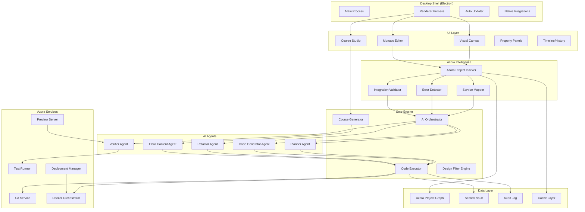

# AzStudio - Design Document

## Overview

AzStudio is the **keystone development environment for Azora OS** - a desktop Windows application that serves as the creative and technical hub where all of Azora's services, UIs, and learning engines come together. It's not just an IDE; it's a multi-purpose studio that blends development, course creation, design prototyping, and service integration into a single cohesive environment.

Built on Electron with Monaco editor integration, AzStudio provides a hybrid interface specifically tailored for Azora's architecture - understanding its microservices, Next.js apps, Prisma schemas, and Ubuntu philosophy. It solves the fragmentation problem where developers currently jump between repos, editors, and tools by providing **one unified environment** to build, polish, and launch Azora OS.

The application follows a local-first architecture where all code processing happens on the user's machine, with deep integration into Azora's existing infrastructure including testing frameworks, Docker Compose services, and deployment pipelines.

## Core Vision

**AzStudio is the single editor where Azora OS can be built, polished, and launched.**

### The Problem It Solves

Azora OS currently has:
- 65+ service directories (most scaffolded, only 4-5 production-ready)
- 14+ app directories (many incomplete or missing)
- Fragmented development workflow across multiple tools
- Manual error fixing and UI polishing
- Disconnected course content creation
- Complex service integration and testing

**AzStudio eliminates this fragmentation** by being:
1. **The automation layer** that applies AI-driven refactors and design upgrades
2. **The content studio** that generates courses and learning materials
3. **The integration hub** that connects frontends to backends and verifies everything works
4. **The error eliminator** that finds and fixes build errors across the entire codebase

### Target Users

1. **Azora Developers** → Building and maintaining the OS, fixing errors, completing services
2. **Educators/Course Creators** → Generating structured learning content via Elara AI
3. **Designers** → Applying global UI filters and prototyping new interfaces
4. **Community Contributors** → Extending Azora OS with new services or modules

### Key Use Cases

**Developer Workflow:**
- "Fix all repo errors and upgrade the Student Portal UI to Premium standard"
- "Complete the Marketplace UI using the existing backend service"
- "Refactor all services to use the new authentication middleware"

**Educator Workflow:**
- "Generate a new course on financial literacy with 5 modules and quizzes"
- "Convert this course outline into video lessons with Elara AI voiceovers"
- "Update all Python courses to use the latest syntax"

**Designer Workflow:**
- "Apply a minimalist design filter across all dashboards"
- "Generate a landing page for the Enterprise offering"
- "Update the design system to match the new brand guidelines"

**Integrator Workflow:**
- "Connect Marketplace UI to backend services and verify API routes"
- "Set up Docker Compose for local development with all services"
- "Deploy the Student Portal to Railway with production configs"

## Architecture

### High-Level System Architecture



### Azora-Specific Architecture Layers

**1. Azora Intelligence Layer**
- Understands Azora's 65+ services and their relationships
- Maps microservices architecture (auth, payment, education, marketplace, etc.)
- Detects errors across the entire monorepo
- Validates service integrations and API contracts
- Recognizes Azora patterns (testing infrastructure, Ubuntu philosophy, etc.)

**2. Course Generation Engine**
- Integrates with Elara AI for content generation
- Supports Azora's education service schema
- Generates courses, modules, lessons, quizzes
- Connects to ElevenLabs for TTS and HeyGen for video
- Manages course database and enrollment tracking

**3. Service Integration Hub**
- Connects Azora's frontends (Student Portal, Enterprise UI, etc.) to backends
- Validates API Gateway routing
- Tests service-to-service communication
- Manages Docker Compose orchestration for local development
- Handles environment variables and secrets across services

**4. Design System Integration**
- Understands Azora's Tailwind config and design tokens
- Applies design filters across all 5+ frontend apps
- Maintains consistency with Ubuntu philosophy aesthetics
- Generates dashboards, portals, and landing pages
- Updates Radix UI components and custom design system

### Technology Stack

**Desktop Runtime:**
- **Electron 28+**: Mature ecosystem, VS Code components, broad plugin compatibility
- **Node.js 20+**: Backend runtime for file operations and service orchestration
- **TypeScript 5+**: Type-safe development across all modules

**Editor & UI:**
- **Monaco Editor**: VS Code's editor component with full language support
- **React 18**: UI framework for visual canvas and property panels
- **Tailwind CSS**: Styling system matching Azora's design language
- **Radix UI**: Accessible component primitives for dialogs, dropdowns, etc.
- **React Flow**: Visual canvas for drag-and-drop service architecture

**AI & Code Intelligence:**
- **OpenAI GPT-4 Turbo**: Primary AI model for code generation and planning
- **Claude 3 Opus**: Alternative model for complex refactoring tasks
- **Babel/TypeScript Compiler API**: AST parsing and transformation
- **ESLint/Prettier**: Code quality and formatting
- **ts-morph**: TypeScript AST manipulation library

**Data & Storage:**
- **SQLite (better-sqlite3)**: Local project graph and metadata storage
- **LevelDB**: Fast key-value cache for indexing results
- **Keytar**: Secure credential storage using OS keychain
- **isomorphic-git**: Pure JavaScript Git implementation

**Testing & Verification:**
- **Jest**: Unit and integration test runner
- **Playwright**: Browser automation for E2E tests and verification
- **axe-core**: Accessibility testing engine
- **Lighthouse**: Performance and best practices auditing

**Build & Packaging:**
- **electron-builder**: Windows installer creation (MSIX/NSIS)
- **electron-updater**: Auto-update functionality
- **webpack 5**: Module bundling and optimization
- **Code signing**: Windows Authenticode certificate integration

## Components and Interfaces

### 1. Desktop Shell (Electron Main Process)

**Responsibilities:**
- Window management and lifecycle
- File system access with security boundaries
- Inter-process communication (IPC)
- Auto-update orchestration
- Native OS integrations

**Key Interfaces:**

```typescript
interface IDesktopShell {
  // Window Management
  createWindow(options: WindowOptions): BrowserWindow;
  closeWindow(windowId: string): void;
  
  // File System
  openFolder(path: string): Promise<ProjectMetadata>;
  watchFileChanges(path: string, callback: FileChangeCallback): void;
  
  // Updates
  checkForUpdates(): Promise<UpdateInfo>;
  downloadUpdate(): Promise<void>;
  installUpdate(): void;
  
  // Security
  requestPermission(type: PermissionType): Promise<boolean>;
  getSecureCredential(key: string): Promise<string>;
  setSecureCredential(key: string, value: string): Promise<void>;
}
```

### 2. Visual Canvas

**Responsibilities:**
- Drag-and-drop service component placement
- Visual connection drawing between services
- Component property editing
- Real-time synchronization with code editor
- Template instantiation

**Key Interfaces:**

```typescript
interface IVisualCanvas {
  // Component Management
  addComponent(type: ComponentType, position: Position): Component;
  removeComponent(id: string): void;
  updateComponent(id: string, properties: Partial<Component>): void;
  
  // Connections
  createConnection(sourceId: string, targetId: string): Connection;
  removeConnection(id: string): void;
  
  // Templates
  loadTemplate(templateId: string): Promise<CanvasState>;
  saveAsTemplate(name: string): Promise<string>;
  
  // Synchronization
  syncWithCode(): Promise<void>;
  onCodeChange(callback: CodeChangeCallback): void;
}

interface Component {
  id: string;
  type: 'service' | 'database' | 'ui' | 'api';
  name: string;
  position: { x: number; y: number };
  properties: Record<string, any>;
  connections: string[];
}
```

### 3. Monaco Editor Integration

**Responsibilities:**
- Code editing with syntax highlighting
- IntelliSense and autocomplete
- Inline AI code actions
- Diff preview and merge
- Multi-file editing

**Key Interfaces:**

```typescript
interface IMonacoEditor {
  // Editor Management
  openFile(path: string): Promise<ITextModel>;
  closeFile(path: string): void;
  saveFile(path: string): Promise<void>;
  
  // AI Actions
  registerCodeAction(action: CodeAction): void;
  showDiffPreview(original: string, modified: string): void;
  applyEdit(edit: TextEdit): Promise<void>;
  
  // Language Features
  provideCompletions(position: Position): Promise<CompletionItem[]>;
  provideDiagnostics(uri: string): Promise<Diagnostic[]>;
  
  // Collaboration
  showRemoteCursor(userId: string, position: Position): void;
  highlightRemoteSelection(userId: string, range: Range): void;
}
```

### 4. Project Indexer

**Responsibilities:**
- Scan and parse project files
- Detect frameworks and conventions
- Build dependency graph
- Extract design tokens and components
- Maintain searchable index

**Key Interfaces:**

```typescript
interface IProjectIndexer {
  // Indexing
  indexProject(rootPath: string): Promise<ProjectGraph>;
  updateIndex(changedFiles: string[]): Promise<void>;
  
  // Queries
  findComponent(name: string): Promise<ComponentInfo[]>;
  findReferences(symbol: string): Promise<Reference[]>;
  getImportGraph(): Promise<DependencyGraph>;
  
  // Framework Detection
  detectFrameworks(): Promise<Framework[]>;
  getProjectConventions(): Promise<Conventions>;
  
  // Design System
  extractDesignTokens(): Promise<DesignTokens>;
  findComponents(): Promise<ComponentRegistry>;
}

interface ProjectGraph {
  files: Map<string, FileNode>;
  dependencies: Map<string, string[]>;
  components: Map<string, ComponentNode>;
  services: Map<string, ServiceNode>;
  apis: Map<string, APINode>;
}
```

### 5. AI Orchestrator

**Responsibilities:**
- Coordinate multiple AI agents
- Manage context and prompts
- Handle rate limiting and retries
- Cache AI responses
- Track token usage and costs

**Key Interfaces:**

```typescript
interface IAIOrchestrator {
  // Agent Coordination
  planTask(prompt: string, context: ProjectContext): Promise<TaskDAG>;
  executeTask(task: Task): Promise<TaskResult>;
  verifyResult(result: TaskResult): Promise<VerificationReport>;
  
  // Context Management
  buildContext(files: string[]): Promise<AIContext>;
  updateContext(changes: FileChange[]): void;
  
  // Model Management
  selectModel(task: TaskType): AIModel;
  estimateCost(prompt: string): Promise<number>;
  
  // Caching
  getCachedResponse(prompt: string): Promise<string | null>;
  cacheResponse(prompt: string, response: string): Promise<void>;
}

interface TaskDAG {
  tasks: Task[];
  dependencies: Map<string, string[]>;
  rollbackPoints: string[];
  estimatedDuration: number;
}
```

### 6. Code Executor

**Responsibilities:**
- Apply AST transformations
- Generate code from templates
- Manage file operations
- Create atomic changesets
- Handle rollbacks

**Key Interfaces:**

```typescript
interface ICodeExecutor {
  // Code Generation
  generateService(spec: ServiceSpec): Promise<GeneratedFiles>;
  generateComponent(spec: ComponentSpec): Promise<string>;
  generateAPI(spec: APISpec): Promise<GeneratedFiles>;
  
  // Transformations
  applyTransform(file: string, transform: ASTTransform): Promise<string>;
  refactorAcrossFiles(operation: RefactorOperation): Promise<Changeset>;
  
  // Changesets
  createChangeset(changes: FileChange[]): Changeset;
  applyChangeset(changeset: Changeset): Promise<void>;
  rollbackChangeset(changesetId: string): Promise<void>;
  
  // Validation
  validateSyntax(code: string, language: string): Promise<Diagnostic[]>;
  validateTypes(file: string): Promise<Diagnostic[]>;
}

interface Changeset {
  id: string;
  timestamp: Date;
  files: Map<string, FileDiff>;
  rollbackData: RollbackData;
  verified: boolean;
}
```

### 7. Design Filter Engine

**Responsibilities:**
- Apply global design transformations
- Update design tokens
- Refactor Tailwind classes
- Modify CSS variables
- Generate style previews

**Key Interfaces:**

```typescript
interface IDesignFilterEngine {
  // Filters
  applyFilter(filter: DesignFilter): Promise<DesignChangeset>;
  previewFilter(filter: DesignFilter): Promise<PreviewResult>;
  
  // Tokens
  updateTokens(tokens: DesignTokens): Promise<void>;
  extractTokens(): Promise<DesignTokens>;
  
  // Transformations
  refactorTailwindClasses(mapping: ClassMapping): Promise<Changeset>;
  updateCSSVariables(variables: CSSVariables): Promise<void>;
  
  // Previews
  generateScreenshots(components: string[]): Promise<Screenshot[]>;
  compareScreenshots(before: Screenshot[], after: Screenshot[]): Promise<Diff[]>;
}

interface DesignFilter {
  name: string;
  type: 'modern-saas' | 'enterprise' | 'minimalist' | 'playful' | 'dark-mode';
  tokens: DesignTokens;
  classTransforms: ClassMapping;
  componentOverrides: ComponentStyles;
}
```

### 8. Verifier Agent

**Responsibilities:**
- Run automated tests
- Check accessibility
- Measure performance
- Validate contracts
- Generate reports

**Key Interfaces:**

```typescript
interface IVerifier {
  // Testing
  runTests(pattern: string): Promise<TestResults>;
  runE2ETests(scenarios: Scenario[]): Promise<E2EResults>;
  
  // Accessibility
  checkAccessibility(url: string): Promise<A11yReport>;
  
  // Performance
  measurePerformance(url: string): Promise<PerformanceReport>;
  
  // Validation
  validateAPIContracts(): Promise<ContractValidation>;
  validateDatabaseSchema(): Promise<SchemaValidation>;
  
  // Reporting
  generateReport(results: VerificationResults): Promise<Report>;
  blockOnFailure(results: VerificationResults): boolean;
}

interface VerificationResults {
  tests: TestResults;
  accessibility: A11yReport;
  performance: PerformanceReport;
  contracts: ContractValidation;
  passed: boolean;
  blockers: Issue[];
}
```

## Data Models

### Project Graph

```typescript
interface ProjectGraph {
  metadata: ProjectMetadata;
  files: Map<string, FileNode>;
  services: Map<string, ServiceNode>;
  components: Map<string, ComponentNode>;
  apis: Map<string, APINode>;
  databases: Map<string, DatabaseNode>;
  dependencies: DependencyGraph;
  designSystem: DesignSystem;
}

interface FileNode {
  path: string;
  type: 'typescript' | 'javascript' | 'css' | 'json' | 'prisma';
  imports: string[];
  exports: string[];
  symbols: Symbol[];
  lastModified: Date;
  hash: string;
}

interface ServiceNode {
  id: string;
  name: string;
  type: 'auth' | 'payment' | 'email' | 'storage' | 'custom';
  port: number;
  endpoints: APINode[];
  dependencies: string[];
  environment: Record<string, string>;
  tests: string[];
}

interface ComponentNode {
  id: string;
  name: string;
  type: 'page' | 'component' | 'layout';
  framework: 'react' | 'next';
  props: PropDefinition[];
  children: string[];
  styles: StyleDefinition;
  tests: string[];
}
```

### Design System

```typescript
interface DesignSystem {
  tokens: DesignTokens;
  components: ComponentRegistry;
  themes: Theme[];
  conventions: StyleConventions;
}

interface DesignTokens {
  colors: ColorTokens;
  spacing: SpacingTokens;
  typography: TypographyTokens;
  shadows: ShadowTokens;
  borders: BorderTokens;
  animations: AnimationTokens;
}

interface ColorTokens {
  primary: ColorScale;
  secondary: ColorScale;
  accent: ColorScale;
  neutral: ColorScale;
  semantic: SemanticColors;
}

interface Theme {
  id: string;
  name: string;
  tokens: DesignTokens;
  cssVariables: Record<string, string>;
  tailwindConfig: TailwindConfig;
}
```

### Task Execution

```typescript
interface Task {
  id: string;
  type: TaskType;
  description: string;
  dependencies: string[];
  rollbackPoint: string;
  operations: Operation[];
  verification: VerificationStep[];
  estimatedDuration: number;
}

interface Operation {
  type: 'create' | 'modify' | 'delete' | 'move';
  target: string;
  action: ASTTransform | FileOperation;
  reversible: boolean;
}

interface VerificationStep {
  type: 'test' | 'lint' | 'type-check' | 'accessibility' | 'performance';
  config: VerificationConfig;
  required: boolean;
  timeout: number;
}
```

## Error Handling

### Error Categories

1. **User Errors**: Invalid input, missing configuration
2. **System Errors**: File system failures, network issues
3. **AI Errors**: Model failures, rate limits, invalid responses
4. **Verification Errors**: Test failures, accessibility violations
5. **Security Errors**: Permission denied, invalid credentials

### Error Recovery Strategy

```typescript
interface ErrorHandler {
  // Classification
  classifyError(error: Error): ErrorCategory;
  
  // Recovery
  attemptRecovery(error: Error): Promise<RecoveryResult>;
  rollbackOnFailure(error: Error): Promise<void>;
  
  // User Communication
  formatErrorMessage(error: Error): UserMessage;
  suggestFixes(error: Error): Fix[];
  
  // Logging
  logError(error: Error, context: ErrorContext): void;
  reportCrash(error: Error): Promise<void>;
}
```

### Rollback Mechanism

All operations create rollback points:
- Before AI transformations
- Before file modifications
- Before test execution
- Before deployment

Rollback data includes:
- Original file contents
- Git commit hash
- Environment state
- Dependency versions

## Testing Strategy

### Unit Tests

- Test individual components in isolation
- Mock external dependencies
- Focus on business logic
- Target: 80% coverage

### Integration Tests

- Test component interactions
- Use real file system (temp directories)
- Mock AI responses
- Target: 70% coverage

### E2E Tests

- Test complete user workflows
- Use Playwright for UI automation
- Test critical paths only
- Target: Key user journeys covered

### Performance Tests

- Measure indexing speed (target: <5s for 1000 files)
- Measure AI response time (target: <10s for code generation)
- Measure UI responsiveness (target: <100ms interactions)
- Memory usage (target: <500MB idle, <2GB active)

## Security Considerations

### Local-First Security

- All code processing happens locally
- No code sent to external servers without explicit permission
- Encrypted secrets storage using OS keychain
- Audit log of all external API calls

### Network Sandboxing

- Allowlist domains for AI APIs
- Block unknown network requests
- Clear permission prompts
- Network activity monitoring

### Code Signing

- Windows Authenticode certificate
- Signed installers and updates
- Verification before execution
- Revocation checking

### Secrets Management

```typescript
interface ISecretsVault {
  // Storage
  setSecret(key: string, value: string, scope: 'global' | 'project'): Promise<void>;
  getSecret(key: string): Promise<string | null>;
  deleteSecret(key: string): Promise<void>;
  
  // Encryption
  encrypt(data: string): Promise<string>;
  decrypt(data: string): Promise<string>;
  
  // Audit
  logAccess(key: string, operation: 'read' | 'write' | 'delete'): void;
  getAuditLog(): Promise<AuditEntry[]>;
}
```

## Performance Optimization

### Indexing Optimization

- Incremental indexing (only changed files)
- Parallel file processing
- LevelDB caching
- Debounced file watching

### AI Response Caching

- Cache identical prompts
- Cache code generation templates
- Cache verification results
- TTL-based invalidation

### UI Performance

- Virtual scrolling for large lists
- Code splitting and lazy loading
- Web Workers for heavy computations
- Debounced canvas updates

### Memory Management

- Dispose unused Monaco models
- Clear old cache entries
- Limit project graph size
- Stream large file operations

## Deployment and Updates

### Installer

- MSIX package for Windows Store
- NSIS installer for direct download
- Silent install option for enterprises
- Custom install location support

### Auto-Updates

- Background update checks (daily)
- Staged rollout (alpha → beta → stable)
- Delta updates for efficiency
- Rollback on update failure

### Telemetry

- Opt-in crash reporting
- Anonymous usage statistics
- Performance metrics
- Feature usage tracking

## Future Considerations

### Phase 2 Features

- macOS and Linux support
- Cloud collaboration backend
- Plugin system for extensions
- Custom AI model integration
- Multi-language support

### Scalability

- Support for monorepos (>10,000 files)
- Distributed indexing
- Remote AI model hosting
- Team workspace management

### Integration

- VS Code extension
- GitHub Actions integration
- Figma plugin for design import
- Slack notifications
