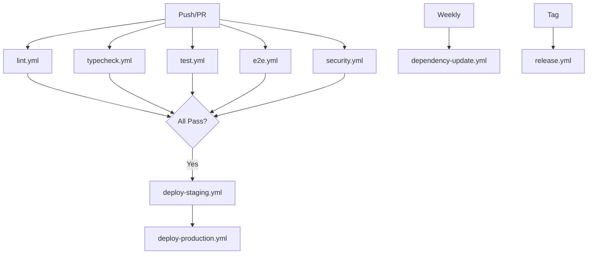

# GitHub Workflows Documentation

## Overview

Azora OS uses 9 production-grade GitHub Actions workflows for CI/CD automation, quality assurance, and deployment.

## Workflows

### 1. Test Suite (`test.yml`)
**Triggers:** Push to main/develop, PRs, manual
**Purpose:** Run unit and integration tests with coverage

**Jobs:**
- `unit-tests`: Fast unit tests with Jest
- `integration-tests`: Integration tests with PostgreSQL & Redis
- `test-summary`: Aggregate results

**Features:**
- Parallel execution
- Code coverage upload to Codecov
- Service containers for databases
- Fail-fast on critical errors

### 2. E2E Tests (`e2e.yml`)
**Triggers:** Push, PRs, manual, daily at 2 AM
**Purpose:** End-to-end testing with Playwright

**Jobs:**
- `playwright`: Browser-based E2E tests

**Features:**
- Multi-browser testing
- Screenshot capture on failure
- Test report artifacts (30 days)
- Scheduled daily runs

### 3. Code Quality (`lint.yml`)
**Triggers:** Push, PRs, manual
**Purpose:** Enforce code quality standards

**Jobs:**
- `eslint`: JavaScript/TypeScript linting
- `prettier`: Code formatting checks
- `markdown`: Markdown linting

**Features:**
- Inline PR annotations
- Multiple linters
- Fast feedback

### 4. TypeScript Validation (`typecheck.yml`)
**Triggers:** Push, PRs, manual
**Purpose:** Validate TypeScript compilation

**Jobs:**
- `typecheck`: Type checking and build verification

**Features:**
- Strict type checking
- Build verification
- Fast failure on type errors

### 5. Security Scanning (`security.yml`)
**Triggers:** Push, PRs, manual, weekly on Monday
**Purpose:** Comprehensive security scanning

**Jobs:**
- `npm-audit`: Dependency vulnerability scanning
- `dependency-review`: PR dependency analysis
- `codeql`: Static code analysis
- `secret-scan`: Secret detection with TruffleHog
- `owasp-scan`: OWASP dependency check

**Features:**
- Multiple security tools
- Automated reports
- Weekly scheduled scans
- Secret detection

### 6. Deploy Staging (`deploy-staging.yml`)
**Triggers:** Push to develop, manual
**Purpose:** Deploy to staging environment

**Jobs:**
- `deploy`: Build, test, and deploy to staging

**Features:**
- Docker build and push
- Health checks
- Slack notifications
- Environment protection

**Environment:** `staging`
**URL:** https://staging.azora.world

### 7. Deploy Production (`deploy-production.yml`)
**Triggers:** Push to main, version tags, manual
**Purpose:** Deploy to production with safety checks

**Jobs:**
- `pre-deploy`: Run all tests and security scans
- `deploy`: Deploy to production
- `rollback`: Automatic rollback on failure

**Features:**
- Pre-deployment validation
- Database migrations
- Health checks
- Smoke tests
- Automatic rollback
- Slack notifications

**Environment:** `production`
**URL:** https://azora.world

### 8. Release Automation (`release.yml`)
**Triggers:** Version tags (v*.*.*), manual
**Purpose:** Automate release process

**Jobs:**
- `create-release`: Build, test, and publish release

**Features:**
- Automatic changelog generation
- GitHub release creation
- npm package publishing
- Docker image tagging
- Documentation updates

### 9. Dependency Updates (`dependency-update.yml`)
**Triggers:** Weekly on Monday, manual
**Purpose:** Automated dependency management

**Jobs:**
- `update-dependencies`: Update npm packages
- `renovate`: Renovate bot integration

**Features:**
- Automated PRs
- Test validation
- Renovate integration
- Grouped updates

## Workflow Dependencies

## Configuration

### Required Secrets

Add these secrets in GitHub Settings → Secrets and variables → Actions:

**Docker:**
- `DOCKER_USERNAME`: Docker Hub username
- `DOCKER_PASSWORD`: Docker Hub password/token

**Deployment:**
- `STAGING_HOST`: Staging server hostname
- `STAGING_USER`: Staging SSH user
- `STAGING_KEY`: Staging SSH private key
- `PROD_HOST`: Production server hostname
- `PROD_USER`: Production SSH user
- `PROD_KEY`: Production SSH private key
- `PROD_DATABASE_URL`: Production database connection string

**Notifications:**
- `SLACK_WEBHOOK`: Slack webhook URL for notifications

**Publishing:**
- `NPM_TOKEN`: npm authentication token
- `RENOVATE_TOKEN`: GitHub token for Renovate

### Environment Protection

Configure environment protection rules:

**Staging:**
- No required reviewers
- Auto-deploy on develop branch

**Production:**
- Required reviewers: 1+
- Deployment branches: main only
- Wait timer: 5 minutes

## Usage

### Running Workflows Manually

1. Go to Actions tab
2. Select workflow
3. Click "Run workflow"
4. Choose branch and parameters

### Monitoring Workflows

- **Status badges**: Add to README.md
- **Slack notifications**: Configured for deployments
- **Email notifications**: GitHub default settings

### Troubleshooting

**Failed Tests:**
1. Check test logs in Actions tab
2. Download artifacts for detailed reports
3. Run tests locally: `npm test`

**Failed Deployments:**
1. Check deployment logs
2. Verify secrets are configured
3. Check health endpoint manually
4. Review rollback logs if triggered

**Security Alerts:**
1. Review security scan artifacts
2. Check npm audit report
3. Review CodeQL findings
4. Address vulnerabilities in dependencies

## Best Practices

1. **Always run tests locally** before pushing
2. **Keep secrets secure** - never commit them
3. **Monitor workflow runs** - fix failures quickly
4. **Review dependency updates** before merging
5. **Test staging** before production deployment
6. **Use semantic versioning** for releases

## Maintenance

### Weekly Tasks
- Review dependency update PRs
- Check security scan results
- Monitor workflow performance

### Monthly Tasks
- Review workflow efficiency
- Update workflow versions
- Optimize caching strategies

### Quarterly Tasks
- Audit secrets and permissions
- Review and update documentation
- Evaluate new GitHub Actions features

## Documentation

Comprehensive documentation is available for all aspects of the CI/CD system:

- **[Troubleshooting Guide](./../WORKFLOW-TROUBLESHOOTING-GUIDE.md)** - Solutions for common workflow failures
- **[Deployment Failure Runbook](./../DEPLOYMENT-FAILURE-RUNBOOK.md)** - Step-by-step incident response procedures
- **[Manual Workflow Execution](./../MANUAL-WORKFLOW-EXECUTION-GUIDE.md)** - How to manually trigger workflows
- **[Production Rollback Procedures](./../PRODUCTION-ROLLBACK-PROCEDURES.md)** - Rollback procedures and verification steps
- **[Performance Monitoring](./../WORKFLOW-PERFORMANCE-MONITORING.md)** - Metrics collection and optimization

## Support

For issues with workflows:
1. Check workflow logs in Actions tab
2. Review [Troubleshooting Guide](./../WORKFLOW-TROUBLESHOOTING-GUIDE.md)
3. Check [Deployment Failure Runbook](./../DEPLOYMENT-FAILURE-RUNBOOK.md) for deployment issues
4. Contact DevOps team
5. Create issue in repository

## Version History

- **v3.0.0** (2025-01-10): Initial production workflows
  - 9 comprehensive workflows
  - Security scanning
  - Automated deployments
  - Dependency management
  - Complete documentation and runbooks
