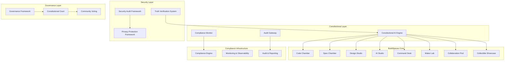

# BuildSpaces Constitutional Compliance Design

## Overview

This design document outlines the comprehensive constitutional and AI development law compliance framework for BuildSpaces. The system implements a multi-layered approach to ensure 95%+ constitutional alignment, absolute No Mock Protocol enforcement, and enterprise-grade security while maintaining the Ubuntu philosophy of collective prosperity.

The design addresses critical violations identified in the current BuildSpaces implementation and establishes the foundation for Citadel-ready deployment of Azora OS.

## Architecture

### High-Level Architecture



### Constitutional AI Engine Architecture

The Constitutional AI Engine serves as the central nervous system for compliance enforcement:

1. **Pre-Action Validation**: All user actions undergo constitutional review before execution
2. **Real-Time Monitoring**: Continuous compliance scoring across all constitutional articles
3. **Automated Remediation**: Intelligent guidance generation for compliance violations
4. **Truth Verification**: Absolute enforcement of No Mock Protocol
5. **Governance Integration**: Constitutional Court and community oversight mechanisms

## Components and Interfaces

### 1. Constitutional AI Engine

**Purpose**: Central constitutional compliance enforcement and monitoring system

**Key Components**:
- `ConstitutionalValidator`: Pre-action compliance validation
- `ComplianceScorer`: Real-time constitutional alignment scoring
- `ViolationDetector`: Automated violation detection and classification
- `RemediationEngine`: Intelligent remediation guidance generation
- `TruthVerifier`: No Mock Protocol enforcement engine

**Interfaces**:
```typescript
interface ConstitutionalAIEngine {
  validateAction(action: UserAction): Promise<ValidationResult>
  calculateComplianceScore(context: SystemContext): Promise<ComplianceScore>
  detectViolations(operation: SystemOperation): Promise<ConstitutionalViolation[]>
  generateRemediation(violations: ConstitutionalViolation[]): Promise<RemediationGuidance[]>
  verifyTruth(implementation: CodeImplementation): Promise<TruthVerificationResult>
}
```

### 2. Security Audit Framework

**Purpose**: Enterprise-grade security monitoring and threat protection

**Key Components**:
- `VulnerabilityScanner`: Continuous security vulnerability assessment
- `ThreatDetector`: Real-time threat detection and response
- `EncryptionManager`: End-to-end encryption for all user data
- `AccessController`: Zero-trust access control implementation
- `IncidentResponder`: Automated security incident response

**Interfaces**:
```typescript
interface SecurityAuditFramework {
  scanVulnerabilities(): Promise<SecurityVulnerability[]>
  detectThreats(context: SecurityContext): Promise<ThreatAssessment>
  encryptData(data: UserData): Promise<EncryptedData>
  controlAccess(request: AccessRequest): Promise<AccessDecision>
  respondToIncident(incident: SecurityIncident): Promise<ResponseAction[]>
}
```

### 3. Privacy Protection Framework

**Purpose**: Constitutional privacy rights enforcement and GDPR compliance

**Key Components**:
- `PrivacyController`: User data control and consent management
- `DataMinimizer`: Minimal data collection enforcement
- `ConsentManager`: Explicit consent tracking and management
- `DataPortabilityEngine`: User data export and deletion capabilities
- `ZeroKnowledgeProver`: Zero-knowledge proof implementation

**Interfaces**:
```typescript
interface PrivacyProtectionFramework {
  manageConsent(userId: string, dataType: DataType): Promise<ConsentStatus>
  minimizeDataCollection(request: DataRequest): Promise<MinimalDataSet>
  exportUserData(userId: string): Promise<UserDataExport>
  deleteUserData(userId: string): Promise<DeletionConfirmation>
  generateZKProof(claim: PrivacyClaim): Promise<ZKProof>
}
```#
## 4. Truth Verification System

**Purpose**: Absolute enforcement of No Mock Protocol and truth validation

**Key Components**:
- `MockDetector`: Automated detection of mock, stub, or placeholder implementations
- `ImplementationValidator`: Production-readiness verification
- `TruthScorer`: Truth alignment scoring for all system claims
- `VerificationEngine`: Multi-layered truth verification mechanisms
- `BlockchainVerifier`: Cryptographic proof validation

**Interfaces**:
```typescript
interface TruthVerificationSystem {
  detectMocks(codebase: Codebase): Promise<MockViolation[]>
  validateImplementation(code: Implementation): Promise<ValidationResult>
  scoreTruth(claim: SystemClaim): Promise<TruthScore>
  verifyWithBlockchain(data: VerifiableData): Promise<BlockchainProof>
  enforceNoMockProtocol(deployment: Deployment): Promise<EnforcementResult>
}
```

### 5. Governance Framework

**Purpose**: Constitutional governance and community oversight implementation

**Key Components**:
- `ConstitutionalCourt`: Dispute resolution and constitutional interpretation
- `CommunityVoting`: Democratic decision-making mechanisms
- `ProposalSystem`: Community proposal submission and review
- `TransparencyEngine`: Full transparency and auditability
- `AccountabilityTracker`: Governance action accountability

**Interfaces**:
```typescript
interface GovernanceFramework {
  submitProposal(proposal: CommunityProposal): Promise<ProposalResult>
  conductVote(vote: CommunityVote): Promise<VoteResult>
  resolveDispute(dispute: ConstitutionalDispute): Promise<DisputeResolution>
  trackAccountability(action: GovernanceAction): Promise<AccountabilityRecord>
  ensureTransparency(operation: SystemOperation): Promise<TransparencyReport>
}
```

### 6. Compliance Engine

**Purpose**: Comprehensive regulatory and legal compliance management

**Key Components**:
- `GDPRCompliance`: European data protection regulation compliance
- `CCPACompliance`: California consumer privacy act compliance
- `SOC2Compliance`: SOC 2 Type II security and availability controls
- `ISO27001Compliance`: Information security management compliance
- `ComplianceReporter`: Automated compliance reporting and certification

**Interfaces**:
```typescript
interface ComplianceEngine {
  validateGDPR(operation: DataOperation): Promise<GDPRComplianceResult>
  validateCCPA(request: DataRequest): Promise<CCPAComplianceResult>
  validateSOC2(controls: SecurityControls): Promise<SOC2ComplianceResult>
  validateISO27001(management: SecurityManagement): Promise<ISO27001ComplianceResult>
  generateComplianceReport(period: ReportingPeriod): Promise<ComplianceReport>
}
```

## Data Models

### Constitutional Compliance Models

```typescript
interface ConstitutionalArticle {
  id: string
  name: string
  description: string
  principles: string[]
  requirements: string[]
  complianceThreshold: number
}

interface ComplianceScore {
  overallScore: number
  articleScores: Record<string, number>
  trend: 'IMPROVING' | 'STABLE' | 'DECLINING'
  lastUpdated: Date
  violations: ConstitutionalViolation[]
}

interface ConstitutionalViolation {
  id: string
  article: ConstitutionalArticle
  principle: string
  severity: 'CRITICAL' | 'HIGH' | 'MEDIUM' | 'LOW'
  description: string
  remediation: string[]
  timestamp: Date
  resolved: boolean
}

interface RemediationGuidance {
  violationId: string
  priority: 'CRITICAL' | 'HIGH' | 'MEDIUM' | 'LOW'
  steps: string[]
  resources: string[]
  estimatedImpact: number
  timeToResolve: number
}
```

### Security and Privacy Models

```typescript
interface SecurityVulnerability {
  id: string
  type: string
  severity: 'CRITICAL' | 'HIGH' | 'MEDIUM' | 'LOW'
  description: string
  affectedComponents: string[]
  remediation: string[]
  cvssScore: number
  discovered: Date
  resolved: boolean
}

interface PrivacyConsent {
  userId: string
  dataType: string
  purpose: string
  granted: boolean
  timestamp: Date
  expiresAt: Date
  withdrawable: boolean
}

interface UserDataExport {
  userId: string
  data: Record<string, any>
  format: 'JSON' | 'CSV' | 'XML'
  encrypted: boolean
  timestamp: Date
  downloadUrl: string
}
```

### Truth Verification Models

```typescript
interface MockViolation {
  id: string
  filePath: string
  lineNumber: number
  type: 'MOCK' | 'STUB' | 'PLACEHOLDER' | 'FAKE_DATA'
  description: string
  severity: 'CRITICAL' | 'HIGH' | 'MEDIUM' | 'LOW'
  remediation: string[]
  detected: Date
}

interface TruthScore {
  claim: string
  score: number
  evidence: string[]
  verificationMethods: string[]
  confidence: number
  timestamp: Date
}

interface BlockchainProof {
  hash: string
  blockNumber: number
  timestamp: Date
  verified: boolean
  network: string
  gasUsed: number
}
```## Error Han
dling

### Constitutional Violation Response

1. **Immediate Detection**: Constitutional AI Engine detects violations in real-time
2. **Automatic Containment**: Violating operations are immediately halted
3. **Violation Classification**: Severity assessment and impact analysis
4. **Remediation Generation**: Automated guidance for resolution
5. **Community Notification**: Transparent reporting to stakeholders
6. **Resolution Tracking**: Progress monitoring until full compliance

### Security Incident Response

1. **Threat Detection**: Real-time security monitoring and alerting
2. **Incident Classification**: Severity and impact assessment
3. **Automatic Response**: Immediate containment and mitigation
4. **Forensic Analysis**: Root cause investigation and evidence collection
5. **Recovery Procedures**: System restoration and hardening
6. **Post-Incident Review**: Lessons learned and process improvement

### Privacy Breach Response

1. **Breach Detection**: Automated privacy violation monitoring
2. **Impact Assessment**: Data exposure and user impact analysis
3. **Regulatory Notification**: GDPR/CCPA compliant breach reporting
4. **User Notification**: Transparent communication to affected users
5. **Remediation Actions**: Data protection and user rights restoration
6. **Compliance Verification**: Regulatory compliance confirmation

### Truth Verification Failures

1. **Mock Detection**: Automated identification of non-production code
2. **Execution Blocking**: Prevention of mock code deployment
3. **Developer Notification**: Clear guidance on No Mock Protocol violations
4. **Alternative Solutions**: Suggestions for production-ready implementations
5. **Verification Requirements**: Proof of real implementation before proceeding
6. **Compliance Tracking**: Monitoring until full No Mock Protocol adherence

## Testing Strategy

### Constitutional Compliance Testing

1. **Automated Compliance Scanning**: Continuous constitutional alignment verification
2. **Violation Simulation**: Controlled testing of violation detection and response
3. **Remediation Validation**: Testing of automated remediation guidance effectiveness
4. **Performance Testing**: Constitutional AI Engine performance under load
5. **Integration Testing**: End-to-end constitutional compliance workflows

### Security Testing

1. **Vulnerability Assessment**: Regular automated security scanning
2. **Penetration Testing**: Simulated attacks and defense validation
3. **Encryption Testing**: End-to-end encryption verification
4. **Access Control Testing**: Zero-trust access control validation
5. **Incident Response Testing**: Security incident response procedure validation

### Privacy Testing

1. **GDPR Compliance Testing**: European data protection regulation adherence
2. **CCPA Compliance Testing**: California privacy law compliance verification
3. **Consent Management Testing**: User consent workflow validation
4. **Data Minimization Testing**: Minimal data collection verification
5. **Zero-Knowledge Proof Testing**: Privacy-preserving proof validation

### Truth Verification Testing

1. **Mock Detection Testing**: Automated mock/stub/placeholder identification
2. **No Mock Protocol Testing**: Absolute enforcement verification
3. **Implementation Validation Testing**: Production-readiness verification
4. **Truth Scoring Testing**: Truth alignment measurement accuracy
5. **Blockchain Verification Testing**: Cryptographic proof validation

### Integration Testing

1. **End-to-End Compliance**: Full constitutional compliance workflow testing
2. **Multi-System Integration**: Cross-component compliance verification
3. **Performance Under Load**: System performance with compliance overhead
4. **Failover Testing**: Compliance maintenance during system failures
5. **Upgrade Testing**: Compliance preservation during system updates

### Monitoring and Observability

1. **Real-Time Dashboards**: Constitutional compliance metrics visualization
2. **Alerting Systems**: Immediate notification of compliance violations
3. **Audit Logging**: Comprehensive audit trail for all compliance activities
4. **Performance Metrics**: System performance impact of compliance measures
5. **Trend Analysis**: Long-term compliance trend monitoring and prediction

### Compliance Reporting

1. **Automated Reports**: Regular compliance status reports
2. **Regulatory Reports**: GDPR, CCPA, SOC 2, ISO 27001 compliance reports
3. **Constitutional Reports**: Constitutional alignment and violation reports
4. **Security Reports**: Security posture and incident reports
5. **Privacy Reports**: Privacy protection and user rights reports

### Continuous Improvement

1. **Feedback Loops**: Community feedback integration for compliance improvement
2. **Machine Learning**: AI-powered compliance optimization
3. **Best Practices**: Industry best practice adoption and implementation
4. **Regulatory Updates**: Automatic adaptation to changing regulations
5. **Constitutional Evolution**: Support for constitutional amendments and updates