# 🤝 Contributing to Azora OS

**Constitutional AI Operating System - Ubuntu Contribution Guide**

*"Ngiyakwazi ngoba sikwazi" - "I can because we can"*

---

## 🌍 Ubuntu Philosophy

Welcome to the Azora OS community! Our contribution philosophy is rooted in **Ubuntu** - the African philosophy that "I am because we are." Every contribution, no matter how small, strengthens our collective mission to build the world's first Constitutional AI Operating System.

```mermaid
graph TB
    subgraph "🌟 Ubuntu Contribution Cycle"
        A[Individual Contribution<br/>👤 Your unique skills] --> B[Community Review<br/>🤝 Collective wisdom]
        B --> C[Knowledge Sharing<br/>📚 Learning together]
        C --> D[Collective Growth<br/>📈 We all benefit]
        D --> E[Enhanced Capability<br/>💪 Stronger system]
        E --> A
    end
    
    style A fill:#3B82F6,stroke:#333,stroke-width:2px
    style B fill:#10B981,stroke:#333,stroke-width:2px
    style C fill:#8B5CF6,stroke:#333,stroke-width:2px
    style D fill:#F59E0B,stroke:#333,stroke-width:2px
    style E fill:#EF4444,stroke:#333,stroke-width:2px
```



---

## 🎯 Ways to Contribute

### 🧠 **Education & Knowledge** - *"My learning becomes our wisdom"*
- **📚 Documentation**: Improve guides, tutorials, and API documentation
- **🎓 Educational Content**: Create learning materials and examples
- **🤖 AI Training**: Contribute to Constitutional AI knowledge base
- **📊 Research**: Share insights on Ubuntu philosophy and AI governance

### 💰 **Financial & Economic** - *"My prosperity enables yours"*
- **⛏️ Mining Algorithms**: Improve Proof-of-Knowledge systems
- **💳 Payment Systems**: Enhance financial transaction security
- **📈 Economic Models**: Contribute to Ubuntu economic theory
- **🪙 Tokenomics**: Help design sustainable AZR economics

### 🔨 **Marketplace & Skills** - *"My work strengthens our foundation"*
- **🎯 Job Matching**: Improve AI-powered skill matching algorithms
- **💼 Career Tools**: Build professional development features
- **🤝 Collaboration**: Create Ubuntu-based teamwork tools
- **⚖️ Dispute Resolution**: Enhance fair arbitration systems

### 🛡️ **Security & Governance** - *"My security ensures our freedom"*
- **🔐 Security Audits**: Review and improve security measures
- **📜 Constitutional AI**: Enhance ethical AI governance
- **🛡️ Threat Detection**: Improve system protection
- **🔍 Compliance**: Ensure regulatory adherence

---

## 🚀 Getting Started

### 1. Ubuntu Environment Setup

#### Prerequisites
```bash
# Ubuntu Development Requirements
Node.js: 20.x LTS
Git: 2.40+
Docker: 24+
PostgreSQL: 15+
Redis: 7+

# Ubuntu Philosophy Understanding
Read: Ubuntu Philosophy Documentation
Watch: Constitutional AI Introduction Videos
Complete: Ubuntu Onboarding Quiz
```

#### Fork & Clone
```bash
# 1. Fork the Ubuntu repository
# Click "Fork" on GitHub: https://github.com/azora-os/azora-os

# 2. Clone your Ubuntu fork
git clone https://github.com/YOUR_USERNAME/azora-os.git
cd azora-os

# 3. Add Ubuntu upstream
git remote add upstream https://github.com/azora-os/azora-os.git

# 4. Verify Ubuntu remotes
git remote -v
```

#### Ubuntu Development Setup
```bash
# 1. Install Ubuntu dependencies
npm install

# 2. Setup Ubuntu environment
cp .env.example .env.development
# Edit .env.development with Ubuntu values

# 3. Initialize Ubuntu database
npm run ubuntu:db:setup

# 4. Start Ubuntu development
npm run ubuntu:dev

# 5. Verify Ubuntu system
npm run ubuntu:health-check
```

### 2. Ubuntu Development Workflow

```mermaid
graph LR
    A[🍴 Fork Repository] --> B[🌿 Create Ubuntu Branch]
    B --> C[💻 Develop with Ubuntu]
    C --> D[🧪 Test Ubuntu Changes]
    D --> E[📝 Document Ubuntu Impact]
    E --> F[🔄 Submit Ubuntu PR]
    F --> G[👥 Community Review]
    G --> H[🎉 Ubuntu Integration]
```



---

## 🌿 Branch Strategy

### Ubuntu Branch Naming Convention
```bash
# Feature branches
ubuntu/feature/description
ubuntu/education/ai-tutor-enhancement
ubuntu/finance/mining-optimization
ubuntu/marketplace/job-matching-ai

# Bug fix branches
ubuntu/fix/description
ubuntu/fix/auth-token-validation
ubuntu/fix/database-connection-pool

# Documentation branches
ubuntu/docs/description
ubuntu/docs/api-reference-update
ubuntu/docs/ubuntu-philosophy-guide
```

### Creating Ubuntu Branches
```bash
# 1. Sync with Ubuntu upstream
git fetch upstream
git checkout main
git merge upstream/main

# 2. Create Ubuntu feature branch
git checkout -b ubuntu/feature/your-amazing-feature

# 3. Develop with Ubuntu principles
# ... make your Ubuntu-aligned changes ...

# 4. Commit Ubuntu changes
git add .
git commit -m "feat(ubuntu): add amazing feature that benefits community

- Implements Ubuntu principle of collective benefit
- Enhances individual capability while strengthening system
- Follows Constitutional AI guidelines
- Includes comprehensive tests and documentation

Ubuntu Impact: This feature enables individual users to achieve X
while contributing Y to the collective knowledge/prosperity/security."
```

---

## 💻 Development Guidelines

### Ubuntu Code Standards

#### 1. Constitutional AI Compliance
```typescript
// ✅ Ubuntu-compliant code example
interface UbuntuService {
  // Individual benefit
  processUserRequest(request: UserRequest): Promise<UserResponse>;
  
  // Collective benefit
  contributeToCollectiveWisdom(insight: Insight): Promise<void>;
  
  // Constitutional compliance
  validateConstitutionalCompliance(action: Action): boolean;
}

class EducationService implements UbuntuService {
  async processUserRequest(request: LearningRequest): Promise<LearningResponse> {
    // Process individual learning
    const personalLearning = await this.processLearning(request);
    
    // Contribute to collective knowledge (Ubuntu principle)
    await this.contributeToCollectiveWisdom({
      topic: request.topic,
      insight: personalLearning.insights,
      anonymized: true
    });
    
    // Validate constitutional compliance
    if (!this.validateConstitutionalCompliance(personalLearning)) {
      throw new ConstitutionalViolationError('Learning violates AI ethics');
    }
    
    return personalLearning;
  }
}
```

#### 2. Ubuntu Documentation Standards
```typescript
/**
 * Ubuntu Function Documentation Template
 * 
 * @description Brief description of what this function does
 * @ubuntu How this function embodies Ubuntu philosophy
 * @individual What benefit this provides to individual users
 * @collective What benefit this provides to the community
 * @constitutional How this maintains Constitutional AI compliance
 * 
 * @param {Type} param - Parameter description
 * @returns {Type} Return value description
 * 
 * @example
 * // Ubuntu usage example
 * const result = await ubuntuFunction(input);
 * 
 * @throws {ConstitutionalViolationError} When action violates AI ethics
 */
async function ubuntuFunction(param: Type): Promise<ReturnType> {
  // Implementation with Ubuntu principles
}
```

#### 3. Ubuntu Testing Standards
```typescript
// Ubuntu test example
describe('Ubuntu Education Service', () => {
  describe('Individual Learning', () => {
    it('should process individual learning request', async () => {
      // Test individual functionality
    });
  });
  
  describe('Collective Contribution', () => {
    it('should contribute insights to collective knowledge', async () => {
      // Test Ubuntu collective benefit
    });
  });
  
  describe('Constitutional Compliance', () => {
    it('should validate constitutional compliance', async () => {
      // Test Constitutional AI adherence
    });
    
    it('should reject unconstitutional actions', async () => {
      // Test ethical boundaries
    });
  });
});
```

### Code Quality Requirements

#### Automated Checks
```bash
# Ubuntu code quality pipeline
npm run ubuntu:lint          # ESLint with Ubuntu rules
npm run ubuntu:format        # Prettier with Ubuntu style
npm run ubuntu:type-check    # TypeScript validation
npm run ubuntu:test          # Jest tests with Ubuntu coverage
npm run ubuntu:security      # Security vulnerability scan
npm run ubuntu:constitutional # Constitutional AI compliance check
```

#### Quality Gates
- **✅ Code Coverage**: Minimum 80% test coverage
- **✅ Ubuntu Compliance**: All functions must follow Ubuntu principles
- **✅ Constitutional Check**: AI ethics validation required
- **✅ Security Scan**: No high/critical vulnerabilities
- **✅ Performance**: No regression in key metrics
- **✅ Documentation**: All public APIs documented

---

## 🧪 Testing Guidelines

### Ubuntu Testing Philosophy
*"My tests protect our collective reliability"*


### Testing Commands
```bash
# Ubuntu test suite
npm run test:ubuntu              # Run all Ubuntu tests
npm run test:unit               # Unit tests only
npm run test:integration        # Integration tests
npm run test:e2e               # End-to-end tests
npm run test:constitutional     # Constitutional AI tests
npm run test:performance       # Performance benchmarks
npm run test:security          # Security tests

# Ubuntu test coverage
npm run test:coverage          # Generate coverage report
npm run test:coverage:ubuntu   # Ubuntu-specific coverage
```

### Writing Ubuntu Tests
```typescript
// Ubuntu test template
import { UbuntuTestSuite } from '@azora/testing';

describe('Ubuntu Feature Tests', () => {
  let ubuntuTestSuite: UbuntuTestSuite;
  
  beforeEach(() => {
    ubuntuTestSuite = new UbuntuTestSuite({
      constitutionalCompliance: true,
      collectiveBenefit: true,
      individualExcellence: true
    });
  });
  
  describe('Individual Functionality', () => {
    it('should provide individual benefit', async () => {
      // Test individual user benefit
      const result = await service.processIndividualRequest(request);
      expect(result.individualBenefit).toBeDefined();
    });
  });
  
  describe('Collective Impact', () => {
    it('should contribute to collective wisdom', async () => {
      // Test Ubuntu collective contribution
      const contribution = await service.getCollectiveContribution();
      expect(contribution.communityBenefit).toBeGreaterThan(0);
    });
  });
  
  describe('Constitutional Compliance', () => {
    it('should maintain AI ethics', async () => {
      // Test Constitutional AI compliance
      const compliance = await ubuntuTestSuite.validateConstitutionalCompliance(action);
      expect(compliance.isCompliant).toBe(true);
    });
  });
});
```

---

## 📝 Documentation Standards

### Ubuntu Documentation Philosophy
*"My documentation becomes our shared knowledge"*

#### Documentation Types
1. **🎓 Educational Documentation**: Learning guides and tutorials
2. **🔧 Technical Documentation**: API references and implementation guides
3. **🤝 Community Documentation**: Contribution guides and Ubuntu philosophy
4. **📊 Governance Documentation**: Constitutional AI policies and procedures

#### Documentation Structure
```markdown
# Ubuntu Document Template

## Overview
Brief description of what this document covers and its Ubuntu significance.

## Ubuntu Philosophy Connection
How this topic relates to Ubuntu principles and Constitutional AI.

## Individual Benefits
What individuals gain from this information.

## Collective Benefits  
How this knowledge strengthens the community.

## Implementation
Step-by-step instructions with Ubuntu considerations.

## Examples
Practical examples demonstrating Ubuntu principles.

## Constitutional Compliance
How to ensure AI ethics and governance requirements.

## Community Impact
Expected positive effects on the Ubuntu community.
```

### API Documentation Standards
```typescript
/**
 * @api {post} /api/ubuntu/learn Submit Learning Achievement
 * @apiName SubmitLearning
 * @apiGroup Ubuntu Education
 * @apiVersion 3.0.0
 * 
 * @apiDescription Submit individual learning achievement that contributes to collective wisdom.
 * This endpoint embodies Ubuntu philosophy by rewarding individual learning while enhancing
 * community knowledge through anonymized insight sharing.
 * 
 * @apiUbuntu Individual learns → Community benefits → Enhanced AI tutoring for all
 * 
 * @apiParam {String} topic Learning topic or subject area
 * @apiParam {Number} progress Learning progress percentage (0-100)
 * @apiParam {Object} insights Key insights gained (anonymized for community)
 * @apiParam {Boolean} shareWithCommunity Consent to share insights (Ubuntu principle)
 * 
 * @apiSuccess {Object} personalReward Individual learning rewards
 * @apiSuccess {Object} communityContribution How this benefits others
 * @apiSuccess {Number} ubuntuMultiplier Community benefit multiplier applied
 * 
 * @apiExample {curl} Ubuntu Learning Submission:
 * curl -X POST http://localhost:4000/api/ubuntu/learn \
 *   -H "Content-Type: application/json" \
 *   -H "Authorization: Bearer ubuntu_token" \
 *   -d '{
 *     "topic": "Constitutional AI Ethics",
 *     "progress": 85,
 *     "insights": {
 *       "keyLearning": "AI governance requires human oversight",
 *       "practicalApplication": "Implemented ethical decision trees"
 *     },
 *     "shareWithCommunity": true
 *   }'
 * 
 * @apiSuccessExample {json} Ubuntu Success Response:
 * {
 *   "success": true,
 *   "personalReward": {
 *     "azrEarned": 25.5,
 *     "knowledgePoints": 100,
 *     "certificateProgress": 85
 *   },
 *   "communityContribution": {
 *     "wisdomShared": true,
 *     "beneficiaries": 1247,
 *     "collectiveKnowledgeGrowth": 0.02
 *   },
 *   "ubuntuMultiplier": 1.15,
 *   "message": "Your learning strengthens our collective wisdom"
 * }
 */
```

---

## 🔄 Pull Request Process

### Ubuntu Pull Request Template
```markdown
## Ubuntu Pull Request

### Description
Brief description of changes and their Ubuntu significance.

### Ubuntu Philosophy Alignment
- [ ] **Individual Excellence**: Changes improve individual user experience
- [ ] **Collective Benefit**: Changes strengthen community capabilities  
- [ ] **Constitutional Compliance**: Changes maintain AI ethics and governance
- [ ] **Shared Prosperity**: Changes contribute to collective growth

### Type of Change
- [ ] 🧠 Education enhancement (learning, knowledge, wisdom)
- [ ] 💰 Financial improvement (prosperity, rewards, economics)
- [ ] 🔨 Marketplace feature (skills, jobs, collaboration)
- [ ] 🛡️ Security/governance (protection, compliance, ethics)
- [ ] 📚 Documentation (knowledge sharing, guides)
- [ ] 🐛 Bug fix (system reliability, user experience)

### Ubuntu Impact Assessment
#### Individual Benefits
- What specific benefits do individual users gain?
- How does this improve personal experience/capability?

#### Collective Benefits  
- How does this strengthen the community?
- What shared value is created?

#### Constitutional Compliance
- How does this maintain AI ethics?
- What governance considerations were addressed?

### Testing
- [ ] Unit tests pass (`npm run test:unit`)
- [ ] Integration tests pass (`npm run test:integration`)
- [ ] Constitutional compliance verified (`npm run test:constitutional`)
- [ ] Ubuntu principles validated (`npm run test:ubuntu`)
- [ ] Performance benchmarks met (`npm run test:performance`)

### Documentation
- [ ] Code comments follow Ubuntu standards
- [ ] API documentation updated (if applicable)
- [ ] Ubuntu philosophy connections explained
- [ ] Community impact documented

### Checklist
- [ ] Code follows Ubuntu style guidelines
- [ ] Self-review completed with Ubuntu lens
- [ ] Constitutional AI compliance verified
- [ ] Breaking changes documented
- [ ] Community benefits clearly articulated

### Screenshots/Examples
Include screenshots, code examples, or other evidence of Ubuntu impact.

### Community Review Requests
Tag specific community members for Ubuntu-focused review:
- @ubuntu-education-team (for learning-related changes)
- @ubuntu-finance-team (for economic/financial changes)  
- @ubuntu-marketplace-team (for skills/job-related changes)
- @ubuntu-governance-team (for constitutional/security changes)
```

### Pull Request Workflow


---

## 👥 Community Guidelines

### Ubuntu Community Values

#### 🤝 **Respect & Inclusion**
- **Welcome All**: Every contributor brings unique value to Ubuntu
- **Cultural Sensitivity**: Honor diverse perspectives and backgrounds
- **Constructive Feedback**: Focus on improving collective capability
- **Patient Teaching**: Share knowledge generously with newcomers

#### 🌱 **Growth & Learning**
- **Continuous Improvement**: Always seek to enhance Ubuntu understanding
- **Knowledge Sharing**: Document learnings for community benefit
- **Mentorship**: Support others in their Ubuntu journey
- **Experimentation**: Encourage innovative approaches to Ubuntu principles

#### 🛡️ **Integrity & Ethics**
- **Constitutional Compliance**: Maintain AI ethics in all contributions
- **Transparency**: Be open about motivations and potential conflicts
- **Accountability**: Take responsibility for Ubuntu impact of contributions
- **Security Mindedness**: Protect community through secure practices

### Communication Channels

#### 🗨️ **Discord Community**
- **#ubuntu-general**: General Ubuntu philosophy discussions
- **#ubuntu-education**: Learning and knowledge sharing
- **#ubuntu-finance**: Economic and financial discussions
- **#ubuntu-marketplace**: Skills and job-related topics
- **#ubuntu-governance**: Constitutional AI and ethics
- **#ubuntu-contributors**: Contributor coordination and support

#### 📧 **Mailing Lists**
- **ubuntu-dev@azora.com**: Development discussions
- **ubuntu-governance@azora.com**: Constitutional AI governance
- **ubuntu-community@azora.com**: Community announcements

#### 🐙 **GitHub Discussions**
- **Ideas**: Propose new Ubuntu features and improvements
- **Q&A**: Ask questions about Ubuntu implementation
- **Show and Tell**: Share Ubuntu success stories
- **Governance**: Discuss Constitutional AI policies

### Code of Conduct

#### Ubuntu Behavioral Standards
1. **🤝 Collaborative Spirit**: Work together for collective benefit
2. **🌍 Global Perspective**: Consider impact on worldwide Ubuntu community
3. **📚 Knowledge Sharing**: Freely share insights and learnings
4. **🛡️ Protective Stance**: Safeguard community from harm
5. **🌱 Growth Mindset**: Embrace learning and improvement opportunities

#### Unacceptable Behavior
- **Individual Supremacy**: Prioritizing personal gain over collective benefit
- **Knowledge Hoarding**: Withholding information that could help community
- **Constitutional Violations**: Actions that violate AI ethics or governance
- **Discriminatory Behavior**: Exclusion based on identity or background
- **Destructive Actions**: Intentionally harming community or individuals

#### Enforcement
Ubuntu community self-governs through:
1. **Peer Feedback**: Community members provide gentle correction
2. **Mentorship**: Experienced contributors guide newcomers
3. **Mediation**: Ubuntu governance team facilitates resolution
4. **Constitutional Review**: AI ethics board evaluates serious violations
5. **Community Decision**: Collective determination of consequences

---

## 🏆 Recognition & Rewards

### Ubuntu Contribution Recognition

#### 🌟 **Ubuntu Badges**
- **🎓 Knowledge Sharer**: Significant documentation contributions
- **💰 Prosperity Builder**: Financial system improvements
- **🔨 Skill Connector**: Marketplace enhancements
- **🛡️ Community Protector**: Security and governance contributions
- **🌍 Ubuntu Ambassador**: Outstanding community leadership

#### 💎 **Azora Gem Rewards**
Contributors earn AZR tokens based on Ubuntu impact:

```mermaid
graph TB
    subgraph "💎 Ubuntu Contribution Rewards"
        A[Individual Contribution<br/>👤 Personal effort] --> B[Ubuntu Multiplier<br/>🔄 Community benefit factor]
        B --> C[AZR Reward<br/>💰 Token compensation]
        
        subgraph "🎯 Reward Categories"
            D[Code Contribution<br/>💻 10-100 AZR]
            E[Documentation<br/>📚 5-50 AZR]
            F[Community Support<br/>🤝 5-25 AZR]
            G[Security Research<br/>🛡️ 25-500 AZR]
        end
        
        C --> D
        C --> E
        C --> F
        C --> G
    end
```



#### 🏅 **Ubuntu Hall of Fame**
Annual recognition for outstanding Ubuntu contributors:
- **Ubuntu Philosopher**: Best embodiment of Ubuntu principles
- **Constitutional Guardian**: Outstanding AI ethics contributions
- **Community Builder**: Exceptional community growth and support
- **Innovation Leader**: Breakthrough technical contributions
- **Global Ambassador**: International Ubuntu community development

---

## 📚 Resources & Learning

### Ubuntu Learning Path

#### 1. **Foundation Level** 🌱
- [ ] Read Ubuntu Philosophy documentation
- [ ] Complete Constitutional AI basics course
- [ ] Set up development environment
- [ ] Make first documentation contribution
- [ ] Join Ubuntu Discord community

#### 2. **Contributor Level** 🌿
- [ ] Submit first code contribution
- [ ] Participate in code review process
- [ ] Help newcomers in community channels
- [ ] Contribute to Ubuntu testing suite
- [ ] Attend Ubuntu community meetings

#### 3. **Ubuntu Advocate Level** 🌳
- [ ] Lead Ubuntu feature development
- [ ] Mentor new contributors
- [ ] Speak at Ubuntu community events
- [ ] Contribute to Constitutional AI governance
- [ ] Build Ubuntu partnerships

#### 4. **Ubuntu Leader Level** 🌲
- [ ] Guide Ubuntu strategic direction
- [ ] Represent Ubuntu at conferences
- [ ] Develop Ubuntu educational content
- [ ] Foster global Ubuntu communities
- [ ] Shape Constitutional AI evolution

### Essential Reading
- **[Ubuntu Philosophy Guide](./docs/UBUNTU-PHILOSOPHY.md)** - Deep dive into Ubuntu principles
- **[Constitutional AI Framework](./docs/CONSTITUTIONAL-AI.md)** - AI ethics and governance
- **[Azora Identity System](./AZORA-IDENTITY.md)** - Brand and cultural foundation
- **[Architecture Guide](./docs/ARCHITECTURE.md)** - Technical system design
- **[Security Guidelines](./docs/SECURITY.md)** - Protection and compliance

### Development Resources
- **[API Documentation](./docs/api/)** - Complete API reference
- **[Component Library](./docs/ui/)** - UI components and design system
- **[Testing Guide](./docs/testing/)** - Ubuntu testing methodologies
- **[Deployment Guide](./docs/DEPLOYMENT-GUIDE.md)** - Production deployment
- **[Troubleshooting](./docs/troubleshooting/)** - Common issues and solutions

---

## 🎉 Getting Help

### Ubuntu Support Channels

#### 🆘 **Immediate Help**
- **Discord #ubuntu-help**: Real-time community support
- **GitHub Issues**: Bug reports and feature requests
- **Stack Overflow**: Tag questions with `azora-os` and `ubuntu`

#### 📚 **Learning Support**
- **Ubuntu Mentorship Program**: Paired learning with experienced contributors
- **Weekly Office Hours**: Live Q&A sessions with Ubuntu team
- **Community Workshops**: Hands-on learning sessions

#### 🔧 **Technical Support**
- **Developer Documentation**: Comprehensive technical guides
- **Video Tutorials**: Step-by-step Ubuntu development guides
- **Code Examples**: Real-world Ubuntu implementation patterns

### Contribution Support
- **Contribution Planning**: Help designing Ubuntu-aligned contributions
- **Code Review Support**: Guidance on Ubuntu code standards
- **Testing Assistance**: Help writing Ubuntu-compliant tests
- **Documentation Review**: Feedback on Ubuntu documentation

---

## 🌟 Thank You

### Ubuntu Gratitude

Thank you for considering contributing to Azora OS! Your participation in our Ubuntu community helps build the world's first Constitutional AI Operating System. Every contribution, whether code, documentation, testing, or community support, strengthens our collective capability to create technology that serves humanity.

Remember: **"Ngiyakwazi ngoba sikwazi" - "I can because we can"**

Your individual excellence contributes to our collective prosperity. Your unique perspective and skills are valuable to our Ubuntu community. Together, we're building not just software, but a new model for how technology can embody human values and create shared prosperity.

### Ubuntu Community Promise

We commit to:
- **🤝 Supporting your Ubuntu journey** with mentorship and resources
- **🌱 Growing together** through shared learning and collaboration  
- **🛡️ Protecting our community** through Constitutional AI governance
- **🌍 Building global Ubuntu** that serves all humanity
- **💎 Sharing prosperity** through fair recognition and rewards

Welcome to the Ubuntu family. Let's build the future together! 🚀

---

**"Through Ubuntu, we multiply sovereignty. Through learning, we generate abundance. Through sharing, we amplify freedom."**

*Join us in building Constitutional AI that serves humanity.*