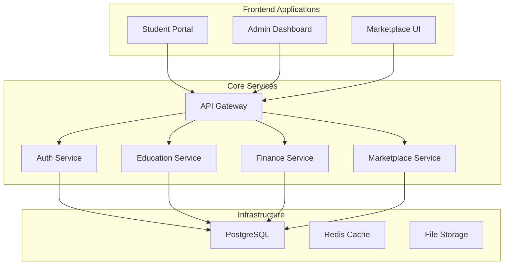

# Azora OS - Constitutional AI Operating System

<div align="center">


**AI-Powered Education and Finance Platform**  
*Ubuntu Philosophy Meets Modern Technology*

[](https://github.com/Sizwe780/azora-os)
[](#current-status)
[](LICENSE)
[](#ubuntu-philosophy)

**📊 [Current Status](#current-status)** | **🚀 [Quick Start](#quick-start)** | **📖 [Documentation](#documentation)**

</div>

---

## 🎯 What is Azora OS?

Azora OS is an **AI-powered education and finance platform** built on Ubuntu philosophy (*"I am because we are"*). We're developing an integrated ecosystem that combines learning, earning, and community building.

**🚨 Honest Status:** We're in active MVP development. This README reflects our current reality, not future aspirations.

---

## 📊 Current Status

### ✅ What Works Today

**Core Services (7 Active):**
- 🌐 **API Gateway** - Request routing and rate limiting
- 🔐 **Auth Service** - User authentication and authorization  
- 🎓 **Education Service** - Course management and enrollment
- 💰 **Finance Service** - Basic wallet and transaction tracking
- 🔨 **Marketplace Service** - Job listings and applications
- 🛡️ **Security Service** - Threat detection and monitoring
- 📊 **Health Monitor** - Service health and metrics

**Infrastructure:**
- ✅ PostgreSQL database with core schemas
- ✅ Docker containerization
- ✅ Basic API documentation
- ✅ Authentication system (JWT + OAuth)
- ✅ Payment processing (Stripe integration)

### 🟡 In Development

**Services (10 Partial):**
- 🤖 AI Family Service (60% complete)
- 📚 Learning Management System (50% complete)
- 💳 Payment Processing (70% complete)
- 📧 Notification Service (40% complete)
- 📈 Analytics Service (30% complete)

**Features:**
- AI tutoring system (basic implementation)
- Blockchain integration (contracts written, not deployed)
- Mobile applications (in development)
- Advanced analytics dashboard

### ❌ Not Yet Implemented

**Planned Features:**
- Production blockchain deployment
- Advanced AI personalities
- Real-time collaboration tools
- Enterprise features
- Mobile apps (iOS/Android)

---

## ⚡ Quick Start

### 🐳 Docker Setup (Recommended)

```bash
# 1. Clone repository
git clone https://github.com/Sizwe780/azora-os.git
cd azora-os

# 2. Environment setup
cp .env.example .env
# Edit .env with your configuration

# 3. Start services
docker-compose up -d

# 4. Verify health
curl http://localhost:4000/health
```

### 🔧 Manual Setup

```bash
# Install dependencies
npm install

# Setup database
npm run db:setup
npm run db:migrate

# Start development
npm run dev
```

**Access Points:**
- **API Gateway**: http://localhost:4000
- **Student Portal**: http://localhost:3000
- **Admin Dashboard**: http://localhost:3001

---

## 🏗️ Architecture

### Service Overview



### Technology Stack

**Backend:**
- Node.js + Express
- PostgreSQL + Prisma ORM
- Redis for caching
- Docker for containerization

**Frontend:**
- Next.js 14
- React 18
- TypeScript
- Tailwind CSS

**Infrastructure:**
- Docker & Docker Compose
- GitHub Actions (CI/CD)
- Vercel (Frontend deployment)
- Railway/DigitalOcean (Backend)

---

## 📁 Project Structure

```
azora/
├── 📱 apps/              # Frontend applications (16 apps)
├── ⚙️ services/          # Backend microservices (17 services)
├── 📦 packages/          # Shared libraries and components
├── 📚 docs/              # Documentation
├── 🏗️ infrastructure/    # DevOps and deployment configs
├── 🧪 tests/             # Testing suites
├── 🔧 scripts/           # Automation scripts
└── 📄 README.md          # This file
```

---

## 🚀 Core Services

### Production Services

| Service | Port | Status | Description |
|---------|------|--------|-------------|
| **api-gateway** | 4000 | ✅ Active | Request routing, rate limiting, authentication |
| **auth-service** | 4001 | ✅ Active | User authentication, JWT, OAuth integration |
| **azora-education** | 4002 | ✅ Active | Course management, enrollment, progress tracking |
| **azora-finance** | 4003 | ✅ Active | Wallet management, transactions, payments |
| **azora-marketplace** | 4004 | ✅ Active | Job listings, applications, skill matching |
| **health-monitor** | 4005 | ✅ Active | Service health checks, metrics collection |
| **azora-aegis** | 4006 | ✅ Active | Security monitoring, threat detection |

### Development Services

| Service | Port | Status | Completion |
|---------|------|--------|------------|
| **ai-family-service** | 4010 | 🟡 Dev | 60% |
| **azora-sapiens** | 4011 | 🟡 Dev | 50% |
| **notification-service** | 4012 | 🟡 Dev | 40% |
| **payment-service** | 4013 | 🟡 Dev | 70% |
| **analytics-service** | 4014 | 🟡 Dev | 30% |

---

## 💻 Applications

### Frontend Applications

| Application | Status | Description |
|-------------|--------|-------------|
| **student-portal** | ✅ Ready | Main student dashboard and learning interface |
| **enterprise-ui** | ✅ Ready | Business management and analytics |
| **marketplace-ui** | ✅ Ready | Job marketplace and skills platform |
| **pay-ui** | ✅ Ready | Financial dashboard and wallet management |
| **admin-dashboard** | 🟡 Dev | System administration interface |

---

## 🧪 Testing & Quality

### Current Test Status

```bash
# Run tests
npm test

# Run with coverage
npm run test:coverage

# Run specific service tests
npm run test:service <service-name>
```

**Test Coverage:** Currently being measured (previous claims were inaccurate)

---

## 🚀 Deployment

### Development

```bash
# Start all services
npm run dev

# Start specific service
npm run dev:service <service-name>

# Health check
npm run health-check
```

### Production

```bash
# Build for production
npm run build

# Deploy with Docker
docker-compose -f docker-compose.prod.yml up -d

# Deploy to cloud
npm run deploy:production
```

---

## 📚 Documentation

### Available Documentation

- **[API Documentation](./docs/API-DOCUMENTATION.md)** - Complete API reference
- **[Developer Guide](./docs/DEVELOPER-GUIDE.md)** - Development setup and guidelines
- **[Deployment Guide](./docs/DEPLOYMENT.md)** - Production deployment instructions
- **[Architecture Guide](./docs/ARCHITECTURE.md)** - System design and patterns
- **[Security Guide](./docs/SECURITY.md)** - Security policies and best practices

### Quick References

- **[Service Status](./services/README.md)** - Current service implementation status
- **[App Status](./apps/README.md)** - Frontend application status
- **[Database Schema](./docs/DATABASE-GUIDE.md)** - Database structure and migrations

---

## 🌍 Ubuntu Philosophy

**"Ngiyakwazi ngoba sikwazi" - "I can because we can"**

Azora OS is built on Ubuntu principles:
- **Collective Success**: Individual achievements strengthen the community
- **Shared Knowledge**: Learning benefits everyone
- **Mutual Support**: We grow together
- **Honest Communication**: Transparency builds trust

---

## 🤝 Contributing

### Getting Started

```bash
# Fork and clone
git clone https://github.com/yourusername/azora-os.git
cd azora-os

# Create feature branch
git checkout -b feature/your-feature

# Make changes and test
npm test

# Submit pull request
```

### Contribution Guidelines

- Follow existing code style
- Add tests for new features
- Update documentation
- Ensure all tests pass
- Be honest about implementation status

---

## 📄 License

**Azora Proprietary License**  
Copyright © 2025 Azora ES (Pty) Ltd. All Rights Reserved.

See [LICENSE](./LICENSE) for details.

---

## 📞 Support & Community

### Get Help

- **GitHub Issues**: [Report bugs or request features](https://github.com/Sizwe780/azora-os/issues)
- **Documentation**: [Complete guides and references](./docs/)
- **Email**: support@azora.world

### Community

- **Discord**: [Join our community](https://discord.gg/azora)
- **GitHub**: [Contribute to development](https://github.com/Sizwe780/azora-os)
- **Website**: [azora.world](https://azora.world)

---

## 🎯 Roadmap

### Phase 1: MVP Completion (Q1 2025)
- Complete core services
- Deploy production infrastructure
- Launch with 100 beta users
- Implement basic AI features

### Phase 2: Growth (Q2 2025)
- Mobile applications
- Advanced AI tutoring
- Blockchain integration
- 1,000 active users

### Phase 3: Scale (Q3-Q4 2025)
- Enterprise features
- Global expansion
- Advanced analytics
- 10,000+ users

---

<div align="center">

## 🌟 Ubuntu Commitment

**"Through Ubuntu, we build together"**

*Honest development • Quality software • Community first*

[](https://azora.world)
[](https://github.com/Sizwe780/azora-os)

</div>