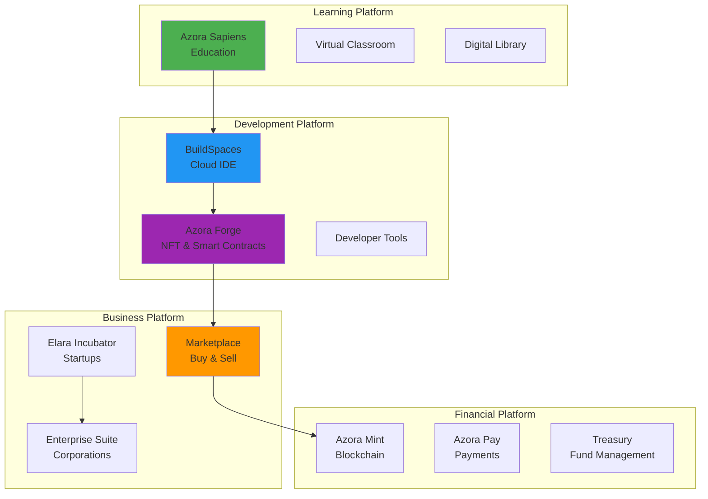
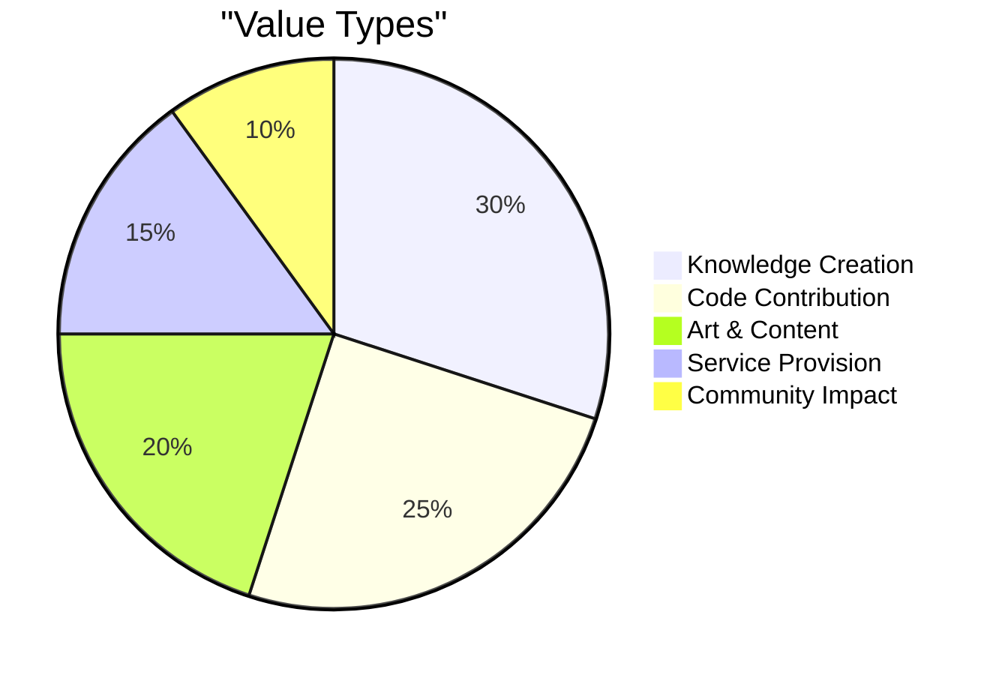

# Azora - The Future of Learning, Building & Earning

> **Constitutional AI • Blockchain-Powered • Antifragile • Ubuntu Economics**

*"Ngiyakwazi ngoba sikwazi - I can because we can"*

---

[](LICENSE)
[](#)
[](#platforms)

## 🌟 What is Azora?

**Azora** is a revolutionary ecosystem that combines **education**, **development tools**, and **economic opportunity** into one seamless platform. Whether you're a student, developer, entrepreneur, or enterprise, Azora provides the tools and infrastructure to learn, build, and earn - all powered by Constitutional AI and blockchain technology.

## 🎯 What We Offer

### For Students & Learners


#### 🎓 Azora Sapiens - Your AI-Powered University
- **K-12 to PhD Programs**: Complete educational pathways
- **AI Tutors**: Personalized learning with ELARA, KOFI, ZURI, and NIA
- **Interactive Courses**: Hands-on learning with real projects
- **Certifications**: Blockchain-verified credentials
- **Research Tools**: Advanced research center for scholars

**Perfect for:**
- Students seeking quality education
- Lifelong learners
- Researchers and academics
- Career changers

### For Developers & Creators

#### 💻 Azora BuildSpaces - Your Development Powerhouse
- **Cloud IDE**: Code anywhere, anytime
- **AI Pair Programming**: Get help from specialized AI agents
- **Deployment Tools**: One-click deployment to production
- **Version Control**: Integrated Git workflows
- **Collaboration**: Real-time team coding

#### 🎨 Azora Forge - Create & Monetize
- **NFT Minting**: Turn your work into valuable assets
- **Smart Contracts**: Deploy without coding
- **Marketplace**: Sell your creations
- **Royalty Tracking**: Automatic attribution and payments

**Perfect for:**
- Software developers
- Digital artists
- Content creators
- Indie hackers

### For Entrepreneurs & Startups

#### 🚀 Elara Incubator - Launch Your Startup
- **Funding Opportunities**: Access to CitadelFund
- **Mentorship**: AI and human mentors
- **Resources**: Development tools and infrastructure
- **Network**: Connect with investors and partners
- **Legal Support**: Smart contract templates

#### 💼 Azora Marketplace - Sell Your Services
- **Project Bidding**: Find clients and projects
- **Escrow Services**: Secure payments
- **Reputation System**: Build your brand
- **Global Reach**: Access worldwide clients

**Perfect for:**
- Startup founders
- Freelancers
- Consultants
- Service providers

### For Enterprises

#### 🏢 Azora Enterprise Suite
- **Corporate Learning**: Train your workforce
- **Custom Solutions**: Tailored to your needs
- **ERP Integration**: Seamless business operations
- **Compliance Tools**: Constitutional AI governance
- **Analytics Dashboard**: Real-time insights

#### 🔐 Enterprise Security
- **Constitutional AI**: Ethical guardrails
- **Audit Trails**: Complete transparency
- **Data Privacy**: GDPR compliant
- **Antifragile Infrastructure**: 99.9% uptime

**Perfect for:**
- Large corporations
- Government agencies
- Educational institutions
- Healthcare organizations

## 📊 Platform Overview

### Our Products



### Value Proposition by User Type

| User Type | Primary Benefit | Key Features | Pricing |
|-----------|----------------|--------------|---------|
| **Students** | Quality education | AI tutors, certifications, research tools | Free - $49/mo |
| **Developers** | Build faster | Cloud IDE, AI assistance, deployment | $29 - $99/mo |
| **Creators** | Monetize work | NFT minting, marketplace, royalties | 10% commission |
| **Startups** | Launch & grow | Funding, mentorship, tools | $199 - $999/mo |
| **Enterprises** | Scale operations | Custom solutions, compliance, analytics | Custom pricing |

## 🎨 Our Applications

### Web Applications
- **Azora Sapiens** - AI-powered learning platform
- **Azora BuildSpaces** - Cloud development environment
- **Azora Forge** - NFT and smart contract creator
- **Azora Marketplace** - Buy and sell digital goods
- **Elara Incubator** - Startup accelerator
- **Azora Enterprise** - Corporate solutions

### Mobile Applications
- **Azora Mobile** - Learn on the go (iOS & Android)
- **Azora Wallet** - Manage your tokens and NFTs

### Desktop Applications
- **AzStudio** - Professional IDE for power users
- **Azrome Browser** - Privacy-focused web browser

## 💎 The Four Pillars

### 1. 🧠 Constitutional AI
**What it means for you:**
- Ethical AI that respects your privacy
- Transparent decision-making
- Fair and unbiased outcomes
- Accountability in every action

### 2. 📜 Auditable Ledger
**What it means for you:**
- Immutable proof of your achievements
- Automatic attribution and royalties
- Complete transparency
- Verifiable credentials

### 3. 🔥 Antifragile Infrastructure
**What it means for you:**
- 99.9% uptime guarantee
- Automatic recovery from failures
- Offline-first capabilities
- Your work is always safe

### 4. 🤝 Ubuntu Tokenomics
**What it means for you:**
- Earn tokens for creating value
- Fair compensation for your work
- 10% of revenue to public goods (CitadelFund)
- Community-first economics

## 💰 How You Earn with Azora

### Proof-of-Value Mining

Earn **AZR tokens** by creating value:



**Ways to Earn:**
1. **Create Courses** - Share your knowledge
2. **Develop Tools** - Build useful applications
3. **Create Art** - Mint and sell NFTs
4. **Provide Services** - Freelance on marketplace
5. **Contribute Code** - Open source contributions
6. **Mentor Others** - Help the community grow

### CitadelFund
**10% of all platform revenue** goes to public goods:
- Scholarships for students
- Open source development
- Community projects
- Social impact initiatives

**You benefit** even when others succeed - true Ubuntu economics.

## 🚀 Getting Started

### For Students
1. **Sign up** at [azora.world](https://azora.world)
2. **Choose your path** (K-12, University, PhD)
3. **Start learning** with AI tutors
4. **Earn certificates** on blockchain

### For Developers
1. **Create account** and access BuildSpaces
2. **Start coding** with AI pair programming
3. **Deploy projects** with one click
4. **Earn tokens** for contributions

### For Entrepreneurs
1. **Apply to Elara Incubator**
2. **Get funding** from CitadelFund
3. **Build your product** with our tools
4. **Launch** on Azora Marketplace

### For Enterprises
1. **Contact sales** at enterprise@azora.world
2. **Get custom demo** of Enterprise Suite
3. **Pilot program** with your team
4. **Full deployment** and training

## 🌍 Our Vision

### Building the Future
Azora is creating an ecosystem where learning, building, and earning come together seamlessly. We're just getting started, and we invite you to join us on this journey.

### Join Early
Be part of building the future of education, development, and economic opportunity. Early adopters will shape the platform and benefit from our growth.

## 🎯 Why Choose Azora?

### vs Traditional Education
- ✅ **Affordable**: 10x cheaper than traditional university
- ✅ **Flexible**: Learn at your own pace
- ✅ **Practical**: Real-world projects, not just theory
- ✅ **Verified**: Blockchain credentials employers trust

### vs Other Platforms
- ✅ **All-in-One**: Learn, build, and earn in one place
- ✅ **AI-Powered**: Personalized experience with AI tutors
- ✅ **Fair Economics**: Earn tokens for your contributions
- ✅ **Ethical**: Constitutional AI ensures fairness

### vs Building Alone
- ✅ **Infrastructure**: Don't reinvent the wheel
- ✅ **Community**: Learn from and collaborate with others
- ✅ **Monetization**: Built-in ways to earn
- ✅ **Support**: AI and human mentorship

## 📱 Platforms

- **Web**: [azora.world](https://azora.world)
- **iOS**: Coming Q1 2026
- **Android**: Coming Q1 2026
- **Desktop**: Windows, macOS, Linux

## 🤝 Join the Movement

### For Individuals
- [Sign Up](https://azora.world/signup) - Start learning or building
- [Explore Courses](https://azora.world/courses) - Browse our catalog
- [Join Community](https://discord.gg/azora) - Connect with others

### For Businesses
- [Enterprise Demo](https://azora.world/enterprise) - See it in action
- [Partner Program](https://azora.world/partners) - Collaborate with us
- [Contact Sales](mailto:enterprise@azora.world) - Custom solutions

## 📚 Resources

- [Documentation](docs/) - Technical guides
- [API Reference](docs/API-DOCUMENTATION.md) - For developers
- [Help Center](https://help.azora.world) - FAQs and support
- [Blog](https://blog.azora.world) - Latest updates
- [Community Forum](https://community.azora.world) - Discussions

## 📄 Legal & Security

- [License](LICENSE) - Usage terms
- [Privacy Policy](https://azora.world/privacy) - How we protect your data
- [Terms of Service](https://azora.world/terms) - Platform rules
- [IP Protection](docs/IP-PROTECTION.md) - Our intellectual property

## 📞 Contact Us

- **General**: info@azora.world
- **Support**: support@azora.world
- **Sales**: enterprise@azora.world
- **Press**: press@azora.world

**Social Media:**
- Twitter: [@AzoraWorld](https://twitter.com/azoraworld)
- LinkedIn: [Azora ES](https://linkedin.com/company/azora)
- Discord: [Join Community](https://discord.gg/azora)

---

<div align="center">

## 🌟 Start Your Journey Today

**Learn • Build • Earn**

[Get Started Free](https://azora.world/signup) | [Book a Demo](https://azora.world/demo) | [View Pricing](https://azora.world/pricing)

---

**Built with Ubuntu Philosophy**

*"My success enables your success"*

**Azora ES (Pty) Ltd** | Building the Future of Learning & Work

[](#)
[](#)
[](#)

**Copyright © 2025 Azora ES (Pty) Ltd. All Rights Reserved.**

## 🗂 Monorepo & Turborepo

This repository is organized as a monorepo using npm workspaces and Turborepo. If you are a developer working locally, please follow the quick setup steps in `docs/TURBO-SETUP.md` to install dependencies and run parallel builds and tests.

For a fast multi-package dev loop, use:

```powershell
npm ci
npm run dev
```

For CI or full builds:

```powershell
npm ci
npm run build
```

</div>