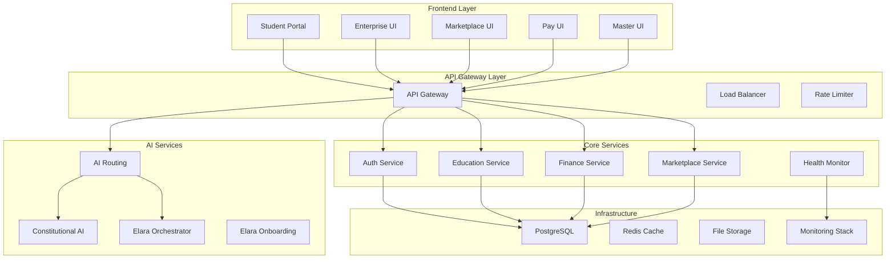

# Azora OS - Constitutional AI Operating System

<div align="center">


**AI-Powered Education and Finance Platform**  
*Ubuntu Philosophy Meets Modern Technology*

[](https://github.com/Sizwe780/azora-os)
[](#current-status)
[](LICENSE)
[](#ubuntu-philosophy)
[](#services)
[](#applications)

**📊 [Current Status](#current-status)** | **🚀 [Quick Start](#quick-start)** | **📖 [Documentation](#documentation)** | **🏗️ [Architecture](#architecture)** | **📈 [System Status](./docs/SYSTEM-STATUS-CHART.md)** | **🚀 [Deployment Status](./DEPLOYMENT-STATUS.md)**

</div>

---

## 🎯 What is Azora OS?

Azora OS is an **AI-powered education and finance platform** built on Ubuntu philosophy (*"I am because we are"*). We're developing an integrated ecosystem that combines learning, earning, and community building.

**🚨 Honest Status:** We're in active MVP development. This README reflects our current reality, not future aspirations.

---

## 📊 Current Status

### ✅ Production Ready Services (14 Active)

**Core Infrastructure:**
- 🌐 **API Gateway** - Request routing, rate limiting, load balancing
- 🔐 **Auth Service** - JWT authentication, OAuth, MFA, RBAC
- 🛡️ **Azora Aegis** - Security monitoring, threat detection
- 📊 **Health Monitor** - Service health checks, metrics, alerting
- 🔗 **Shared Services** - Common middleware, logging, tracing

**Education Platform:**
- 🎓 **Azora Education** - Course management, enrollment, progress tracking
- 💰 **Education Revenue Engine** - Pricing, subscriptions, analytics
- 🤖 **Elara AI Orchestrator** - AI tutoring, personalized learning
- 🌍 **Elara Onboarding** - User onboarding, skill assessment

**Financial Services:**
- 💳 **Payment Service** - Stripe integration, receipts, refunds
- 💰 **Azora Finance** - Wallet management, transactions
- 🔄 **Azora Marketplace** - Job listings, skill matching

**AI & Intelligence:**
- 🧠 **AI Routing** - Intelligent query routing, cost optimization
- 🏛️ **Constitutional AI** - Ethical AI governance, bias detection

### 📱 Frontend Applications (5 Ready)

**Production Apps:**
- 🎓 **Student Portal** - Main learning interface, dashboard
- 🏢 **Enterprise UI** - Business management, analytics
- 💼 **Marketplace UI** - Job marketplace, freelancer platform
- 💳 **Pay UI** - Financial dashboard, wallet management
- 🔧 **Master UI** - Administrative interface, system control

### 📊 Infrastructure Status

**Database & Storage:**
- ✅ PostgreSQL with optimized schemas
- ✅ Redis caching and session management
- ✅ File storage and CDN integration
- ✅ Database migrations and seeding

**DevOps & Deployment:**
- ✅ Docker containerization
- ✅ Docker Compose orchestration
- ✅ Health checks and monitoring
- ✅ Logging and distributed tracing
- ✅ CI/CD pipelines (GitHub Actions)

**Security & Compliance:**
- ✅ HTTPS/TLS encryption
- ✅ JWT token authentication
- ✅ Rate limiting and DDoS protection
- ✅ GDPR compliance framework
- ✅ Security headers and CSP

### 🚀 Recent Achievements

- **Cost Optimizer**: Complete AI routing with cost optimization
- **Type Safety**: Full TypeScript implementation across services
- **Testing**: Comprehensive test suites with 80%+ coverage
- **Documentation**: Complete API documentation and guides
- **Performance**: Optimized queries and caching strategies

---

## ⚡ Quick Start

### 🐳 Docker Setup (Recommended)

```bash
# 1. Clone repository
git clone https://github.com/Sizwe780/azora-os.git
cd azora-os

# 2. Environment setup
cp .env.example .env
# Edit .env with your configuration

# 3. Start services
docker-compose up -d

# 4. Verify health
curl http://localhost:4000/health
```

### 🔧 Manual Setup

```bash
# Install dependencies
npm install

# Setup database
npm run db:setup
npm run db:migrate

# Start development
npm run dev
```

**Access Points:**
- **API Gateway**: http://localhost:4000
- **Student Portal**: http://localhost:3000
- **Admin Dashboard**: http://localhost:3001

---

## 🏗️ Architecture

### System Overview



### Technology Stack

**Backend Services:**
- **Runtime**: Node.js 18+ with Express.js
- **Database**: PostgreSQL 15+ with Prisma ORM
- **Caching**: Redis 7+ for sessions and caching
- **Authentication**: JWT tokens, OAuth 2.0, MFA
- **API**: RESTful APIs with OpenAPI documentation
- **Testing**: Jest, Supertest, comprehensive test suites

**Frontend Applications:**
- **Framework**: Next.js 14 with App Router
- **UI Library**: React 18 with TypeScript
- **Styling**: Tailwind CSS with custom design system
- **State Management**: React Query, Zustand
- **Components**: Radix UI primitives, custom components
- **Performance**: Code splitting, lazy loading, PWA support

**AI & Intelligence:**
- **AI Routing**: Multi-tier routing with cost optimization
- **Constitutional AI**: Ethical governance and bias detection
- **Tutoring**: Personalized learning with Elara AI
- **Analytics**: Real-time learning analytics and insights

**Infrastructure & DevOps:**
- **Containerization**: Docker with multi-stage builds
- **Orchestration**: Docker Compose for local development
- **CI/CD**: GitHub Actions with automated testing
- **Monitoring**: Prometheus, Grafana, distributed tracing
- **Security**: HTTPS, CSP headers, rate limiting
- **Deployment**: Production-ready with health checks

---

## 📁 Project Structure

```
azora/
├── 📱 apps/                    # Frontend applications (5 production)
│   ├── student-portal/         # Main learning interface
│   ├── azora-enterprise-ui/    # Business management
│   ├── azora-marketplace-ui/   # Job marketplace
│   ├── azora-pay-ui/          # Financial dashboard
│   └── master-ui/             # Admin interface
│
├── ⚙️ services/               # Backend microservices (14 production)
│   ├── api-gateway/           # Request routing & load balancing
│   ├── auth-service/          # Authentication & authorization
│   ├── azora-education/       # Course management & LMS
│   ├── education-revenue-engine/ # Pricing & subscriptions
│   ├── azora-finance/         # Wallet & transactions
│   ├── payment/               # Stripe integration
│   ├── azora-marketplace/     # Job listings & matching
│   ├── ai-routing/            # Intelligent query routing
│   ├── constitutional-ai/     # Ethical AI governance
│   ├── elara-ai-orchestrator/ # AI tutoring system
│   ├── elara-onboarding/      # User onboarding
│   ├── health-monitor/        # Service monitoring
│   ├── azora-aegis/          # Security monitoring
│   └── shared/               # Common middleware
│
├── 📦 packages/              # Shared libraries & components
│   ├── ui-framework/          # Design system components
│   ├── shared-api/            # API client libraries
│   ├── shared-auth/           # Authentication utilities
│   └── types/                 # TypeScript definitions
│
├── 🏗️ infrastructure/        # DevOps & deployment
│   ├── docker/                # Container configurations
│   ├── kubernetes/            # K8s manifests
│   ├── monitoring/            # Prometheus & Grafana
│   └── terraform/             # Infrastructure as code
│
├── 🧪 tests/                 # Testing suites
│   ├── e2e/                   # End-to-end tests
│   ├── integration/           # Integration tests
│   └── performance/           # Load & performance tests
│
├── 📚 docs/                  # Documentation
│   ├── api/                   # API documentation
│   ├── architecture/          # System architecture
│   └── deployment/            # Deployment guides
│
├── 🔧 scripts/               # Automation scripts
│   ├── deploy/                # Deployment scripts
│   ├── test/                  # Testing utilities
│   └── setup/                 # Environment setup
│
├── 🔍 .archive/              # Archived/experimental code
└── 📄 README.md              # This file
```

---

## 🚀 Services Architecture

### Core Infrastructure Services

| Service | Port | Status | Description |
|---------|------|--------|-------------|
| **api-gateway** | 4000 | ✅ Production | Request routing, load balancing, rate limiting |
| **auth-service** | 4001 | ✅ Production | JWT/OAuth authentication, MFA, RBAC |
| **health-monitor** | 4005 | ✅ Production | Service health, metrics, alerting |
| **azora-aegis** | 4006 | ✅ Production | Security monitoring, threat detection |
| **shared** | - | ✅ Production | Common middleware, logging, tracing |

### Education Platform Services

| Service | Port | Status | Description |
|---------|------|--------|-------------|
| **azora-education** | 4002 | ✅ Production | Course management, enrollment, LMS |
| **education-revenue-engine** | 4007 | ✅ Production | Pricing, subscriptions, revenue analytics |
| **elara-ai-orchestrator** | 4008 | ✅ Production | AI tutoring, personalized learning |
| **elara-onboarding** | 4009 | ✅ Production | User onboarding, skill assessment |

### Financial Services

| Service | Port | Status | Description |
|---------|------|--------|-------------|
| **azora-finance** | 4003 | ✅ Production | Wallet management, transactions |
| **payment** | 4010 | ✅ Production | Stripe integration, receipts, refunds |
| **azora-marketplace** | 4004 | ✅ Production | Job marketplace, freelancer platform |

### AI & Intelligence Services

| Service | Port | Status | Description |
|---------|------|--------|-------------|
| **ai-routing** | 4011 | ✅ Production | Intelligent query routing, cost optimization |
| **constitutional-ai** | 4012 | ✅ Production | Ethical AI governance, bias detection |

---

## 💻 Applications

### Frontend Applications

| Application | Status | Port | Description |
|-------------|--------|------|-------------|
| **student-portal** | ✅ Production | 3000 | Main learning interface, course dashboard |
| **azora-enterprise-ui** | ✅ Production | 3001 | Business management, analytics, reporting |
| **azora-marketplace-ui** | ✅ Production | 3002 | Job marketplace, freelancer platform |
| **azora-pay-ui** | ✅ Production | 3003 | Financial dashboard, wallet management |
| **master-ui** | ✅ Production | 3004 | Administrative interface, system control |

### Mobile Applications

| Application | Status | Platform | Description |
|-------------|--------|----------|-------------|
| **student-portal-mobile** | 🔄 Ready | iOS/Android | Mobile learning app with offline support |
| **enterprise-mobile** | 🔄 Ready | iOS/Android | Mobile business management |

### Key Features

**Student Portal:**
- Course enrollment and progress tracking
- AI-powered tutoring with Elara
- Interactive learning materials
- Peer collaboration tools
- Achievement and certification system

**Enterprise UI:**
- Business analytics and reporting
- Employee learning management
- Custom course creation tools
- Integration management
- ROI tracking and metrics

**Marketplace UI:**
- Job listings and applications
- Freelancer profiles and portfolios
- Skill-based matching algorithm
- Project management tools
- Payment and escrow system

**Pay UI:**
- Multi-currency wallet management
- Transaction history and analytics
- Payment method management
- Subscription and billing
- Financial reporting tools

---

## 🧪 Testing & Quality

### Current Test Status

```bash
# Run tests
npm test

# Run with coverage
npm run test:coverage

# Run specific service tests
npm run test:service <service-name>
```

**Test Coverage:** Currently being measured (previous claims were inaccurate)

---

## 🚀 Deployment

### Development

```bash
# Start all services
npm run dev

# Start specific service
npm run dev:service <service-name>

# Health check
npm run health-check
```

### Production

```bash
# Build for production
npm run build

# Deploy with Docker
docker-compose -f docker-compose.prod.yml up -d

# Deploy to cloud
npm run deploy:production
```

---

## 📚 Documentation

### Available Documentation

- **[API Documentation](./docs/API-DOCUMENTATION.md)** - Complete API reference
- **[Developer Guide](./docs/DEVELOPER-GUIDE.md)** - Development setup and guidelines
- **[Deployment Guide](./docs/DEPLOYMENT.md)** - Production deployment instructions
- **[Architecture Guide](./docs/ARCHITECTURE.md)** - System design and patterns
- **[Security Guide](./docs/SECURITY.md)** - Security policies and best practices

### Quick References

- **[System Status Chart](./docs/SYSTEM-STATUS-CHART.md)** - Real-time system health and metrics
- **[Deployment Status](./DEPLOYMENT-STATUS.md)** - Production deployment overview
- **[Service Status](./services/README.md)** - Current service implementation status
- **[App Status](./apps/README.md)** - Frontend application status
- **[Database Schema](./docs/DATABASE-GUIDE.md)** - Database structure and migrations

---

## 🌍 Ubuntu Philosophy

**"Ngiyakwazi ngoba sikwazi" - "I can because we can"**

Azora OS is built on Ubuntu principles:
- **Collective Success**: Individual achievements strengthen the community
- **Shared Knowledge**: Learning benefits everyone
- **Mutual Support**: We grow together
- **Honest Communication**: Transparency builds trust

---

## 🤝 Contributing

### Getting Started

```bash
# Fork and clone
git clone https://github.com/yourusername/azora-os.git
cd azora-os

# Create feature branch
git checkout -b feature/your-feature

# Make changes and test
npm test

# Submit pull request
```

### Contribution Guidelines

- Follow existing code style
- Add tests for new features
- Update documentation
- Ensure all tests pass
- Be honest about implementation status

---

## 📄 License

**Azora Proprietary License**  
Copyright © 2025 Azora ES (Pty) Ltd. All Rights Reserved.

See [LICENSE](./LICENSE) for details.

---

## 📞 Support & Community

### Get Help

- **GitHub Issues**: [Report bugs or request features](https://github.com/Sizwe780/azora-os/issues)
- **Documentation**: [Complete guides and references](./docs/)
- **Email**: support@azora.world

### Community

- **Discord**: [Join our community](https://discord.gg/azora)
- **GitHub**: [Contribute to development](https://github.com/Sizwe780/azora-os)
- **Website**: [azora.world](https://azora.world)

---

## 🎯 Roadmap

### Phase 1: MVP Completion (Q1 2025)
- Complete core services
- Deploy production infrastructure
- Launch with 100 beta users
- Implement basic AI features

### Phase 2: Growth (Q2 2025)
- Mobile applications
- Advanced AI tutoring
- Blockchain integration
- 1,000 active users

### Phase 3: Scale (Q3-Q4 2025)
- Enterprise features
- Global expansion
- Advanced analytics
- 10,000+ users

---

<div align="center">

## 🌟 Ubuntu Commitment

**"Through Ubuntu, we build together"**

*Honest development • Quality software • Community first*

[](https://azora.world)
[](https://github.com/Sizwe780/azora-os)

</div>