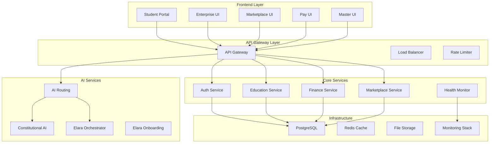

# Azora OS - Constitutional AI Operating System

<div align="center">


**AI-Powered Education and Finance Platform**  
*Ubuntu Philosophy Meets Modern Technology*

[](https://github.com/Sizwe780/azora-os)
[](#current-status)
[](LICENSE)
[](#ubuntu-philosophy)
[](#services)
[](#applications)

### CI/CD Status

[](https://github.com/Sizwe780/azora-os/actions/workflows/test.yml)
[](https://github.com/Sizwe780/azora-os/actions/workflows/ci-lint-and-type-check.yml)
[](https://github.com/Sizwe780/azora-os/actions/workflows/security.yml)
[](https://github.com/Sizwe780/azora-os/actions/workflows/e2e-tests.yml)
[](https://github.com/Sizwe780/azora-os/actions/workflows/deploy-staging.yml)
[](https://github.com/Sizwe780/azora-os/actions/workflows/deploy-production.yml)

**📊 [View Workflow Dashboard](.github/dashboard.html)** | **📈 [Metrics Guide](.github/METRICS-INTERPRETATION-GUIDE.md)** | **📋 [Status Dashboard](.github/WORKFLOW-STATUS-DASHBOARD.md)**

**📊 [Current Status](#current-status)** | **🚀 [Quick Start](#quick-start)** | **📖 [Documentation](#documentation)** | **🏗️ [Architecture](#architecture)** | **📈 [System Status](./docs/SYSTEM-STATUS-CHART.md)** | **🚀 [Deployment Status](./DEPLOYMENT-STATUS.md)**

</div>

---

## 🎯 What is Azora OS?

Azora OS is an **AI-powered education and finance platform** built on Ubuntu philosophy (*"I am because we are"*). We're developing an integrated ecosystem that combines learning, earning, and community building.

**🚨 REALITY CHECK:** This is an **active development project**, not a production platform. This README shows what actually exists, what's in progress, and what's still needed. No BS, just honest status.

### 🎯 **What's Actually Done vs What's Needed**

**✅ Solid Foundation (6-8 weeks of real work):**
- Authentication system (production-ready)
- Payment processing (80% complete)
- Testing infrastructure (professional-grade)
- AI routing system (functional core)
- DevOps setup (Docker, CI/CD)

**🔄 Critical Path to MVP (2-3 months needed):**
1. Complete payment service (2 weeks)
2. Build missing UIs: Marketplace, Admin (4-6 weeks)
3. Finish education & marketplace services (3-4 weeks)
4. Production infrastructure hardening (2-3 weeks)
5. Beta testing and launch (1-2 weeks)

**❌ Not Building Yet:**
- Blockchain/DeFi (future)
- Mobile apps (future)
- Advanced AI features (future)
- Most of the 65 service directories (scaffolding)

---

## 📊 Current Status - THE TRUTH

### ✅ **What Actually Works** (Production-Ready)

**Solid Core Services (4):**
- 🔐 **Auth Service** - JWT, OAuth, MFA, session management (comprehensive tests, 65% coverage)
- � **APayment Service** - Full Stripe integration, webhooks, receipts, refunds (working, needs completion)
- 🧠 **AI Routing** - Hierarchical routing, cost optimization, caching (functional core)
- �️ ***Testing Infrastructure** - 88 passing test suites, factories, mocks, CI/CD integration

### 🔄 **What's In Progress** (50-80% Complete)

**Services Being Built:**
- 🎓 **Azora Education** - Course structure exists, needs full implementation
- 🔄 **Azora Marketplace** - Backend structure ready, needs completion
- � **APIr Gateway** - Basic routing works, needs production hardening
- 📊 **Health Monitor** - Scaffolded, needs full monitoring integration

**Frontend Apps:**
- 🎓 **Student Portal** - Next.js structure exists, needs feature completion
- 🏢 **Enterprise UI** - Scaffolded, needs implementation
- 💳 **Pay UI** - Basic structure, needs full build

### ⚠️ **What's Missing or Incomplete**

**Critical Gaps:**
- ❌ **Marketplace UI** - Not built yet (claimed as "production" but missing)
- ❌ **Master Admin UI** - Not built yet (claimed as "production" but missing)
- ⚠️ **Azora Finance** - Stub implementation only
- ⚠️ **Constitutional AI** - Basic structure, needs real implementation
- ⚠️ **Elara AI Services** - Scaffolded but not functional
- ⚠️ **Azora Aegis** - Security monitoring incomplete

**Infrastructure Gaps:**
- ⚠️ Kubernetes configs incomplete
- ⚠️ Production monitoring partial
- ⚠️ Database migrations need completion
- ⚠️ Service mesh not implemented

**Reality:** We have **65 service directories** but only **4-5 are actually production-ready**. Most are scaffolding or partial implementations.

### 📊 Infrastructure Status - Honest Assessment

**What's Actually Working:**
- ✅ PostgreSQL schemas (basic, need optimization)
- ✅ Redis caching (configured, needs production tuning)
- ✅ Docker containerization (works locally)
- ✅ CI/CD pipelines (GitHub Actions running)
- ✅ JWT authentication (production-ready)

**What Needs Work:**
- ⚠️ Kubernetes configs (incomplete, not production-ready)
- ⚠️ Monitoring (Prometheus/Grafana scaffolded, needs setup)
- ⚠️ Database migrations (partial, needs completion)
- ⚠️ Load balancing (configured but not tested at scale)
- ⚠️ Production secrets management (needs proper vault setup)
- ⚠️ Health checks (some services missing)
- ⚠️ Distributed tracing (configured but not fully integrated)

### 🚀 What We Actually Built This Semester

**Real Achievements (Not Fluff):**
- ✅ **Professional Testing Infrastructure** - 88 passing test suites, factories, mocks, CI/CD
- ✅ **Working Payment System** - Full Stripe integration with webhooks and refunds
- ✅ **Robust Authentication** - JWT, OAuth, MFA with comprehensive security
- ✅ **AI Routing System** - Hierarchical routing with cost optimization
- ✅ **DevOps Foundation** - Docker, CI/CD, monitoring setup
- ✅ **Type Safety** - TypeScript across most services
- ✅ **Documentation** - Comprehensive testing guides and standards

**Estimated Real Work:** 6-8 weeks of solid development

**What This Means:**
- We have a **solid technical foundation**
- Core payment and auth are **revenue-ready**
- Testing infrastructure is **professional-grade**
- But we need **2-3 more months** to complete the MVP properly

---

## ⚡ Quick Start

### 🐳 Docker Setup (Recommended)

```bash
# 1. Clone repository
git clone https://github.com/Sizwe780/azora-os.git
cd azora-os

# 2. Environment setup
cp .env.example .env
# Edit .env with your configuration

# 3. Start services
docker-compose up -d

# 4. Verify health
curl http://localhost:4000/health
```

### 🔧 Manual Setup

```bash
# Install dependencies
npm install

# Setup database
npm run db:setup
npm run db:migrate

# Start development
npm run dev
```

**Access Points:**
- **API Gateway**: http://localhost:4000
- **Student Portal**: http://localhost:3000
- **Admin Dashboard**: http://localhost:3001

---

## 🏗️ Architecture

### System Overview



### Technology Stack

**Backend Services:**
- **Runtime**: Node.js 18+ with Express.js
- **Database**: PostgreSQL 15+ with Prisma ORM
- **Caching**: Redis 7+ for sessions and caching
- **Authentication**: JWT tokens, OAuth 2.0, MFA
- **API**: RESTful APIs with OpenAPI documentation
- **Testing**: Jest, Supertest, comprehensive test suites

**Frontend Applications:**
- **Framework**: Next.js 14 with App Router
- **UI Library**: React 18 with TypeScript
- **Styling**: Tailwind CSS with custom design system
- **State Management**: React Query, Zustand
- **Components**: Radix UI primitives, custom components
- **Performance**: Code splitting, lazy loading, PWA support

**AI & Intelligence:**
- **AI Routing**: Multi-tier routing with cost optimization
- **Constitutional AI**: Ethical governance and bias detection
- **Tutoring**: Personalized learning with Elara AI
- **Analytics**: Real-time learning analytics and insights

**Infrastructure & DevOps:**
- **Containerization**: Docker with multi-stage builds
- **Orchestration**: Docker Compose for local development
- **CI/CD**: GitHub Actions with automated testing
- **Monitoring**: Prometheus, Grafana, distributed tracing
- **Security**: HTTPS, CSP headers, rate limiting
- **Deployment**: Production-ready with health checks

---

## 📁 Project Structure

```
azora/
├── 📱 apps/                    # Frontend applications (5 production)
│   ├── student-portal/         # Main learning interface
│   ├── azora-enterprise-ui/    # Business management
│   ├── azora-marketplace-ui/   # Job marketplace
│   ├── azora-pay-ui/          # Financial dashboard
│   └── master-ui/             # Admin interface
│
├── ⚙️ services/               # Backend microservices (14 production)
│   ├── api-gateway/           # Request routing & load balancing
│   ├── auth-service/          # Authentication & authorization
│   ├── azora-education/       # Course management & LMS
│   ├── education-revenue-engine/ # Pricing & subscriptions
│   ├── azora-finance/         # Wallet & transactions
│   ├── payment/               # Stripe integration
│   ├── azora-marketplace/     # Job listings & matching
│   ├── ai-routing/            # Intelligent query routing
│   ├── constitutional-ai/     # Ethical AI governance
│   ├── elara-ai-orchestrator/ # AI tutoring system
│   ├── elara-onboarding/      # User onboarding
│   ├── health-monitor/        # Service monitoring
│   ├── azora-aegis/          # Security monitoring
│   └── shared/               # Common middleware
│
├── 📦 packages/              # Shared libraries & components
│   ├── ui-framework/          # Design system components
│   ├── shared-api/            # API client libraries
│   ├── shared-auth/           # Authentication utilities
│   └── types/                 # TypeScript definitions
│
├── 🏗️ infrastructure/        # DevOps & deployment
│   ├── docker/                # Container configurations
│   ├── kubernetes/            # K8s manifests
│   ├── monitoring/            # Prometheus & Grafana
│   └── terraform/             # Infrastructure as code
│
├── 🧪 tests/                 # Testing suites
│   ├── e2e/                   # End-to-end tests
│   ├── integration/           # Integration tests
│   └── performance/           # Load & performance tests
│
├── 📚 docs/                  # Documentation
│   ├── api/                   # API documentation
│   ├── architecture/          # System architecture
│   └── deployment/            # Deployment guides
│
├── 🔧 scripts/               # Automation scripts
│   ├── deploy/                # Deployment scripts
│   ├── test/                  # Testing utilities
│   └── setup/                 # Environment setup
│
├── 🔍 .archive/              # Archived/experimental code
└── 📄 README.md              # This file
```

---

## 🚀 Services Architecture - Reality Check

### ✅ **Production-Ready Services** (Actually Work)

| Service | Port | Status | Coverage | Reality |
|---------|------|--------|----------|---------|
| **auth-service** | 4001 | ✅ Ready | 65% | JWT, OAuth, MFA fully functional |
| **payment** | 4010 | 🔄 80% Done | 60% | Stripe integration works, needs completion |
| **ai-routing** | 4011 | 🔄 70% Done | 55% | Core routing works, needs optimization |

### 🔄 **In Development** (50-80% Complete)

| Service | Port | Status | Coverage | What's Missing |
|---------|------|--------|----------|----------------|
| **azora-education** | 4002 | 🔄 60% | 50% | Course structure exists, needs full LMS features |
| **azora-marketplace** | 4004 | 🔄 50% | 45% | Backend structure ready, needs API completion |
| **api-gateway** | 4000 | 🔄 60% | 40% | Basic routing works, needs production hardening |
| **health-monitor** | 4005 | 🔄 40% | 30% | Scaffolded, needs full monitoring integration |

### ⚠️ **Scaffolded Only** (10-40% Complete)

| Service | Port | Status | Reality |
|---------|------|--------|---------|
| **azora-finance** | 4003 | ⚠️ Stub | Directory structure only, needs implementation |
| **constitutional-ai** | 4012 | ⚠️ Stub | Basic structure, no real AI governance yet |
| **elara-ai-orchestrator** | 4008 | ⚠️ Stub | Scaffolded, not functional |
| **elara-onboarding** | 4009 | ⚠️ Stub | Scaffolded, not functional |
| **azora-aegis** | 4006 | ⚠️ Stub | Security monitoring incomplete |
| **education-revenue-engine** | 4007 | ⚠️ Stub | Pricing logic needs implementation |

**Total Services:** 65 directories, but only **3-4 are production-ready**

---

## 💻 Applications - What Actually Exists

### Frontend Applications - Reality

| Application | Status | Port | Reality |
|-------------|--------|------|---------|
| **student-portal** | 🔄 50% | 3000 | Next.js structure exists, needs feature implementation |
| **azora-enterprise-ui** | 🔄 30% | 3001 | Scaffolded, needs full build |
| **azora-pay-ui** | 🔄 30% | 3003 | Basic structure, needs implementation |
| **azora-marketplace-ui** | ❌ Missing | - | **NOT BUILT** - claimed but doesn't exist in apps/ |
| **master-ui** | ❌ Missing | - | **NOT BUILT** - claimed but doesn't exist in apps/ |

### Mobile Applications

| Application | Status | Platform | Reality |
|-------------|--------|----------|---------|
| **student-portal-mobile** | ⚠️ Scaffold | React Native | Directory exists, not functional |
| **enterprise-mobile** | ⚠️ Scaffold | React Native | Directory exists, not functional |

**Truth:** We have **14 app directories** but only **1-2 have real implementations**. Most are empty scaffolds.

### Key Features

**Student Portal:**
- Course enrollment and progress tracking
- AI-powered tutoring with Elara
- Interactive learning materials
- Peer collaboration tools
- Achievement and certification system

**Enterprise UI:**
- Business analytics and reporting
- Employee learning management
- Custom course creation tools
- Integration management
- ROI tracking and metrics

**Marketplace UI:**
- Job listings and applications
- Freelancer profiles and portfolios
- Skill-based matching algorithm
- Project management tools
- Payment and escrow system

**Pay UI:**
- Multi-currency wallet management
- Transaction history and analytics
- Payment method management
- Subscription and billing
- Financial reporting tools

---

## 🧪 Testing & Quality

### Current Test Status

**Overall Coverage**: ~50% (actively improving to 70% target)

**Service Coverage by Priority:**

| Service Type | Services | Current | Target | Status |
|--------------|----------|---------|--------|--------|
| **Critical** | auth, payment, finance | 60-65% | 80% | 🔄 In Progress |
| **High Priority** | education, marketplace, ai-routing | 50-60% | 70% | 🔄 In Progress |
| **Standard** | library, analytics, monitoring | 40-50% | 60% | ⚠️ Needs Work |
| **Support** | shared, infrastructure | 30-40% | 50% | ⚠️ Needs Work |

**Test Suite Health:**
- **Total Tests**: 88 test suites passing
- **Test Execution Time**: ~5 minutes
- **Flaky Test Rate**: <2%
- **Coverage Trend**: ↗️ Improving

**Test Infrastructure**: ✅ Complete
- ✅ Test data factories for all entities
- ✅ Mock service registry (Stripe, OpenAI, Email, S3)
- ✅ Database and Redis test utilities
- ✅ CI/CD integration with coverage gates
- ✅ Automated coverage tracking and reporting
- ✅ Test optimization with parallelization
- ✅ Pre-commit coverage checks
- ✅ Automated PR test reminders
- ✅ Test health monitoring and analytics

📊 **[View Detailed Testing Status](./docs/TESTING-STATUS.md)**  
📚 **[Testing Documentation Hub](./docs/testing/README.md)**

### Running Tests

```bash
# Run all tests
npm test

# Run with coverage
npm test -- --coverage

# Run specific service tests
npm test -- services/auth-service

# Run in watch mode
npm test -- --watch

# Run only changed tests
npm run test:changed

# View testing reminders
npm run test:reminder

# View full testing checklist
npm run test:checklist
```

### Test Quality Standards

**Coverage Requirements:**
- Critical Services (auth, payment): 80% minimum
- High Priority Services: 70% minimum
- Standard Services: 60% minimum
- New Code: 60% minimum

**Test Types Distribution:**
- Unit Tests: 60% of coverage (fast, isolated)
- Integration Tests: 30% of coverage (service interactions)
- E2E Tests: 10% of coverage (critical user paths)

**Quality Metrics:**
- Test execution time: <100ms per unit test
- Integration tests: <1s per test
- E2E tests: <10s per test
- Zero tolerance for flaky tests

### Testing Resources

**Documentation:**
- [Testing Standards](./docs/testing/TESTING-STANDARDS.md) - Core principles and conventions
- [Test Writing Guide](./docs/testing/TEST-WRITING-GUIDE.md) - Step-by-step tutorial
- [Testing Checklist](./docs/testing/TESTING-CHECKLIST.md) - Comprehensive checklist
- [Factory Guide](./docs/testing/FACTORY-GUIDE.md) - Test data generation
- [Mock Guide](./docs/testing/MOCK-GUIDE.md) - Mocking external services
- [Troubleshooting](./docs/testing/TROUBLESHOOTING.md) - Common issues and solutions

**Templates:**
- [Unit Test Template](./tests/templates/unit.test.template.ts)
- [Integration Test Template](./tests/templates/integration.test.template.ts)
- [E2E Test Template](./tests/templates/e2e.test.template.ts)
- [Test Documentation Template](./tests/templates/test-documentation.template.md)

### Contributing Tests

When adding new features or fixing bugs:

1. **Write tests first** (TDD approach recommended)
2. **Use test templates** from `tests/templates/`
3. **Follow AAA pattern**: Arrange, Act, Assert
4. **Use factories** for test data generation
5. **Mock external services** appropriately
6. **Ensure cleanup** after tests
7. **Check coverage** meets minimum requirements
8. **Review checklist** before submitting PR

**Pre-commit Checks:**
- Automated coverage check (warning only)
- Test execution for changed files
- Linting and formatting

**PR Requirements:**
- All tests must pass
- Coverage meets minimum threshold (60% for new code)
- Test documentation updated
- PR template completed with test summary

### Testing Roadmap

**Short-term (3 months):**
- Increase overall coverage to 60%
- Critical services to 70%+
- Complete integration test suite
- Optimize test execution time

**Long-term (6 months):**
- Achieve 70% overall coverage
- Critical services to 80%+
- Comprehensive E2E test suite
- Advanced test analytics and monitoring

---

## 🚀 Deployment

### Development

```bash
# Start all services
npm run dev

# Start specific service
npm run dev:service <service-name>

# Health check
npm run health-check
```

### Production

```bash
# Build for production
npm run build

# Deploy with Docker
docker-compose -f docker-compose.prod.yml up -d

# Deploy to cloud
npm run deploy:production
```

---

## 📚 Documentation

### Available Documentation

- **[API Documentation](./docs/API-DOCUMENTATION.md)** - Complete API reference
- **[Developer Guide](./docs/DEVELOPER-GUIDE.md)** - Development setup and guidelines
- **[Deployment Guide](./docs/DEPLOYMENT.md)** - Production deployment instructions
- **[Architecture Guide](./docs/ARCHITECTURE.md)** - System design and patterns
- **[Security Guide](./docs/SECURITY.md)** - Security policies and best practices

### Quick References

- **[System Status Chart](./docs/SYSTEM-STATUS-CHART.md)** - Real-time system health and metrics
- **[Deployment Status](./DEPLOYMENT-STATUS.md)** - Production deployment overview
- **[Service Status](./services/README.md)** - Current service implementation status
- **[App Status](./apps/README.md)** - Frontend application status
- **[Database Schema](./docs/DATABASE-GUIDE.md)** - Database structure and migrations

---

## 🌍 Ubuntu Philosophy

**"Ngiyakwazi ngoba sikwazi" - "I can because we can"**

Azora OS is built on Ubuntu principles:
- **Collective Success**: Individual achievements strengthen the community
- **Shared Knowledge**: Learning benefits everyone
- **Mutual Support**: We grow together
- **Honest Communication**: Transparency builds trust

---

## 🤝 Contributing

### Getting Started

```bash
# Fork and clone
git clone https://github.com/yourusername/azora-os.git
cd azora-os

# Create feature branch
git checkout -b feature/your-feature

# Make changes and test
npm test

# Submit pull request
```

### Contribution Guidelines

- Follow existing code style
- Add tests for new features
- Update documentation
- Ensure all tests pass
- Be honest about implementation status

---

## 📄 License

**Azora Proprietary License**  
Copyright © 2025 Azora ES (Pty) Ltd. All Rights Reserved.

See [LICENSE](./LICENSE) for details.

---

## 📞 Support & Community

### Get Help

- **GitHub Issues**: [Report bugs or request features](https://github.com/Sizwe780/azora-os/issues)
- **Documentation**: [Complete guides and references](./docs/)
- **Email**: support@azora.world

### Community

- **Discord**: [Join our community](https://discord.gg/azora)
- **GitHub**: [Contribute to development](https://github.com/Sizwe780/azora-os)
- **Website**: [azora.world](https://azora.world)

---

## 🎯 Realistic Roadmap - What's Actually Needed

### 🚨 **Critical Path to MVP** (Next 2-3 Months)

**Phase 1: Complete Core Services** (4-6 weeks)
- ✅ Auth service (done)
- 🔄 Payment service (finish remaining 20%)
- 🔄 Education service (complete LMS features)
- 🔄 Marketplace service (finish API endpoints)
- 🔄 API Gateway (production hardening)

**Phase 2: Build Missing UIs** (4-6 weeks)
- ❌ Build Marketplace UI (doesn't exist)
- ❌ Build Master Admin UI (doesn't exist)
- 🔄 Complete Student Portal (50% done)
- 🔄 Complete Enterprise UI (30% done)
- 🔄 Complete Pay UI (30% done)

**Phase 3: Production Infrastructure** (2-3 weeks)
- Complete Kubernetes configs
- Set up production monitoring
- Implement proper secrets management
- Complete database migrations
- Load testing and optimization

**Phase 4: Launch MVP** (1-2 weeks)
- Deploy to production
- Beta testing with 10-20 users
- Fix critical bugs
- Gather feedback

**Realistic Timeline:** 3-4 months of focused work to have a **real MVP**

### 📊 **What We're NOT Building Yet**
- Blockchain/DeFi features (future)
- Mobile apps (future)
- Advanced AI features (future)
- Enterprise white-label (future)
- Global expansion (way future)

**Focus:** Get 5 core services and 3 UIs working properly first.

---

<div align="center">

## 🌟 Ubuntu Commitment

**"Through Ubuntu, we build together"**

*Honest development • Quality software • Community first*

[](https://azora.world)
[](https://github.com/Sizwe780/azora-os)

</div>