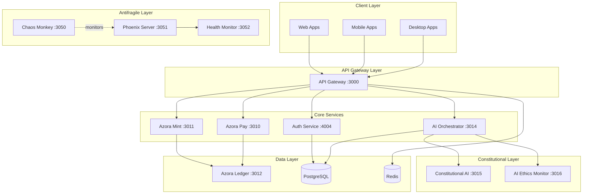

# 🌍 Azora Ecosystem

> **Constitutional • Auditable • Antifragile • Ubuntu-driven**

*"Ngiyakwazi ngoba sikwazi - I am because we are"*

---

[](https://github.com/Sizwe780/azora-os/actions)
[](#services)
[](#applications)
[](LICENSE)
[](docs/STATUS-DASHBOARD.md)

## 🌟 The Vision

**Azora** is the world's first **Civilization-Grade Operating System** - a digital organism built on four non-negotiable pillars that create an antifragile, ethical, and collectively beneficial ecosystem.

## 🏛️ The Four Pillars

### 1. 🧠 Constitutional AI (Superego)
Ethical guardrails enforced at every layer of the system.

- **20+ Constitutional Rules**: Fairness, transparency, privacy, accountability
- **Self-Critique Loop**: Every AI action undergoes ethical review
- **Bias Detection**: Continuous monitoring for unfair outcomes
- **Transparency Scoring**: All AI decisions are explainable

### 2. 📜 Auditable Ledger (Memory)
Immutable blockchain recording of all transactions and actions.

- **Proof-of-Value Mining**: Earn tokens by creating genuine value
- **Attribution Enforcement**: Automatic royalties for creators
- **Constitutional Compliance Tags**: Every transaction tagged with ethics score
- **Complete Audit Trail**: Full transparency and accountability

### 3. 🔥 Antifragile Infrastructure (Body)
Systems that grow stronger from failures and chaos.

- **Chaos Monkey**: 7 failure types for controlled chaos testing
- **Phoenix Server**: 5 auto-recovery strategies
- **Resilience Adapter**: Offline-first capabilities
- **Learning from Failure**: Every incident improves the system

### 4. 🤝 Ubuntu Tokenomics (Incentive)
"I am because we are" - collective benefit economics.

- **Proof-of-Value**: 5 value types (knowledge, code, art, service, impact)
- **CitadelFund**: 10% of all revenue to public goods
- **Automatic Attribution**: Fair compensation for all contributors
- **Collective Benefit Metrics**: Success measured by community impact

## 🚀 Quick Start

### Prerequisites
- Node.js 20+
- PostgreSQL 14+
- Docker & Docker Compose
- Git

### Installation

```bash
# Clone the repository
git clone https://github.com/Sizwe780/azora-os.git
cd azora-os

# Install dependencies
npm install

# Set up environment variables
cp .env.example .env
# Edit .env with your configuration

# Start core services
npm run start:core

# Or start all services
npm run start:all
```

### Verify Installation

```bash
# Check service health
npm run health:check

# Run service audit
npm run service:audit
```

## 📊 System Architecture



## 🛠️ Services

### Core Infrastructure (6 services)
| Service | Port | Purpose | Status |
|---------|------|---------|--------|
| [ai-orchestrator](services/ai-orchestrator) | 3014 | AI coordination + Constitutional AI | ✅ Production |
| [azora-auth](services/azora-auth) | 4004 | Ubuntu Constitutional authentication | ✅ Production |
| [azora-api-gateway](services/azora-api-gateway) | 3000 | API routing and rate limiting | ✅ Production |
| [azora-mint](services/azora-mint) | 3011 | Proof-of-Value blockchain | ✅ Production |
| [azora-pay](services/azora-pay) | 3010 | Payment processing + CitadelFund | ✅ Production |
| [azora-ledger](services/azora-ledger) | 3012 | Immutable transaction ledger | ✅ Production |

### Constitutional AI (4 services)
| Service | Port | Purpose | Status |
|---------|------|---------|--------|
| [constitutional-ai](services/constitutional-ai) | 3015 | Ethical guardrails enforcement | ✅ Production |
| [ai-ethics-monitor](services/ai-ethics-monitor) | 3016 | Continuous ethics monitoring | ✅ Production |
| [ai-family-service](services/ai-family-service) | 3017 | AI agent coordination | ✅ Production |
| [arbiter-system](services/arbiter-system) | 3018 | Conflict resolution | ✅ Production |

### Antifragile Infrastructure (5 services)
| Service | Port | Purpose | Status |
|---------|------|---------|--------|
| [chaos-monkey](services/chaos-monkey) | 3050 | Controlled failure injection | ✅ Production |
| [phoenix-server](services/phoenix-server) | 3051 | Auto-recovery service | ✅ Production |
| [health-monitor](services/health-monitor) | 3052 | System health tracking | ✅ Production |
| [monitoring-service](services/monitoring-service) | 3053 | Metrics and observability | ✅ Production |
| [audit-logging-service](services/audit-logging-service) | 3054 | Comprehensive audit logs | ✅ Production |

### Education Platform (8 services)
| Service | Port | Purpose | Status |
|---------|------|---------|--------|
| [azora-education](services/azora-education) | 3020 | Education platform core | ✅ Production |
| [azora-classroom](services/azora-classroom) | 3021 | Virtual classroom | ✅ Production |
| [azora-assessment](services/azora-assessment) | 3022 | Assessment and grading | ✅ Production |
| [elara-content-generator](services/elara-content-generator) | 3023 | AI content generation | ✅ Production |
| [azora-library](services/azora-library) | 3024 | Digital library | ✅ Production |
| [azora-research-center](services/azora-research-center) | 3025 | Research collaboration | ✅ Production |
| [enrollment-service](services/enrollment-service) | 3026 | Student enrollment | ✅ Production |
| [personalization-engine](services/personalization-engine) | 3027 | Personalized learning | ✅ Production |

### Marketplace & Finance (6 services)
| Service | Port | Purpose | Status |
|---------|------|---------|--------|
| [azora-marketplace](services/azora-marketplace) | 3030 | Digital marketplace | ✅ Production |
| [project-marketplace](services/project-marketplace) | 3031 | Project bidding platform | ✅ Production |
| [billing-service](services/billing-service) | 3032 | Billing and invoicing | ✅ Production |
| [subscription](services/subscription) | 3033 | Subscription management | ✅ Production |
| [defi-lending](services/defi-lending) | 3034 | DeFi lending platform | ✅ Production |
| [azora-treasury](services/azora-treasury) | 3035 | Treasury management | ✅ Production |

### Enterprise & Collaboration (8 services)
| Service | Port | Purpose | Status |
|---------|------|---------|--------|
| [azora-forge](services/azora-forge) | 3040 | Development platform | ✅ Production |
| [elara-incubator](services/elara-incubator) | 3041 | Startup incubator | ✅ Production |
| [azora-careers](services/azora-careers) | 3042 | Job platform | ✅ Production |
| [azora-erp](services/azora-erp) | 3043 | Enterprise resource planning | ✅ Production |
| [azora-studyspaces](services/azora-studyspaces) | 3044 | Collaborative study spaces | ✅ Production |
| [azora-corporate-learning](services/azora-corporate-learning) | 3045 | Corporate training | ✅ Production |
| [enterprise](services/enterprise) | 3046 | Enterprise suite | ✅ Production |
| [governance-service](services/governance-service) | 3047 | Governance and compliance | ✅ Production |

### Specialized Services (22 services)
- AI & Analytics: ai-routing, ai-evolution-engine, azora-analytics, quantum-deep-mind
- Security: shield_service, kyc-aml-service, tamper-proof-data-service
- Data: azora-database-layer, quantum-tracking
- And 13 more specialized services

**Total Services**: 59

## 📱 Applications

### Core Applications (5 apps)
| Application | Description | Tech Stack |
|-------------|-------------|------------|
| [azora-master](apps/azora-master) | Main orchestration app | Next.js, TypeScript |
| [azora-sapiens](apps/azora-sapiens) | Learning platform | Next.js, React |
| [azora-buildspaces](apps/azora-buildspaces) | Development environment | Next.js, Monaco |
| [azrome](apps/azrome) | Custom browser | Electron, Chromium |
| [azstudio](apps/azstudio) | Integrated development environment | Electron, Monaco |

### Platform Applications (18 apps)
- Education: azora-classroom, azora-research-center, azora-library
- Enterprise: azora-enterprise-suite, azora-jobspaces, azora-compliance
- Finance: azora-finance, azora-pay, azora-investor-portal
- Development: azora-dev, azora-cloud, azora-oracle
- Mobile: azora-sapiens-mobile, azora-enterprise-suite-mobile
- And 4 more specialized apps

**Total Applications**: 23

## 📦 Packages

### Shared Libraries (33 packages)
- **@azora/api-client**: Unified API client
- **@azora/ui-components**: Shared UI components
- **@azora/auth**: Authentication utilities
- **@azora/database**: Database layer
- **@azora/blockchain**: Blockchain utilities
- And 28 more packages

See [packages/](packages/) for complete list.

## 🧪 Development

### Project Structure

```
azora/
├── apps/                  # 23 applications
├── services/              # 59 microservices
├── packages/              # 33 shared packages
├── docs/                  # Documentation
├── infrastructure/        # Infrastructure as code
├── scripts/               # Automation scripts
├── tests/                 # Integration tests
└── docker-compose.yml     # Service orchestration
```

### Development Commands

```bash
# Start specific service groups
npm run start:core          # Core services only
npm run start:blockchain    # Blockchain services
npm run start:antifragile   # Chaos Monkey + Phoenix

# Health and diagnostics
npm run health:check        # Check all services
npm run service:audit       # Audit service status

# Testing
npm test                    # Run all tests
npm run test:integration    # Integration tests
npm run test:e2e           # End-to-end tests

# Build
npm run build              # Build all services
npm run build:apps         # Build applications only
```

## 🔒 Security

### Security Features
- **Helmet.js**: Security headers on all services
- **Rate Limiting**: Prevent abuse and DDoS
- **CSRF Protection**: Cross-site request forgery prevention
- **JWT Authentication**: Secure token-based auth
- **Input Validation**: Joi schema validation
- **Audit Logging**: Complete audit trail

### Security Audits
- Regular dependency updates
- Automated vulnerability scanning
- Penetration testing
- Code security reviews

See [docs/SECURITY.md](docs/SECURITY.md) for details.

## 📈 Monitoring & Observability

### Metrics
- **Prometheus**: Metrics collection
- **Grafana**: Visualization dashboards
- **Winston**: Structured logging
- **Health Checks**: All services expose `/health`

### Dashboards
- [Service Health Dashboard](docs/STATUS-DASHBOARD.md)
- [Performance Metrics](docs/PERFORMANCE-BENCHMARKS.md)
- [Launch Readiness](docs/launch-dashboard.html)

## 🚢 Deployment

### Docker Compose

```bash
# Start all services
docker-compose up -d

# Start specific groups
docker-compose -f docker-compose.services.yml up -d
docker-compose -f docker-compose.prod.yml up -d
```

### Kubernetes

```bash
# Deploy to Kubernetes
kubectl apply -f infrastructure/k8s/

# Check deployment status
kubectl get pods -n azora
```

### Cloud Platforms
- **Vercel**: Frontend applications
- **Railway**: Backend services
- **AWS**: Production infrastructure

See [docs/DEPLOYMENT.md](docs/DEPLOYMENT.md) for detailed guides.

## 📚 Documentation

### Core Documentation
- [Architecture Overview](docs/ARCHITECTURE.md)
- [API Documentation](docs/API-DOCUMENTATION.md)
- [Service Architecture](docs/SERVICE-ARCHITECTURE.md)
- [Testing Guide](docs/TESTING.md)
- [Deployment Guide](docs/DEPLOYMENT.md)
- [Contributing Guidelines](CONTRIBUTING.md)

### Philosophy & Vision
- [Ubuntu Philosophy](docs/UBUNTU-PHILOSOPHY.md)
- [Azora Constitution](docs/AZORA-CONSTITUTION.md)
- [Product Suite](docs/AZORA-PRODUCT-SUITE.md)

### Operations
- [Operations Runbook](docs/OPERATIONS-RUNBOOK.md)
- [Troubleshooting Guide](docs/TROUBLESHOOTING.md)
- [Incident Response](docs/INCIDENT-RESPONSE-PROCEDURES.md)

## 🤝 Contributing

We welcome contributions that align with Ubuntu philosophy!

1. Read [CONTRIBUTING.md](CONTRIBUTING.md)
2. Fork the repository
3. Create a feature branch
4. Make your changes
5. Submit a pull request

### Development Guidelines
- Follow TypeScript best practices
- Write comprehensive tests
- Document all APIs
- Embrace Ubuntu philosophy
- Ensure Constitutional AI compliance

## 📄 License

Proprietary - Azora ES (Pty) Ltd

This software is proprietary and confidential. Unauthorized copying, distribution, or use is strictly prohibited.

See [LICENSE](LICENSE) for details.

## 🙏 Acknowledgments

Built with Ubuntu philosophy: "My success enables your success"

### Core Team
- Azora ES (Pty) Ltd
- Constitutional AI Research Team
- Ubuntu Economics Institute

### Technologies
- Node.js & TypeScript
- React & Next.js
- PostgreSQL & Prisma
- Docker & Kubernetes
- Ethereum & Hardhat

## 📞 Support

- **Documentation**: [docs/](docs/)
- **Issues**: [GitHub Issues](https://github.com/Sizwe780/azora-os/issues)
- **Email**: support@azora.world
- **Community**: [Discord](https://discord.gg/azora)

---

<div align="center">

**🌍 The Azora organism is ALIVE! 🌟**

*"Ngiyakwazi ngoba sikwazi - I am because we are"*

[](docs/UBUNTU-PHILOSOPHY.md)
[](docs/AZORA-CONSTITUTION.md)
[](services/chaos-monkey)
[](services/azora-ledger)

</div>