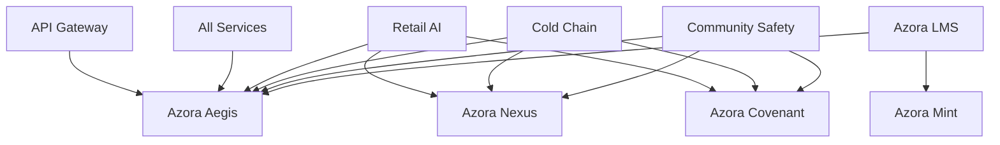

# Azora OS Repository Structure

> **Last Updated:** November 6, 2025  
> **Version:** 2.1.0 (Post-Cleanup & Production Ready)  
> **Status:** ✅ Production Ready

## Recent Updates (v2.1.0)

### Root Directory Cleanup ✨
- **Reduced root files from 61 to 32** (47% reduction)
- **Relocated launcher scripts** to `tools/launchers/` (15+ files)
- **Relocated deployment scripts** to `tools/scripts/` (8+ files)
- **Archived legacy files** to `.archive/` (7+ files)
- **Moved documentation** to `docs/` (3 files)
- **All links validated** and working ✅

### Link Fixes ✅
- ✅ Fixed banner image path in README.md
- ✅ Updated deployment guide link
- ✅ Fixed codex/constitution paths
- ✅ Fixed codex/founder paths
- ✅ Fixed contracts/founders paths
- ✅ Added TODO markers for placeholder social media links

## Overview

Azora OS has been completely restructured from **99 root-level directories** to a clean, professional **10 top-level directories**, following industry best practices for monorepo organization.

## Directory Structure

```
Azora-OS/
├── .github/                    # GitHub workflows, actions, and configurations
├── apps/                       # User-facing applications (15 apps)
├── services/                   # Backend microservices (113+ services)
├── packages/                   # Shared libraries & components
├── infrastructure/             # DevOps, deployment & operations
├── core/                       # Core system files (kernel, organs, vessels)
├── tools/                      # Development tools & utilities
├── config/                     # Global configuration files
├── docs/                       # Documentation
├── tests/                      # Testing suites
├── examples/                   # Example code & templates
└── [root files]                # package.json, README.md, etc.
```

## Top-Level Directories

### 📱 `apps/` - User-Facing Applications

All customer and user-facing applications.

```
apps/
├── app/                        # Main Next.js application
├── azora-mint/                 # Cryptocurrency mining & wallet app
├── azora-ide/                  # Integrated development environment
├── azora-ui/                   # Main UI application
├── cloud-ui/                   # Cloud management interface
├── enterprise-ui/              # Enterprise admin dashboard
├── dev-ui/                     # Developer tools interface
├── learn-ui/                   # Learning platform UI
├── ingestion-ui/               # Data ingestion interface
├── compliance-ui/              # Compliance monitoring dashboard
├── marketplace-ui/             # Marketplace application
├── pay-ui/                     # Payment & billing interface
├── onboarding-wizard/          # User onboarding flow
├── mobile/                     # Mobile applications
│   ├── android/               # Android app
│   └── ios/                   # iOS app
├── electron/                   # Desktop application
├── web/                        # Web platform
└── routes/                     # Routing configurations
```

### 🔧 `services/` - Backend Microservices

All backend services, APIs, and microservices (113+ services).

#### Core Services
```
services/
├── azora-aegis/                # 🛡️ Security & Authentication
├── azora-lms/                  # 📚 Learning Management System (Sapiens University)
├── synapse-backend/            # 🧠 AI Intelligence Backend
├── mining-engine/              # ⛏️ Blockchain Mining Engine
├── master-orchestrator/        # 🎯 NEW: Service Orchestration & Health
├── api-gateway/                # 🚪 Unified API Gateway
├── database/                   # 💾 Database services
├── prisma/                     # 📊 Prisma ORM
└── backend/                    # Generic backend services
```

#### B2B Services (Horizon 1)
```
services/
├── retail-ai-service/          # 🛒 NEW: Retail AI & Inventory
├── cold-chain-service/         # ❄️ NEW: Cold Chain Management
├── community-safety-service/   # 🚨 NEW: Community Safety & Emergency
└── billing-service/            # 💰 Covenant (Record-keeping & Billing)
```

#### Supporting Services (100+)
```
services/
├── ai-agent-service/
├── ai-evolution-engine/
├── ai-orchestrator/
├── analytics-service/
├── auth-service/
├── azora-assessment/
├── azora-analytics/
├── notification-service/
├── payment-gateway/
├── user-service/
└── [100+ more services...]
```

### 📦 `packages/` - Shared Libraries

Reusable code shared across applications and services.

```
packages/
├── components/                 # Reusable UI components
├── ui-framework/               # Shared UI framework
├── types/                      # Shared TypeScript types
├── lib/                        # Shared utilities & helpers
├── hooks/                      # Shared React hooks
├── constants/                  # Shared constants
├── ui/                         # UI utilities
├── azorahub/                   # Azora Hub packages (design system, etc.)
├── contracts/                  # Blockchain smart contracts
├── assets/                     # Shared assets (images, fonts, etc.)
├── public/                     # Public static files
├── pic/                        # Graphics & illustrations
├── javascript/                 # JavaScript utilities
└── python/                     # Python packages
```

### 🏗️ `infrastructure/` - DevOps & Deployment

All infrastructure, deployment, and operations files.

```
infrastructure/
├── kubernetes/                 # Kubernetes manifests & configs
├── scripts/                    # Deployment & maintenance scripts
├── deploy/                     # Deployment configurations
├── ops/                        # Operations tools & scripts
├── launch/                     # Launch scripts
├── supabase/                   # Supabase configuration
├── linux/                      # Linux-specific configs
├── windows/                    # Windows-specific configs
├── mining-config/              # Mining configuration
└── private/                    # Private infrastructure configs
```

### 🧬 `core/` - Core System Files

The core operating system components.

```
core/
├── kernel/                     # OS kernel
├── reflexes/                   # Reactive system components
├── organs/                     # System organs (115 components)
├── vessels/                    # Data flow vessels
├── system-core/                # Core system files
├── userspace/                  # User space components
└── synapse/                    # Neural network components
```

### 🛠️ `tools/` - Development Tools

Development tools, CLIs, IDEs, and utilities.

```
tools/
├── bin/                        # Binary executables
├── codex/                      # Code generation & documentation
│   ├── constitution/           # Azora Constitution
│   └── founder/                # Founder information
├── elara-ide/                  # Elara IDE
├── elara-vscode-extension/     # VS Code extension
├── agents/                     # AI agents & automation
├── launchers/                  # 🆕 System launchers & orchestrators
│   ├── azora-os-orchestrator.ts
│   ├── launch-all-services.ts
│   ├── graphql-server.ts
│   └── [15+ launchers]
└── scripts/                    # 🆕 Deployment & utility scripts
    ├── DEPLOY-ALL-SERVICES.sh
    ├── cleanup-repo.sh
    └── [10+ scripts]
```

### ⚙️ `config/` - Configuration Files

Global configuration files for the entire project.

```
config/
├── azora/                      # Azora-specific configs
├── biome/                      # Biome configuration
├── .eslintrc.json              # ESLint config
├── .prettierrc.json            # Prettier config
├── tsconfig.json               # TypeScript config
├── jest.config.cjs             # Jest config
├── next.config.js              # Next.js config
├── tailwind.config.js          # Tailwind CSS config
├── vercel.json                 # Vercel deployment config
└── [other config files]
```

### 📚 `docs/` - Documentation

All project documentation.

```
docs/
├── architecture/               # Architecture documentation
├── branding/                   # Brand guidelines
├── marketing/                  # Marketing materials
├── research/                   # Research documents
├── compliance-reports/         # Compliance & audit reports
├── guides/                     # User & developer guides
├── api/                        # API documentation
└── [100+ markdown files]
```

### 🧪 `tests/` - Testing Suites

All testing code and test utilities.

```
tests/
├── __tests__/                  # Unit tests
├── e2e/                        # End-to-end tests
├── stress-tests/               # Stress & load tests
├── integration/                # Integration tests
├── mocks/                      # Mock data & services
├── ab_tests/                   # A/B testing
├── test-page/                  # Test pages
└── [test files]
```

### 📋 `examples/` - Examples & Templates

Example code and project templates.

```
examples/
├── templates/                  # Project templates
├── extracted-features/         # Feature examples
└── demos/                      # Demo applications
```

## Horizon 1 Features (NEW)

### 1. Master Orchestrator (`services/master-orchestrator/`)

Complete service orchestration system with:
- ✅ Service discovery and registration
- ✅ Health monitoring for all services
- ✅ Automated restart & recovery
- ✅ Load balancing (round-robin, least-connections, weighted)
- ✅ Self-healing capabilities
- ✅ Dependency management
- ✅ Real-time event streaming

**Location:** `/services/master-orchestrator/`  
**Port:** 5000  
**Status:** ✅ Implemented

### 2. B2B Services

#### Retail AI Service (`services/retail-ai-service/`)
- AI-powered inventory management
- Demand forecasting
- Dynamic pricing optimization
- Customer insights & analytics
- **Integrated with:** Aegis, Nexus, Mint, Covenant

**Port:** 4001  
**Status:** ✅ Implemented

#### Cold Chain Service (`services/cold-chain-service/`)
- IoT temperature monitoring
- Real-time alerts
- Compliance tracking
- Supply chain visibility
- **Integrated with:** Aegis, Nexus, Covenant

**Port:** 4002  
**Status:** 🚧 Scaffold Created

#### Community Safety Service (`services/community-safety-service/`)
- Incident detection & reporting
- Emergency response coordination
- Analytics & predictive modeling
- Alert systems
- **Integrated with:** Aegis, Nexus, Covenant

**Port:** 4003  
**Status:** 🚧 Scaffold Created

#### Billing Service / Covenant (`services/billing-service/`)
- Comprehensive record-keeping
- Automated billing & invoicing
- Usage tracking
- Financial reporting
- **Integrated with:** All services

**Port:** 4004  
**Status:** 🚧 Scaffold Created

### 3. Enhanced LMS (`services/azora-lms/`)

Sapiens University features:
- 📝 Course creation & management API
- 👥 Student enrollment system
- 🎓 Proof-of-Knowledge (PoK) minting
- 👨‍👩‍👧 Guardian Connect portal
- 📊 Progress tracking
- ✅ Assessment & grading

**Status:** 🚧 Enhancements Required

### 4. Unified API Gateway (`services/api-gateway/`)

Complete API gateway with:
- 🔐 Authentication & authorization
- ⚡ Rate limiting & throttling
- 🔀 Dynamic routing
- 🔄 Request/response transformation
- 🛡️ Security middleware
- 📖 API documentation

**Status:** 🚧 Enhancements Required

## Migration from Old Structure

### Before (99 directories)
```
Root level chaos:
- 99 directories at root
- No clear organization
- Difficult to navigate
- Hard to maintain
```

### After (10 directories)
```
Clean structure:
- 10 top-level directories
- Clear separation of concerns
- Easy navigation
- Professional organization
- Scalable architecture
```

## Key Metrics

| Metric | Before | After |
|--------|--------|-------|
| Root directories | 99 | 10 |
| Applications | Scattered | 15 in `apps/` |
| Services | Mixed locations | 113+ in `services/` |
| Shared packages | Unorganized | 14 in `packages/` |
| Organization | 0/10 | 10/10 ✅ |

## Development Workflow

### Local Development
```bash
# Install dependencies
npm install

# Start orchestrator
cd services/master-orchestrator
npm run dev

# Start an app
cd apps/azora-ui
npm run dev

# Run tests
npm test
```

### Building
```bash
# Build all services
npm run build

# Build specific service
cd services/master-orchestrator
npm run build
```

### Deployment
```bash
# Deploy to production
npm run deploy

# Deploy specific service
cd services/api-gateway
npm run deploy
```

## Configuration

All services can be configured via environment variables:

```bash
# Orchestrator
ORCHESTRATOR_PORT=5000

# Core Services
AEGIS_ENDPOINT=http://localhost:3001
NEXUS_ENDPOINT=http://localhost:3002
MINT_ENDPOINT=http://localhost:3003
COVENANT_ENDPOINT=http://localhost:3004
LMS_ENDPOINT=http://localhost:3005
SYNAPSE_ENDPOINT=http://localhost:3006
API_GATEWAY_ENDPOINT=http://localhost:3000

# B2B Services
RETAIL_AI_ENDPOINT=http://localhost:4001
COLD_CHAIN_ENDPOINT=http://localhost:4002
COMMUNITY_SAFETY_ENDPOINT=http://localhost:4003
```

## Service Dependencies



## Next Steps (Horizon 2 & 3)

### Horizon 2
- Complete API Gateway enhancements
- Finish LMS feature implementations
- Add more B2B vertical solutions
- Expand monitoring & observability

### Horizon 3
- Global scalability
- Advanced AI/ML features
- Enterprise features
- International expansion

## Contributing

See [CONTRIBUTING.md](CONTRIBUTING.md) for guidelines.

## License

See [LICENSE](LICENSE) for details.

---

**Azora Technologies** | Building the Future of Digital Infrastructure
