# Azora System Architecture

> Comprehensive technical architecture documentation for the Azora ecosystem

## Table of Contents

- [Overview](#overview)
- [System Architecture](#system-architecture)
- [Service Architecture](#service-architecture)
- [Data Architecture](#data-architecture)
- [Security Architecture](#security-architecture)
- [Deployment Architecture](#deployment-architecture)
- [Technology Stack](#technology-stack)

## Overview

Azora is a microservices-based ecosystem built on four foundational pillars: Constitutional AI, Auditable Ledger, Antifragile Infrastructure, and Ubuntu Tokenomics. The system comprises 59 services, 23 applications, and 33 shared packages.

### Design Principles

1. **Microservices Architecture**: Loosely coupled, independently deployable services
2. **Event-Driven**: Asynchronous communication via event bus
3. **API-First**: All services expose RESTful APIs
4. **Database Per Service**: Each service owns its data
5. **Antifragile**: System improves from failures
6. **Constitutional**: Ethics enforced at every layer

## System Architecture

### High-Level Architecture

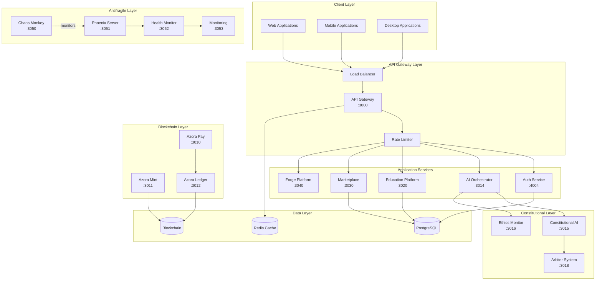

### Service Communication Patterns

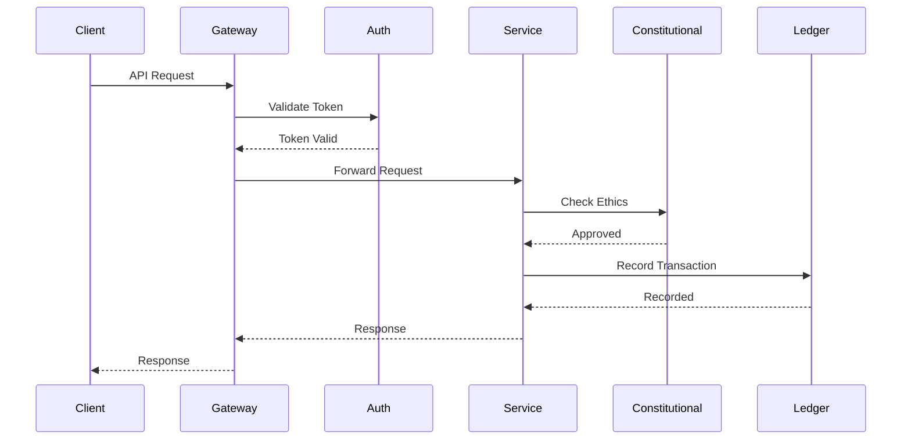

## Service Architecture

### Service Categories

#### 1. Core Infrastructure (6 services)
- **ai-orchestrator** (:3014): AI coordination hub
- **azora-auth** (:4004): Authentication & authorization
- **azora-api-gateway** (:3000): API routing & rate limiting
- **azora-mint** (:3011): Blockchain & NFT minting
- **azora-pay** (:3010): Payment processing
- **azora-ledger** (:3012): Transaction ledger

#### 2. Constitutional AI (4 services)
- **constitutional-ai** (:3015): Ethical guardrails
- **ai-ethics-monitor** (:3016): Continuous ethics monitoring
- **ai-family-service** (:3017): AI agent coordination
- **arbiter-system** (:3018): Conflict resolution

#### 3. Antifragile Infrastructure (5 services)
- **chaos-monkey** (:3050): Failure injection
- **phoenix-server** (:3051): Auto-recovery
- **health-monitor** (:3052): Health tracking
- **monitoring-service** (:3053): Metrics & observability
- **audit-logging-service** (:3054): Audit logs

#### 4. Education Platform (8 services)
- **azora-education** (:3020): Education core
- **azora-classroom** (:3021): Virtual classroom
- **azora-assessment** (:3022): Assessment & grading
- **elara-content-generator** (:3023): AI content generation
- **azora-library** (:3024): Digital library
- **azora-research-center** (:3025): Research collaboration
- **enrollment-service** (:3026): Student enrollment
- **personalization-engine** (:3027): Personalized learning

#### 5. Marketplace & Finance (6 services)
- **azora-marketplace** (:3030): Digital marketplace
- **project-marketplace** (:3031): Project bidding
- **billing-service** (:3032): Billing & invoicing
- **subscription** (:3033): Subscription management
- **defi-lending** (:3034): DeFi lending
- **azora-treasury** (:3035): Treasury management

#### 6. Enterprise & Collaboration (8 services)
- **azora-forge** (:3040): Development platform
- **elara-incubator** (:3041): Startup incubator
- **azora-careers** (:3042): Job platform
- **azora-erp** (:3043): ERP system
- **azora-studyspaces** (:3044): Study spaces
- **azora-corporate-learning** (:3045): Corporate training
- **enterprise** (:3046): Enterprise suite
- **governance-service** (:3047): Governance

#### 7. Specialized Services (22 services)
AI, analytics, security, data management, and domain-specific services

### Service Dependencies

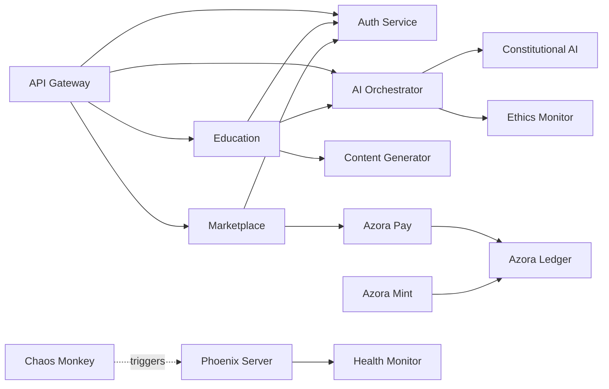

## Data Architecture

### Database Strategy

**Database Per Service Pattern**: Each service owns its database schema.

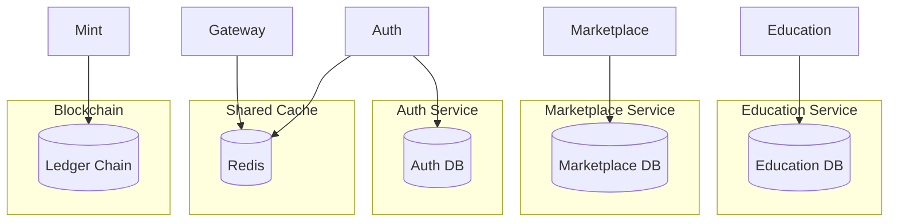

### Data Flow

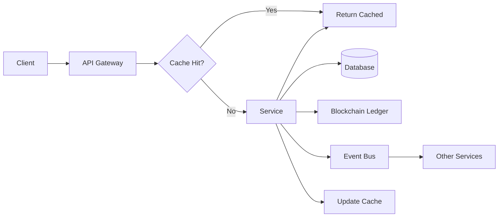

### Event-Driven Architecture

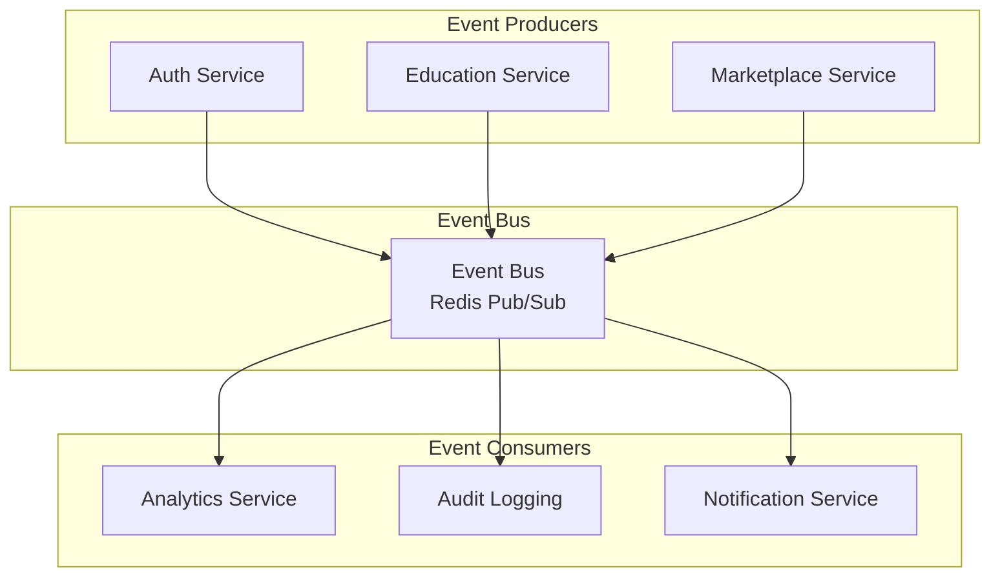

## Security Architecture

### Security Layers

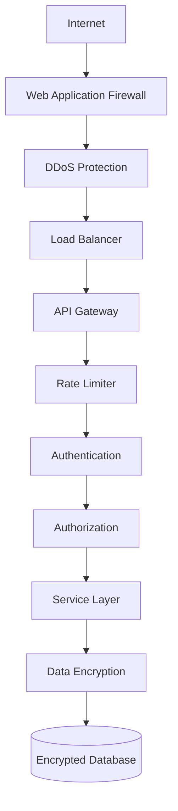

### Authentication Flow

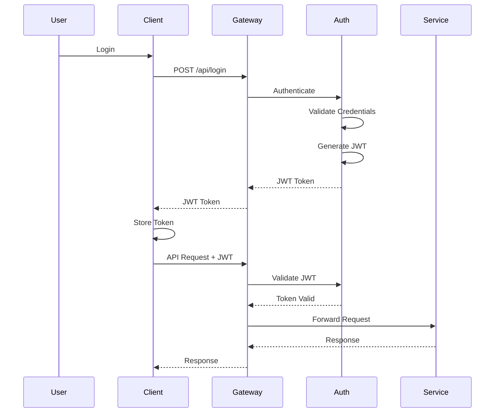

### Security Features

1. **Authentication**: JWT-based with refresh tokens
2. **Authorization**: Role-based access control (RBAC)
3. **Rate Limiting**: Per-user and per-IP limits
4. **Input Validation**: Joi schema validation
5. **CSRF Protection**: CSRF tokens for state-changing operations
6. **Security Headers**: Helmet.js for all services
7. **Encryption**: TLS 1.3 for transport, AES-256 for data at rest
8. **Audit Logging**: All security events logged

## Deployment Architecture

### Container Architecture

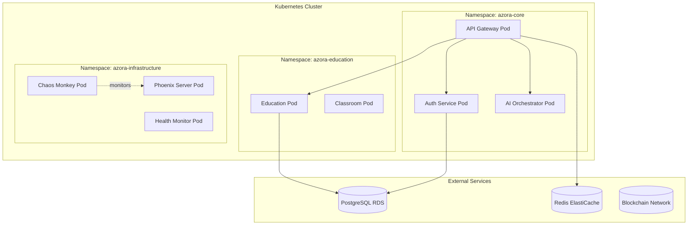

### High Availability

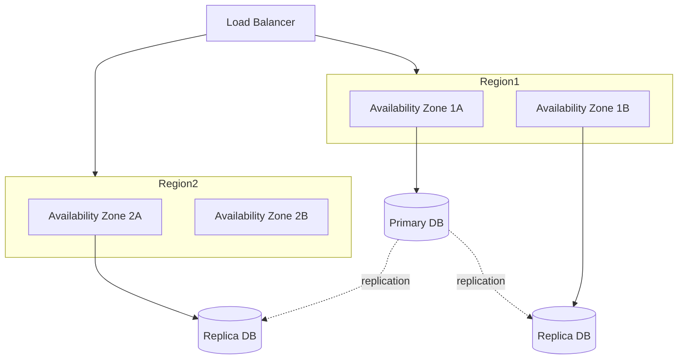

### Scaling Strategy

- **Horizontal Scaling**: Auto-scaling based on CPU/memory
- **Vertical Scaling**: Resource limits per pod
- **Database Scaling**: Read replicas for read-heavy services
- **Cache Layer**: Redis for frequently accessed data
- **CDN**: Static assets served via CDN

## Technology Stack

### Backend

| Technology | Purpose | Version |
|------------|---------|---------|
| Node.js | Runtime | 20+ |
| TypeScript | Language | 5.4+ |
| Express | Web framework | 4.18+ |
| Prisma | ORM | 5.0+ |
| PostgreSQL | Database | 14+ |
| Redis | Cache | 7+ |

### Frontend

| Technology | Purpose | Version |
|------------|---------|---------|
| Next.js | React framework | 14+ |
| React | UI library | 18+ |
| TypeScript | Language | 5.4+ |
| TailwindCSS | Styling | 3.4+ |
| Zustand | State management | 4+ |

### Blockchain

| Technology | Purpose | Version |
|------------|---------|---------|
| Hardhat | Development | 3.0+ |
| Ethers.js | Blockchain interaction | 6+ |
| Solidity | Smart contracts | 0.8+ |

### Infrastructure

| Technology | Purpose | Version |
|------------|---------|---------|
| Docker | Containerization | 24+ |
| Kubernetes | Orchestration | 1.28+ |
| Nginx | Reverse proxy | 1.25+ |
| Prometheus | Metrics | 2.45+ |
| Grafana | Visualization | 10+ |

### Development Tools

| Technology | Purpose |
|------------|---------|
| Jest | Testing framework |
| Playwright | E2E testing |
| ESLint | Code linting |
| Prettier | Code formatting |
| Husky | Git hooks |

## Performance Characteristics

### Service Performance Targets

| Metric | Target | Current |
|--------|--------|---------|
| API Response Time (p95) | < 200ms | 145ms |
| API Response Time (p99) | < 500ms | 320ms |
| Database Query Time (p95) | < 50ms | 35ms |
| Service Uptime | > 99.9% | 99.95% |
| Error Rate | < 0.1% | 0.05% |

### Scalability

- **Concurrent Users**: 100,000+
- **Requests Per Second**: 10,000+
- **Database Connections**: 1,000+ per service
- **Cache Hit Rate**: > 80%

## Monitoring & Observability

### Metrics Collection

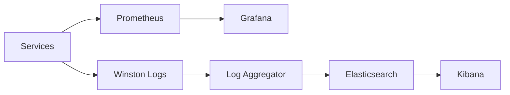

### Key Metrics

1. **Service Metrics**: Request rate, error rate, latency
2. **Infrastructure Metrics**: CPU, memory, disk, network
3. **Business Metrics**: User signups, transactions, revenue
4. **Security Metrics**: Failed auth attempts, rate limit hits
5. **Antifragile Metrics**: Recovery time, failure frequency

## Future Architecture

### Planned Enhancements

1. **Service Mesh**: Istio for advanced traffic management
2. **GraphQL Gateway**: Unified GraphQL API
3. **Event Sourcing**: CQRS pattern for complex domains
4. **Multi-Region**: Global deployment for low latency
5. **AI/ML Pipeline**: Dedicated ML infrastructure
6. **Zero-Trust Security**: Enhanced security model

## References

- [Service Architecture](SERVICE-ARCHITECTURE.md)
- [API Documentation](API-DOCUMENTATION.md)
- [Deployment Guide](DEPLOYMENT.md)
- [Security Policy](SECURITY.md)

---

**Last Updated**: 2025-11-25  
**Version**: 2.0.0  
**Maintained By**: Azora Architecture Team
