# 🏗️ Azora OS Architecture Guide

**Constitutional AI Operating System - Supreme Organism Design**

*"Ubuntu: I am because we are" - Architectural Philosophy*

---

## 📋 Table of Contents

1. [Ubuntu Architecture Philosophy](#-ubuntu-architecture-philosophy)
2. [Supreme Organism Pattern](#-supreme-organism-pattern)
3. [Sankofa Engine Design](#-sankofa-engine-design)
4. [Service Architecture](#-service-architecture)
5. [Data Flow & Communication](#-data-flow--communication)
6. [Security Architecture](#-security-architecture)
7. [Scalability & Performance](#-scalability--performance)
8. [Deployment Architecture](#-deployment-architecture)

---

## 🌍 Ubuntu Architecture Philosophy

### Core Principles
Azora OS architecture embodies Ubuntu philosophy where individual components strengthen the collective system:

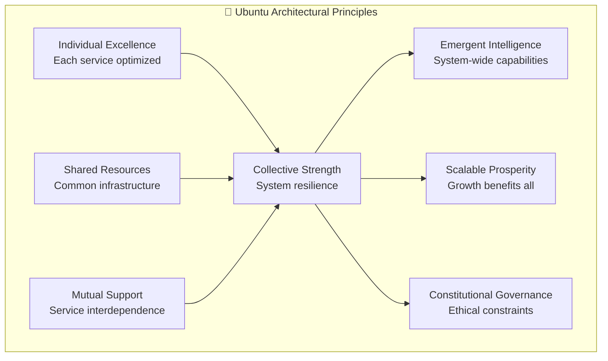

### Design Patterns
- **🤝 Collaborative Services**: Services that enhance each other's capabilities
- **🔄 Circular Dependencies**: Beneficial interdependencies that create value loops
- **📈 Emergent Properties**: System capabilities that arise from service interactions
- **🛡️ Constitutional Constraints**: Built-in ethical and governance limitations
- **🌱 Organic Growth**: Architecture that evolves with community needs

---

## 🦾 Supreme Organism Pattern

### Biological Inspiration
Azora OS mirrors a living organism with specialized systems working in harmony:

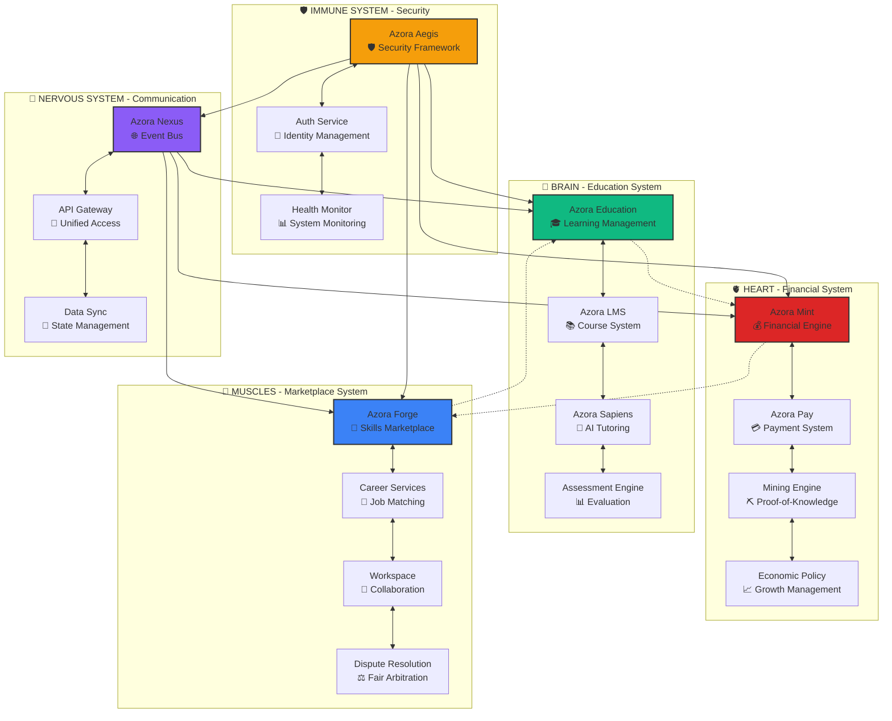

### System Interactions
Each organ system has specific responsibilities while contributing to the whole:

| System | Primary Function | Ubuntu Principle | Interactions |
|--------|------------------|------------------|--------------|
| **🧠 Brain** | Knowledge processing | *My learning becomes our wisdom* | Feeds insights to all systems |
| **🫀 Heart** | Value circulation | *My prosperity enables yours* | Distributes rewards and incentives |
| **💪 Muscles** | Work execution | *My effort strengthens our foundation* | Connects skills with opportunities |
| **🔗 Nervous System** | Communication | *My message reaches our community* | Enables all inter-system communication |
| **🛡️ Immune System** | Protection | *My security ensures our freedom* | Protects all systems from threats |

---

## ⚙️ Sankofa Engine Design

### Engine Architecture
The Sankofa Engine is the core Ubuntu multiplier that transforms individual actions into collective benefits:

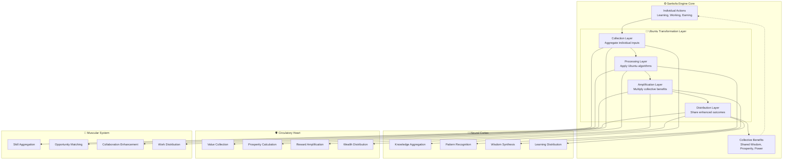

### Ubuntu Algorithms
The engine uses specific algorithms to implement Ubuntu principles:

#### 1. Knowledge Multiplication Algorithm
```typescript
interface KnowledgeMultiplier {
  individualLearning: LearningEvent;
  communityContext: CommunityKnowledge;
  
  multiply(): CollectiveWisdom {
    const personalGain = this.individualLearning.value;
    const communityGain = personalGain * this.communityContext.multiplier;
    const totalWisdom = personalGain + communityGain;
    
    return {
      individual: personalGain,
      collective: communityGain,
      total: totalWisdom,
      ubuntu: true
    };
  }
}
```

#### 2. Prosperity Circulation Algorithm
```typescript
interface ProsperityCirculator {
  individualEarning: FinancialEvent;
  communityPool: CommunityWealth;
  
  circulate(): SharedProsperity {
    const personalReward = this.individualEarning.amount;
    const communityBonus = personalReward * 0.1; // 10% Ubuntu bonus
    const circulationEffect = this.communityPool.distribute(communityBonus);
    
    return {
      personal: personalReward + circulationEffect.personalBonus,
      community: circulationEffect.communityGrowth,
      ubuntu: true
    };
  }
}
```

---

## 🏢 Service Architecture

### Microservices Design
Each service follows Ubuntu principles while maintaining independence:

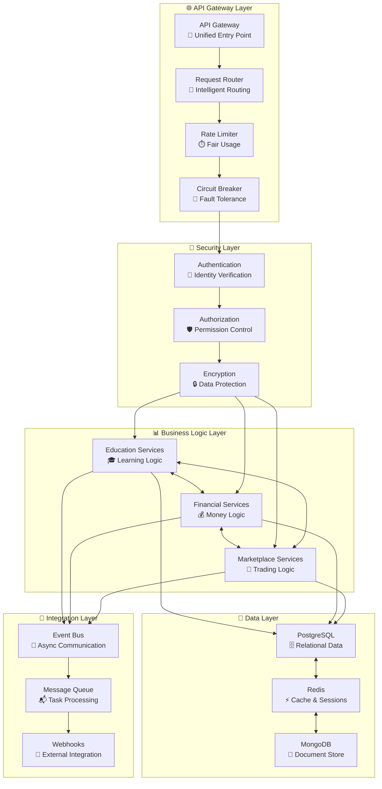

### Service Communication Patterns

#### 1. Synchronous Communication (REST APIs)
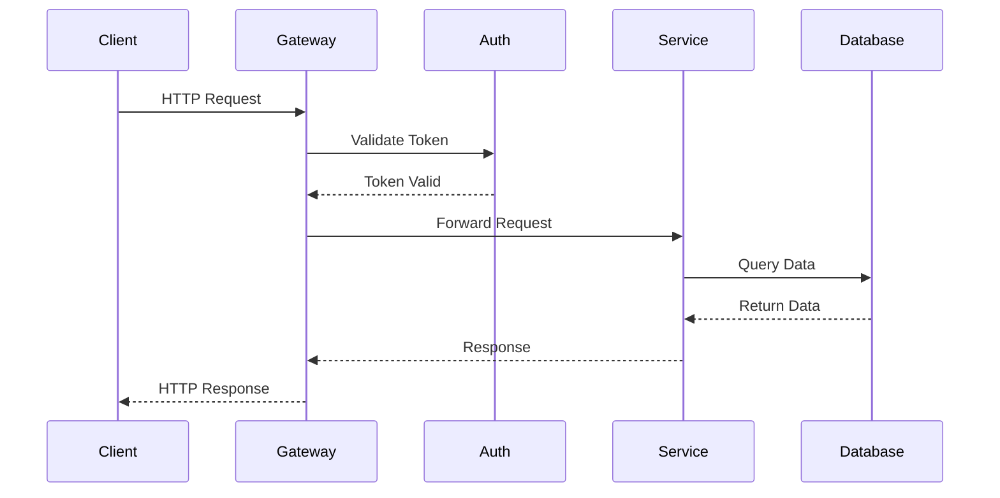

#### 2. Asynchronous Communication (Event Bus)
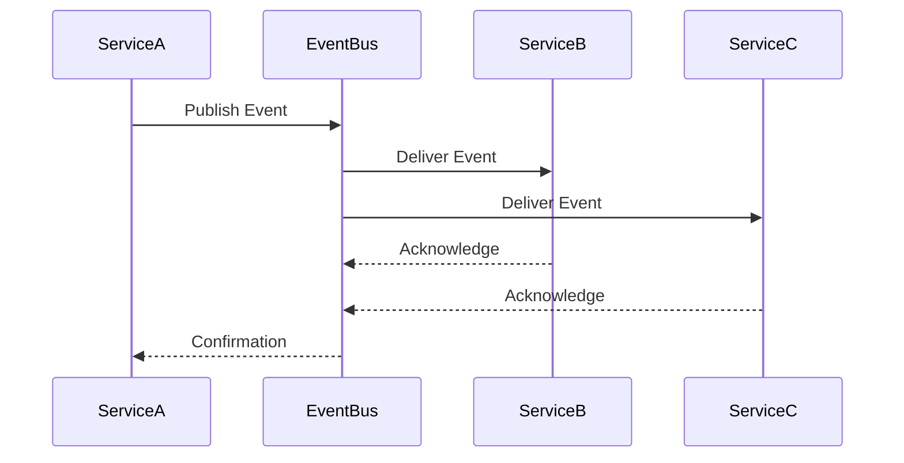

---

## 🌊 Data Flow & Communication

### Ubuntu Data Flow Pattern
Data flows through the system following Ubuntu principles of sharing and amplification:

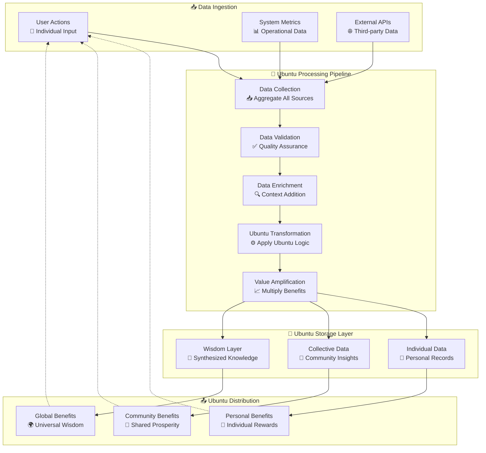

### Event-Driven Architecture
The system uses events to maintain Ubuntu synchronization:

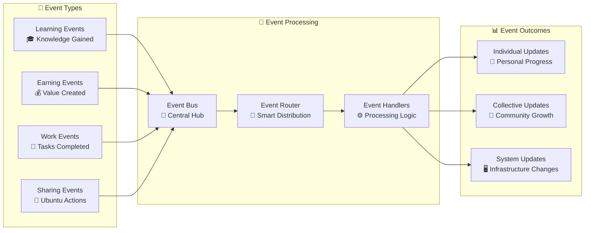

---

## 🛡️ Security Architecture

### Constitutional Security Model
Security is built on Ubuntu principles of collective protection:

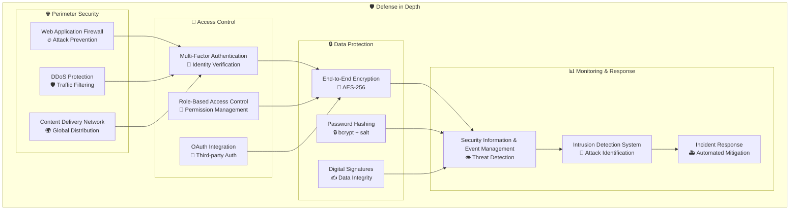

### Constitutional AI Security
AI governance ensures ethical and secure operations:

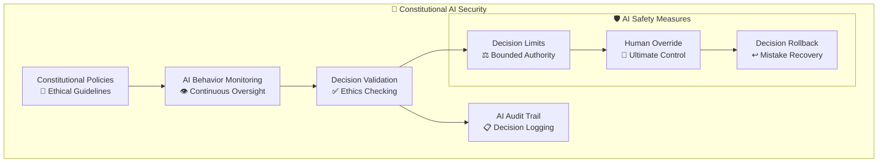

---

## 📈 Scalability & Performance

### Ubuntu Scalability Model
The system scales through collective resource sharing:

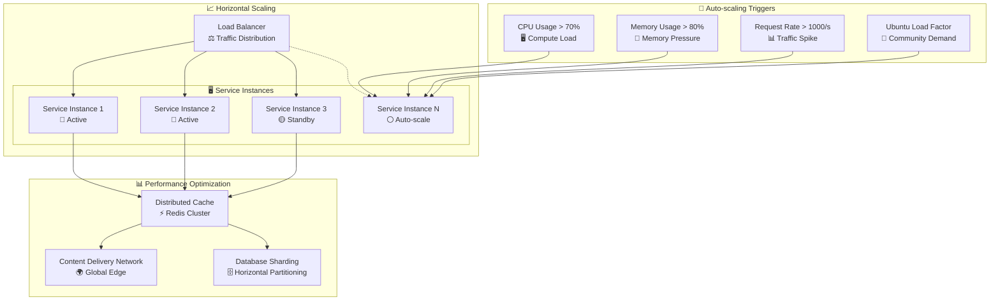

### Performance Metrics & Monitoring
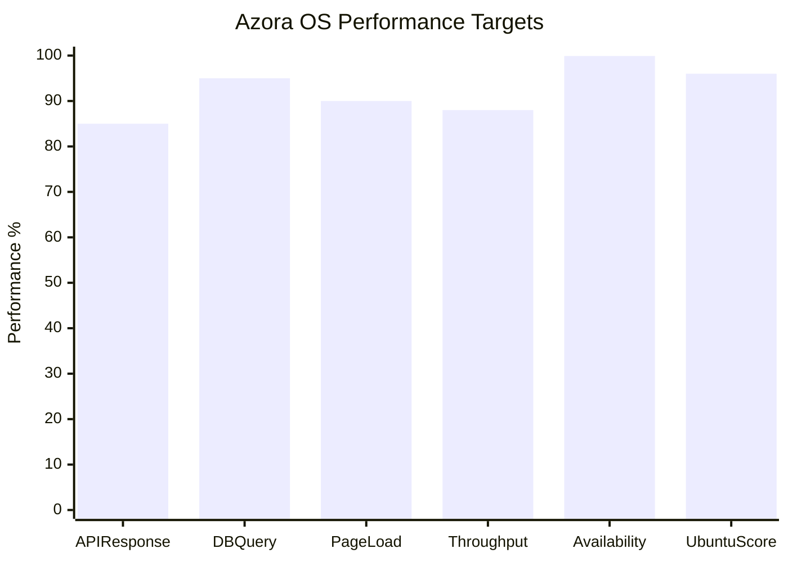

---

## 🚀 Deployment Architecture

### Ubuntu Cloud Infrastructure
Deployment follows Ubuntu principles of shared resources and collective resilience:

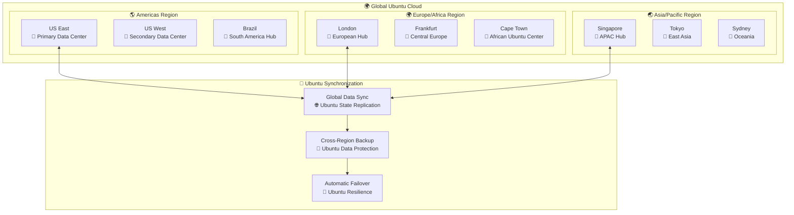

### Container Orchestration
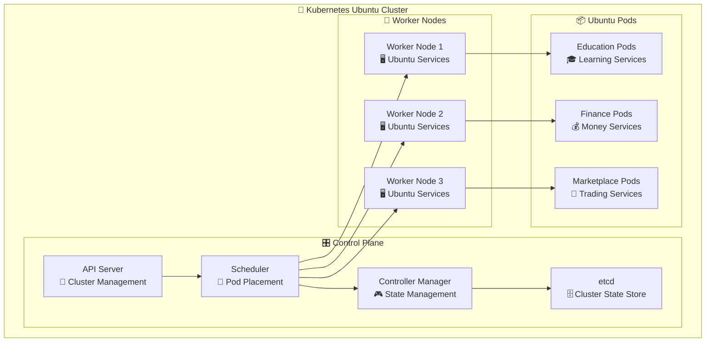

---

## 🔮 Future Architecture Evolution

### Ubuntu Architecture Roadmap
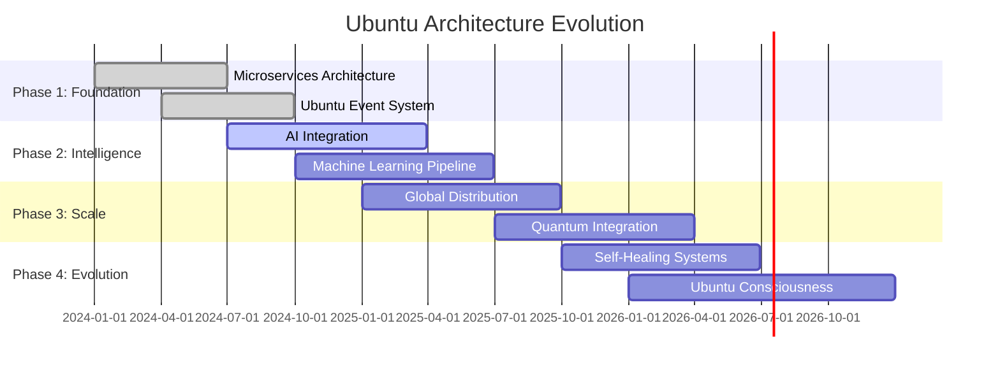

### Emerging Technologies Integration
- **🔬 Quantum Computing**: Enhanced cryptography and optimization
- **🧠 Neuromorphic Chips**: Brain-inspired processing for AI
- **🌐 Edge Computing**: Ubuntu processing at network edges
- **🔗 Blockchain Evolution**: Advanced consensus mechanisms
- **🤖 AGI Integration**: Artificial General Intelligence capabilities

---

## 📚 Architecture Resources

### Documentation Links
- **[🔧 Service Development Guide](./services/README.md)** - Building Ubuntu services
- **[🗄️ Database Design Guide](./database/README.md)** - Ubuntu data modeling
- **[🔐 Security Implementation](./security/README.md)** - Constitutional security
- **[📊 Monitoring Setup](./monitoring/README.md)** - Ubuntu observability
- **[🚀 Deployment Guide](./deployment/README.md)** - Ubuntu infrastructure

### Architecture Principles Summary
1. **🤝 Ubuntu First**: Every architectural decision considers collective benefit
2. **🔄 Circular Value**: Systems create value loops that benefit all participants
3. **📈 Emergent Intelligence**: Architecture enables capabilities beyond individual services
4. **🛡️ Constitutional Governance**: Built-in ethical constraints and oversight
5. **🌱 Organic Evolution**: Architecture adapts and grows with community needs

---

**"Ngiyakwazi ngoba sikwazi" - "I can because we can"**

*The architecture of Azora OS embodies Ubuntu philosophy, creating a system where individual excellence contributes to collective prosperity and wisdom.*