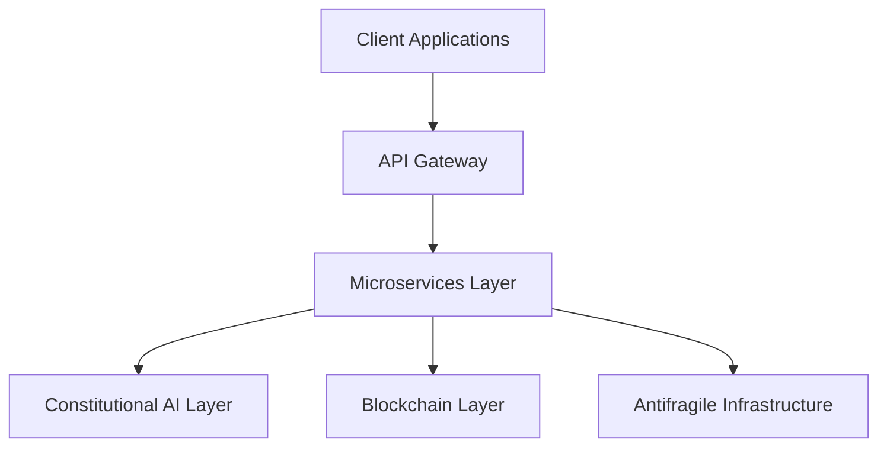
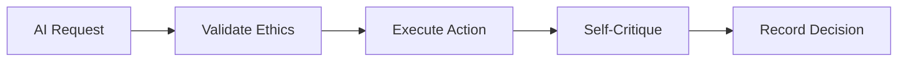
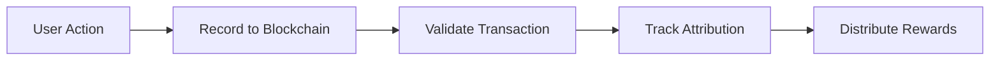
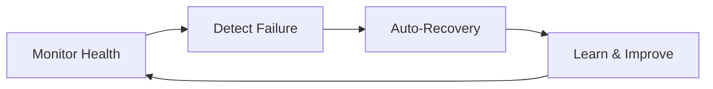
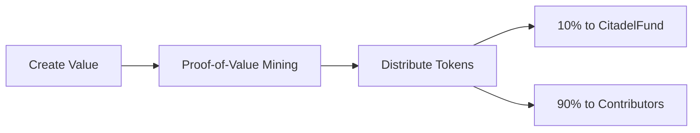
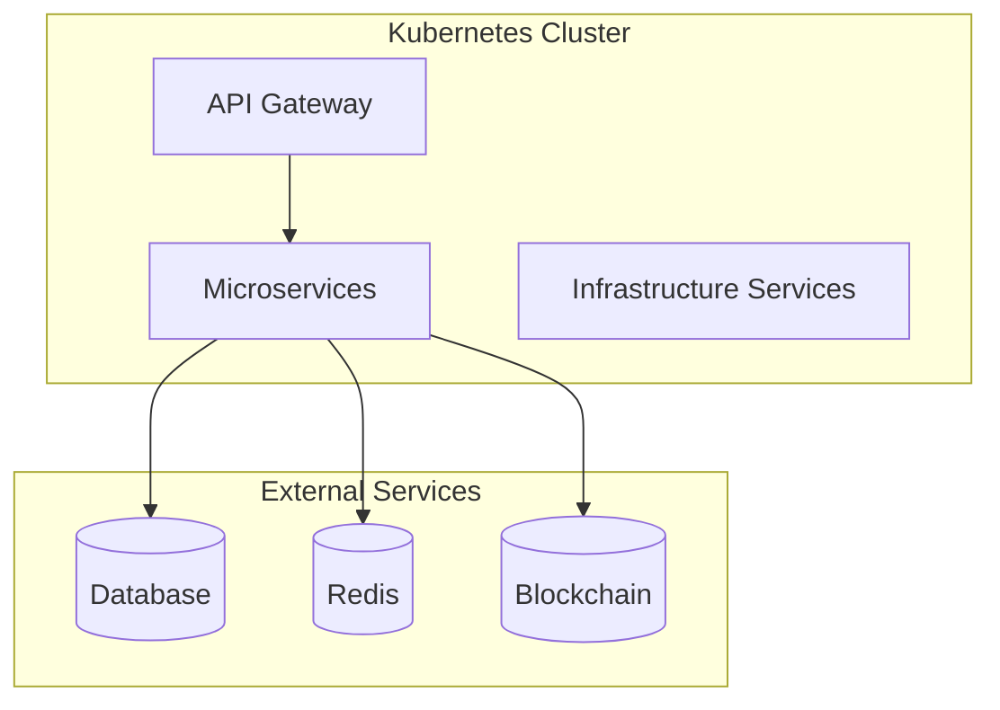

# Azora System Architecture

> High-level conceptual architecture for the Azora ecosystem

**Last Updated**: 2025-11-25

> [!NOTE]
> This document provides a high-level overview of Azora's architecture. Detailed implementation specifics are maintained in private documentation for IP protection.

## Table of Contents

- [Overview](#overview)
- [System Architecture](#system-architecture)
- [Core Pillars](#core-pillars)
- [Technology Stack](#technology-stack)
- [Deployment](#deployment)

## Overview

Azora is built as a microservices-based ecosystem with four foundational pillars:

1. **Constitutional AI**: Ethical guardrails at every layer
2. **Auditable Ledger**: Immutable blockchain recording
3. **Antifragile Infrastructure**: Systems that improve from failures
4. **Ubuntu Tokenomics**: Collective benefit economics

### Design Principles

- **Microservices Architecture**: Loosely coupled, independently deployable
- **Event-Driven**: Asynchronous communication
- **API-First**: RESTful APIs throughout
- **Antifragile**: Improves from chaos and failures
- **Constitutional**: Ethics enforced everywhere

## System Architecture

### High-Level Architecture

### Service Layers

#### 1. Client Layer
- Web applications
- Mobile applications
- Desktop applications

#### 2. API Gateway
- Request routing
- Rate limiting
- Authentication
- Load balancing

#### 3. Microservices Layer
- Core business services
- Domain-specific services
- Integration services

#### 4. Constitutional AI Layer
- Ethical validation
- Bias detection
- Fairness scoring
- Transparency tracking

#### 5. Blockchain Layer
- Transaction recording
- Proof-of-Value mining
- Attribution tracking
- Immutable audit trail

#### 6. Antifragile Infrastructure
- Chaos engineering
- Auto-recovery
- Health monitoring
- Resilience management

## Core Pillars

### Constitutional AI

**Key Features:**
- Self-critique loops
- Bias detection
- Fairness scoring
- Transparency requirements

### Auditable Ledger

**Key Features:**
- Immutable recording
- Proof-of-Value mining
- Automatic attribution
- Complete audit trail

### Antifragile Infrastructure

**Key Features:**
- Chaos engineering
- Automated recovery
- Failure learning
- Resilience improvement

### Ubuntu Tokenomics

**Key Features:**
- Proof-of-Value rewards
- CitadelFund contributions
- Fair attribution
- Collective benefit

## Technology Stack

### Backend
- **Runtime**: Node.js
- **Language**: TypeScript
- **Framework**: Express
- **Database**: PostgreSQL
- **ORM**: Prisma
- **Cache**: Redis

### Frontend
- **Framework**: Next.js
- **UI Library**: React
- **Language**: TypeScript
- **Styling**: TailwindCSS
- **State**: Zustand

### Blockchain
- **Platform**: Ethereum-compatible
- **Development**: Hardhat
- **Interaction**: Ethers.js

### Infrastructure
- **Containers**: Docker
- **Orchestration**: Kubernetes
- **Monitoring**: Prometheus + Grafana
- **Logging**: Winston

## Deployment

### Container Architecture

### High Availability

- Multi-region deployment
- Auto-scaling
- Load balancing
- Database replication
- Cache redundancy

## Security

### Security Layers

1. **Network Security**: WAF, DDoS protection
2. **Application Security**: Rate limiting, input validation
3. **Authentication**: JWT-based auth
4. **Authorization**: Role-based access control
5. **Data Security**: Encryption at rest and in transit
6. **Audit Logging**: Complete activity tracking

## Monitoring & Observability

### Metrics
- Service health
- Performance metrics
- Business metrics
- Security metrics

### Logging
- Structured logging
- Centralized log aggregation
- Real-time alerting

## Contributing

See [CONTRIBUTING.md](../CONTRIBUTING.md) for development guidelines.

## License

Proprietary - Azora ES (Pty) Ltd

---

> [!IMPORTANT]
> **IP Protection Notice**: This document contains only high-level architectural concepts. Detailed implementation specifics, algorithms, and business logic are proprietary and confidential.

**Ubuntu Philosophy**: "My architecture enables our collective success"
