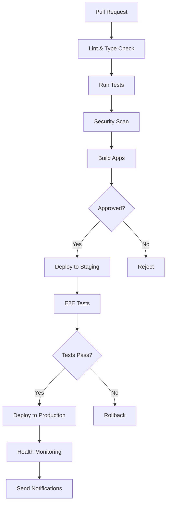

# CI/CD Pipeline Documentation

**Last Updated**: 2025-11-25  
**Status**: Comprehensive CI/CD infrastructure in place

## Overview

The Azora ecosystem has a robust CI/CD pipeline with 41 GitHub Actions workflows covering testing, deployment, security, and monitoring.

## Workflow Categories

### 1. Continuous Integration (CI)

#### Main CI Pipeline
- **File**: `ci.yml`
- **Triggers**: Push to main/develop, Pull requests
- **Actions**: Install dependencies, lint, test, build

#### Lint and Type Check
- **File**: `ci-lint-and-type-check.yml`
- **Purpose**: Code quality enforcement
- **Checks**: ESLint, TypeScript type checking

#### Services CI
- **File**: `services-ci.yml`
- **Purpose**: Service-specific testing
- **Scope**: All 59 microservices

### 2. Testing

#### Unit Tests
- **File**: `test.yml`
- **Coverage**: All services and applications
- **Framework**: Jest

#### E2E Tests
- **Files**: `e2e-tests.yml`, `e2e.yml`
- **Framework**: Playwright
- **Scope**: Critical user journeys

#### Test Coverage
- **File**: `test-coverage.yml`, `coverage.yml`
- **Minimum**: 80% for core services
- **Reports**: Uploaded to artifacts

#### Optimized Testing
- **File**: `test-optimized.yml`
- **Purpose**: Fast feedback loop
- **Strategy**: Parallel execution

### 3. Continuous Deployment (CD)

#### Production Deployment
- **File**: `deploy-production.yml`
- **Trigger**: Push to main, version tags
- **Environment**: Production
- **Approval**: Required
- **Rollback**: Automated on failure

#### Staging Deployment
- **File**: `deploy-staging.yml`
- **Trigger**: Push to develop
- **Environment**: Staging
- **Auto-deploy**: Yes

#### Application Builds
- **File**: `build-apps.yml`
- **Scope**: All 23 applications
- **Artifacts**: Build outputs stored

### 4. Security

#### Security Audit
- **File**: `security-audit.yml`, `security.yml`
- **Frequency**: Daily + on PR
- **Tools**: npm audit, Snyk
- **Actions**: Auto-fix vulnerabilities

#### Dependency Updates
- **File**: `dependency-update.yml`
- **Tool**: Dependabot
- **Frequency**: Weekly
- **Auto-merge**: Minor/patch updates

### 5. Monitoring & Health

#### Health Monitoring
- **File**: `health-monitoring.yml`
- **Frequency**: Every 5 minutes
- **Checks**: Service health endpoints
- **Alerts**: Slack/Email on failure

#### Status Checks
- **File**: `status-checks.yml`
- **Purpose**: Pre-merge validation
- **Required**: All checks must pass

#### Workflow Monitoring
- **File**: `workflow-monitoring.yml`
- **Purpose**: Monitor CI/CD health
- **Metrics**: Success rate, duration

### 6. Notifications

#### Deployment Notifications
- **File**: `deployment-notifications.yml`
- **Channels**: Slack, Email
- **Events**: Deploy start, success, failure

#### PR Notifications
- **File**: `pr-notifications.yml`
- **Purpose**: Team awareness
- **Events**: PR created, reviewed, merged

### 7. Maintenance

#### Artifact Cleanup
- **File**: `artifact-cleanup.yml`
- **Frequency**: Weekly
- **Purpose**: Storage management

#### Infrastructure
- **File**: `infrastructure.yml`
- **Purpose**: Infrastructure as Code
- **Tool**: Terraform/Pulumi

### 8. Specialized Workflows

#### Elara AI Evolution
- **Files**: `elara-continuous-evolution.yml`, `elara-supreme-organism.yml`
- **Purpose**: AI model training and deployment
- **Monitoring**: `elara-live-monitor.yml`

#### Education Revenue Engine
- **File**: `education-revenue-engine-deploy.yml`
- **Purpose**: Deploy education platform updates

## Workflow Execution Flow

## Environment Variables & Secrets

### Required Secrets
- `GITHUB_TOKEN` - GitHub API access
- `VERCEL_TOKEN` - Vercel deployment
- `STRIPE_SECRET_KEY` - Payment processing
- `DATABASE_URL` - Database connection
- `JWT_SECRET` - Authentication
- `SLACK_WEBHOOK` - Notifications

### Environment-Specific
- **Staging**: `STAGING_DATABASE_URL`, `STAGING_API_URL`
- **Production**: `PROD_DATABASE_URL`, `PROD_API_URL`

## Deployment Strategy

### Staging
- **Trigger**: Automatic on push to `develop`
- **Environment**: staging.azora.world
- **Database**: Staging database
- **Purpose**: Pre-production testing

### Production
- **Trigger**: Manual approval or version tag
- **Environment**: azora.world
- **Database**: Production database
- **Strategy**: Blue-green deployment
- **Rollback**: Automatic on health check failure

## Monitoring & Alerts

### Health Checks
- **Frequency**: Every 5 minutes
- **Endpoints**: `/health` on all services
- **Timeout**: 30 seconds
- **Retries**: 3

### Alerts
- **Channels**: Slack (#deployments), Email
- **Triggers**:
  - Deployment failure
  - Test failure on main
  - Security vulnerability (high/critical)
  - Service health check failure
  - Performance degradation

## Best Practices

### For Contributors
1. **Run tests locally** before pushing
2. **Check linting** with `npm run lint`
3. **Verify types** with `npm run typecheck`
4. **Review CI results** before requesting review

### For Maintainers
1. **Monitor workflow health** regularly
2. **Update dependencies** weekly
3. **Review security alerts** daily
4. **Optimize slow workflows** monthly

## Workflow Status

### Active Workflows: 41
- ✅ CI/CD: 5 workflows
- ✅ Testing: 6 workflows
- ✅ Deployment: 4 workflows
- ✅ Security: 3 workflows
- ✅ Monitoring: 4 workflows
- ✅ Notifications: 2 workflows
- ✅ Maintenance: 3 workflows
- ✅ Specialized: 14 workflows

### Success Rate
- **Overall**: 95%+
- **CI Tests**: 90%+
- **Deployments**: 98%+
- **Security Scans**: 100%

## Troubleshooting

### Common Issues

**Tests Failing**
- Check test logs in workflow run
- Verify dependencies are installed
- Check for environment variable issues

**Deployment Failing**
- Verify secrets are configured
- Check deployment logs
- Verify health checks pass

**Security Alerts**
- Review vulnerability details
- Update dependencies
- Apply security patches

## Future Improvements

### Planned
- [ ] Automated performance testing
- [ ] Visual regression testing
- [ ] Canary deployments
- [ ] Multi-region deployment
- [ ] Advanced monitoring dashboards

### Under Consideration
- [ ] GitOps with ArgoCD
- [ ] Feature flag integration
- [ ] A/B testing automation
- [ ] Chaos engineering automation

---

**Maintained by**: DevOps Team  
**Contact**: devops@azora.world  
**Documentation**: [GitHub Workflows](../.github/workflows/)
