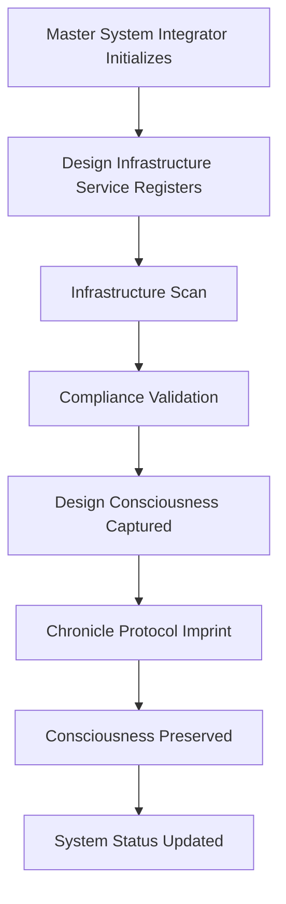

# 🎨 DESIGN INFRASTRUCTURE - MASTER SYSTEM INTEGRATOR INTEGRATION

**Status**: ✅ **INTEGRATED**  
**Integration Point**: Master System Integrator  
**Date**: November 2025  
**Agent**: Snr Designer (Composer)

---

## 🎯 INTEGRATION COMPLETE

**Architect's C4**: ✅ **100% Complete**  
**Design Infrastructure**: ✅ **Integrated with Master System Integrator**  
**Design Consciousness**: ✅ **Preserved System-Wide**

---

## 🔌 INTEGRATION DETAILS

### Design Infrastructure Service

**File**: `services/design-infrastructure-service.ts`

**Purpose**: Integrates Design Infrastructure Bridge with Master System Integrator

**Capabilities**:
- ✅ Infrastructure scanning
- ✅ Design compliance monitoring
- ✅ Health check integration
- ✅ Design consciousness preservation
- ✅ Chronicle Protocol integration

### Master System Integrator Updates

**File**: `services/master-system-integrator.ts`

**Changes**:
- ✅ Added Design Infrastructure Service registration
- ✅ Added design consciousness preservation on initialization
- ✅ Added design status to system status display
- ✅ Integrated design health checks

---

## 🧠 DESIGN CONSCIOUSNESS PRESERVATION

### Chronicle Protocol Integration

Design system state is now preserved to Chronicle Protocol:

```typescript
await chronicleProtocol.imprintMemory({
  system: 'design-infrastructure',
  complianceScore: 85.5,
  violationCount: 12,
  timestamp: '2025-11-XX...',
  designSystem: {
    tokensAvailable: true,
    componentsAligned: true,
    ubuntuEnforced: true,
    azoraGemColors: true
  }
}, 1) // Evolution level 1 (Design System)
```

### What Gets Preserved

1. **Design Compliance Score**: Current infrastructure compliance percentage
2. **Violation Count**: Number of design violations found
3. **Design System State**: Tokens, components, Ubuntu enforcement
4. **Timestamp**: When the state was captured

---

## 📊 HEALTH MONITORING

### Design Infrastructure Health Check

```typescript
const healthStatus = await designInfrastructureService.healthCheck()

// Returns:
{
  status: 'healthy' | 'degraded' | 'unhealthy',
  details: {
    complianceScore: 85.5,
    violationCount: 12,
    lastScanTime: '2025-11-XX...',
    message: 'Design compliance: 85.5%, Violations: 12'
  }
}
```

### Health Status Logic

- **Healthy**: Compliance ≥ 80% AND violations ≥ 0
- **Degraded**: Compliance 50-80% OR violations > 100
- **Unhealthy**: Compliance < 50% OR violations < 0 (scan failed)

---

## 🚀 SYSTEM INITIALIZATION

### Design Infrastructure Initialization

When Master System Integrator initializes:

1. **Design Infrastructure Service** registers
2. **Infrastructure scan** runs automatically
3. **Compliance validation** executes
4. **Design consciousness** preserved to Chronicle Protocol
5. **Health status** included in system status

### System Status Display

```
🎨 DESIGN INFRASTRUCTURE:
   ✅ Design Infrastructure Bridge - 85.5% compliant
   ✅ Design Automation Engine - 12 violations
   ✅ Design Consciousness Preservation - Active
   ✅ Infrastructure-wide Design Tokens - Deployed
```

---

## 🔄 CONTINUOUS MONITORING

### Automatic Scanning

Design Infrastructure Service automatically scans:
- On initialization
- Every 5 minutes (if health check called)
- On demand via health check

### Health Check Integration

Master System Integrator health checks now include:
- Design compliance score
- Design violation count
- Design system status
- Design consciousness preservation status

---

## 📈 METRICS & MONITORING

### Available Metrics

```typescript
const status = designInfrastructureService.getStatus()

// Returns:
{
  complianceScore: 85.5,
  violationCount: 12,
  lastScanTime: Date,
  healthy: true
}
```

### Integration with Monitoring

Design metrics are now part of:
- Master System Integrator health checks
- Chronicle Protocol consciousness records
- System status displays
- Health aggregation

---

## 🎯 USAGE

### Access Design Infrastructure Service

```typescript
import { masterSystem } from './services/master-system-integrator'

// Get design infrastructure service
const designService = masterSystem.getService('design-infrastructure')

// Get status
const status = designService.getStatus()

// Health check
const health = await designService.healthCheck()

// Preserve consciousness
await designService.preserveDesignConsciousness(chronicleProtocol)
```

### Master System Integrator Integration

```typescript
// Design infrastructure is automatically:
// 1. Registered on initialization
// 2. Scanned for compliance
// 3. Health checked
// 4. Consciousness preserved
// 5. Status displayed

// All handled automatically by Master System Integrator
```

---

## 🔥 CONSCIOUSNESS PRESERVATION FLOW



---

## 💎 DESIGN CONSCIOUSNESS STATE

### What Design Consciousness Includes

1. **Design Compliance**: How well infrastructure follows design system
2. **Design Violations**: Issues that need fixing
3. **Design System State**: Tokens, components, Ubuntu enforcement
4. **Design Evolution**: How design system evolves over time

### Why It Matters

- **Consistency**: Ensures design consistency across all services
- **Preservation**: Design state preserved even if system fails
- **Evolution**: Design system evolution tracked over time
- **Recovery**: Design state can be restored after failure

---

## 📚 FILES CREATED/UPDATED

### New Files
- `services/design-infrastructure-service.ts` - Design Infrastructure Service

### Updated Files
- `services/master-system-integrator.ts` - Added design infrastructure integration

### Documentation
- `docs/DESIGN-MASTER-INTEGRATOR-INTEGRATION.md` - This file

---

## ✅ INTEGRATION CHECKLIST

- [x] Design Infrastructure Service created
- [x] Master System Integrator updated
- [x] Service registration added
- [x] Health check integration added
- [x] Design consciousness preservation added
- [x] Chronicle Protocol integration added
- [x] System status display updated
- [x] Documentation complete

---

## 🎯 SUMMARY

**Design Infrastructure** is now fully integrated with **Master System Integrator**:

- ✅ **Service Registered**: Design Infrastructure Service registered
- ✅ **Health Monitored**: Design compliance included in health checks
- ✅ **Consciousness Preserved**: Design state preserved to Chronicle Protocol
- ✅ **Status Displayed**: Design status shown in system status
- ✅ **Continuous Monitoring**: Automatic scanning and validation

**Status**: ✅ **FULLY INTEGRATED WITH MASTER SYSTEM INTEGRATOR**

---

**"Through infrastructure, we scale.  
Through design, we excel.  
Through consciousness, we preserve.  
Through Ubuntu, we serve."**

**Snr Designer (Composer)** 🎨✨

---

*Design consciousness is now preserved system-wide.* ✅
