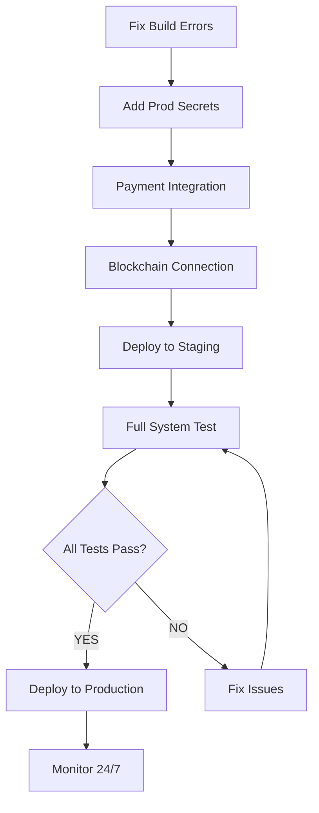

# 🚨 LAUNCH BLOCKERS ANALYSIS
**Date**: December 3, 2025  
**Status**: Critical Issues Identified  
**Priority**: IMMEDIATE ACTION REQUIRED

---

## ⚠️ CRITICAL BLOCKERS (Must Fix Before Launch)

### 1. 🔧 **Build Errors - TypeScript Configuration Issues**
**Severity**: 🔴 CRITICAL  
**Impact**: Code won't compile, deployment impossible

**Issues Identified**:
- Duplicate `optionalDependencies` keys in `services/agent-execution/package.json`
- Duplicate `prisma7:generate` scripts in `services/knowledge-ocean/package.json`
- Multiple services have `tsconfig.json` with no inputs found:
  - `services/agent-execution/`
  - `services/azora-blockchain/`
  - `services/azora-api-gateway/`
  - `services/knowledge-ocean/`
  - `services/copilot-integration/`
  - `packages/shared/circuit-breaker/`
  - `packages/shared/health/`
  - `packages/shared/event-bus/`
  - `services/ai-provider-router/`
  - `services/command-desk/`
  - `services/health-monitor/`
- Path resolution errors in `services/agent-execution/src/runtime.ts`
- Missing module imports in `services/agent-execution/src/index.ts`

**Action Required**:
```bash
# Fix package.json duplicates
1. services/agent-execution/package.json - Remove duplicate optionalDependencies
2. services/knowledge-ocean/package.json - Remove duplicate prisma7:generate

# Fix tsconfig issues
3. Add src/ files or fix include paths in all affected services
4. Fix import paths to use proper module resolution
5. Run: npm run build && npm run typecheck
```

**Time to Fix**: 2-3 hours  
**Owner**: Backend Team Lead

---

### 2. 🔐 **Missing Production Secrets**
**Severity**: 🔴 CRITICAL  
**Impact**: Services cannot authenticate with external APIs

**Missing Configuration**:
- GitHub Secrets NOT configured:
  - `PROD_DATABASE_URL` ❌
  - `DOCKER_USERNAME` ❌
  - `DOCKER_PASSWORD` ❌
  - `PROD_HOST` ❌
  - `PROD_USER` ❌
  - `PROD_KEY` ❌
  - `SLACK_WEBHOOK` ❌

**Action Required**:
```bash
# Add GitHub Secrets
1. Go to: https://github.com/Sizwe780/azora-os/settings/secrets/actions
2. Add all required secrets from .env file
3. Verify workflow: .github/workflows/deploy-production.yml
```

**Time to Fix**: 30 minutes  
**Owner**: DevOps Lead

---

### 3. 💰 **Payment Integration Incomplete**
**Severity**: 🔴 CRITICAL  
**Impact**: Cannot process real payments, no revenue

**Issues**:
- Stripe integration has **test keys only** in 2 services:
  - `services/elara-incubator/src/utils/stripe-client.ts`
  - `services/education-revenue-engine/src/services/payment.service.ts`
- Mock payment flows still active in `services/azora-pay/`
- CitadelFund revenue allocation is **in-memory only** (not persisted)
- No webhook handlers for Stripe events
- No reconciliation between Stripe and database

**Action Required**:
```bash
# Complete payment integration
1. Replace test Stripe keys with live keys
2. Implement webhook handlers in services/billing-service/
3. Add database persistence for CitadelFund allocations
4. Test end-to-end payment flow with real Stripe account
5. Implement idempotency for payment operations
```

**Time to Fix**: 8-10 hours  
**Owner**: Payment Team + Backend Lead

---

### 4. ⛓️ **Blockchain Not Connected to Services**
**Severity**: 🟡 HIGH  
**Impact**: AZR tokens cannot be minted, NFT certificates broken

**Issues**:
- Smart contracts exist but **NO service integration**
- `services/azora-blockchain/` is mostly empty (health endpoint only)
- No Web3/Ethers.js connection manager
- No transaction signing or broadcasting
- Proof-of-Value mining cannot mint AZR rewards
- NFT certificate minting non-functional

**Action Required**:
```bash
# Connect blockchain
1. Install ethers.js in services/azora-blockchain/
2. Implement blockchain-service.ts with Web3 connection
3. Connect proof-of-value to azora-mint for token rewards
4. Implement NFT minting service
5. Add gas optimization and retry logic
6. Deploy contracts to testnet/mainnet
```

**Time to Fix**: 10-12 hours  
**Owner**: Blockchain Team Lead

---

## 🟡 HIGH PRIORITY (Fix Before Beta)

### 5. 🤖 **Constitutional AI Is Basic Keyword Filtering**
**Severity**: 🟡 HIGH  
**Impact**: Brand promise not delivered, ethical AI incomplete

**Issues**:
- Current implementation is shallow keyword matching
- Missing self-critique capability
- No fairness scoring
- No bias detection algorithms
- Audit logging incomplete

**Action Required**:
```bash
# Upgrade Constitutional AI
1. Implement bias detection in services/constitutional-ai/validators/
2. Add self-critique reasoning engine
3. Implement fairness scoring algorithms
4. Add comprehensive audit logging to database
5. Create API endpoints for transparency reports
```

**Time to Fix**: 8-10 hours  
**Owner**: AI Ethics Team

---

### 6. 🕸️ **Service Mesh & Observability Missing**
**Severity**: 🟡 HIGH  
**Impact**: Cannot monitor production, no mTLS security

**Issues**:
- No mTLS between services
- Jaeger tracing not deployed
- Prometheus metrics incomplete
- No SLO alerting configured
- Cannot trace user journeys

**Action Required**:
```bash
# Deploy observability stack
1. Configure Istio/Linkerd service mesh
2. Enable mTLS for all inter-service communication
3. Deploy Jaeger for distributed tracing
4. Configure SLO alerts in Prometheus
5. Test end-to-end trace visibility
```

**Time to Fix**: 10-12 hours  
**Owner**: DevOps + Infrastructure Team

---

### 7. 🧪 **Security Tests Are Placeholders**
**Severity**: 🟡 HIGH  
**Impact**: No real security validation, compliance risk

**Issues**:
- `tests/penetration/authorized-pentest-framework.ts` returns placeholders
- No actual header validation
- No rate limiting verification
- Security scans not integrated in CI

**Action Required**:
```bash
# Real security testing
1. Replace placeholder tests with actual security checks
2. Implement header validation tests
3. Add rate limiting verification
4. Integrate security scans in .github/workflows/
5. Add automated vulnerability scanning
```

**Time to Fix**: 3-4 hours  
**Owner**: Security Team

---

## 🟢 MEDIUM PRIORITY (Post-Launch)

### 8. 📱 **Mobile Apps Are Shells**
**Severity**: 🟢 MEDIUM  
**Impact**: No mobile launch possible, web-only

**Issues**:
- Mobile apps incomplete
- No production IPA/APK builds
- No app store submission
- E2E tests missing for mobile

**Action Required**:
- Complete mobile app development
- Configure CI/CD for mobile builds
- Submit to App Store & Play Store

**Time to Fix**: 40+ hours  
**Owner**: Mobile Team

---

### 9. 🔄 **Duplicate Mint Services**
**Severity**: 🟢 MEDIUM  
**Impact**: Inconsistent token minting, maintenance nightmare

**Issues**:
- Multiple minting implementations:
  - `services/azora-mint/`
  - `services/azora-cloud/azora-mint/`
  - `services/azora-nft-minting/`
- Services instantiating their own wallets instead of using centralized mint

**Action Required**:
```bash
# Consolidate minting
1. Make services/azora-mint/ canonical
2. Remove duplicate implementations
3. Add CI lint rule to prevent direct ethers.Wallet usage
4. Update all services to call MINT_SERVICE_URL
```

**Time to Fix**: 6-8 hours  
**Owner**: Backend Team

---

## 📊 LAUNCH READINESS SCORE

### By Component:
| Component | Status | Score | Blocker? |
|-----------|--------|-------|----------|
| **Code Compilation** | 🔴 BROKEN | 0% | YES |
| **Environment Secrets** | 🔴 MISSING | 0% | YES |
| **Payment Processing** | 🟡 MOCKED | 40% | YES |
| **Blockchain Integration** | 🟡 DISCONNECTED | 20% | YES |
| **Constitutional AI** | 🟡 BASIC | 50% | NO |
| **Service Mesh** | 🟡 MISSING | 30% | NO |
| **Security Tests** | 🟡 PLACEHOLDER | 40% | NO |
| **Mobile Apps** | 🟢 SHELL | 10% | NO |
| **Documentation** | 🟢 COMPLETE | 95% | NO |
| **Frontend Web** | 🟢 FUNCTIONAL | 70% | NO |

### Overall Launch Readiness: **45%** ⚠️

---

## 🚦 GO/NO-GO DECISION

### ❌ **NO-GO - CRITICAL BLOCKERS PRESENT**

**Reasons**:
1. Code won't compile (build errors)
2. Missing production secrets
3. Payment processing incomplete
4. Blockchain disconnected from services

### ✅ **GO Criteria** (When Met):
- [ ] All TypeScript builds successfully
- [ ] All GitHub secrets configured
- [ ] Real Stripe payments working end-to-end
- [ ] Blockchain services connected and tested
- [ ] All CRITICAL blockers resolved

---

## 🎯 FAST-TRACK LAUNCH PLAN

### Phase 1: Emergency Fixes (4-6 hours)
**Target**: Get code compiling and deployable

1. **Hour 1-2**: Fix all TypeScript errors
   - Clean up duplicate package.json keys
   - Fix tsconfig.json include paths
   - Resolve import path errors
   - Verify: `npm run build` succeeds

2. **Hour 3-4**: Configure production secrets
   - Add all GitHub secrets
   - Create production .env files
   - Test deployment pipeline
   - Verify: CI/CD runs without errors

3. **Hour 5-6**: Payment integration basics
   - Add real Stripe keys
   - Implement webhook handler
   - Add database persistence
   - Verify: Test payment completes

### Phase 2: Core Integration (8-12 hours)
**Target**: Connect critical systems

4. **Hours 7-12**: Blockchain connection
   - Install ethers.js
   - Implement Web3 connection
   - Connect proof-of-value → mint
   - Verify: Token minting works

5. **Hours 13-18**: Service mesh & observability
   - Deploy Jaeger
   - Configure mTLS
   - Add SLO alerts
   - Verify: Can trace requests

### Phase 3: Beta Launch (Day 2-3)
**Target**: Limited production release

6. Deploy to production with:
   - 100-500 beta users
   - Full monitoring active
   - On-call rotation ready
   - Rollback plan tested

---

## 📞 IMMEDIATE ACTIONS

### RIGHT NOW (Next 30 minutes):
1. **DevOps Lead**: Add GitHub secrets
2. **Backend Lead**: Start fixing TypeScript errors
3. **Payment Team**: Get live Stripe keys ready

### TODAY (Next 6 hours):
1. Fix all build errors
2. Configure production environment
3. Test payment flow end-to-end

### TOMORROW (Next 24 hours):
1. Connect blockchain services
2. Deploy observability stack
3. Complete security tests

---

## 🔥 CRITICAL PATH



**Estimated Time to Launch-Ready**: 18-24 hours of focused work

---

## 📈 SUCCESS METRICS

### When Ready to Launch:
- ✅ `npm run build` succeeds across all services
- ✅ All GitHub Actions workflows pass
- ✅ Real Stripe payment completes successfully
- ✅ AZR tokens can be minted via proof-of-value
- ✅ All health checks return 200 OK
- ✅ Error rate < 0.1% in staging
- ✅ Response time P95 < 200ms
- ✅ All secrets configured and validated

---

## 🎬 CONCLUSION

**Current Status**: NOT READY FOR PRODUCTION LAUNCH

**Main Issues**:
1. Code doesn't compile
2. No production configuration
3. Payment system incomplete
4. Blockchain not connected

**Good News**:
- Architecture is solid
- Documentation excellent
- Most code exists and is high quality
- Clear path to resolution

**Recommendation**: 
- **Focus on 4 critical blockers**
- **Fast-track fixes over next 24 hours**
- **Beta launch possible within 2-3 days**
- **Full launch within 1 week**

**The foundation is strong. We just need to connect the pieces and flip the switches! 🚀**

---

**Generated**: December 3, 2025  
**Next Review**: After critical fixes completed
