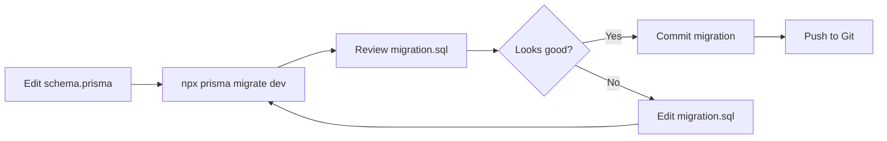
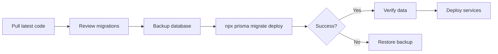

# 🔄 Database Migrations Guide

**Ubuntu Principle:** *"My changes strengthen our foundation"*

Complete guide to managing database schema changes in Azora OS.

---

## 📋 Overview

Azora OS uses **Prisma Migrate** for database schema management. Each service manages its own migrations independently.

---

## 🚀 Quick Start

### Create a Migration

```bash
# Navigate to service
cd services/azora-education

# Create migration
npx prisma migrate dev --name add_student_grade

# This will:
# 1. Generate SQL migration file
# 2. Apply migration to database
# 3. Regenerate Prisma Client
```

### Apply Migrations (Production)

```bash
# Apply all pending migrations
npx prisma migrate deploy

# Check migration status
npx prisma migrate status
```

### Reset Database (DEV ONLY!)

```bash
# WARNING: Deletes all data!
npx prisma migrate reset
```

---

## 📁 Migration File Structure

```
services/azora-education/
├── prisma/
│   ├── schema.prisma
│   └── migrations/
│       ├── 20250110_init/
│       │   └── migration.sql
│       ├── 20250111_add_student_grade/
│       │   └── migration.sql
│       └── migration_lock.toml
```

---

## 🛠️ Common Migration Tasks

### 1. Add New Field

**Schema Change:**
```prisma
model Student {
  id        String   @id @default(cuid())
  email     String   @unique
  grade     String?  // NEW FIELD
  createdAt DateTime @default(now())
}
```

**Create Migration:**
```bash
npx prisma migrate dev --name add_student_grade
```

**Generated SQL:**
```sql
-- AlterTable
ALTER TABLE "students" ADD COLUMN "grade" TEXT;
```

### 2. Add New Model

**Schema Change:**
```prisma
model Certificate {
  id        String   @id @default(cuid())
  studentId String
  courseId  String
  issuedAt  DateTime @default(now())
  
  @@index([studentId])
  @@index([courseId])
}
```

**Create Migration:**
```bash
npx prisma migrate dev --name add_certificates
```

**Generated SQL:**
```sql
-- CreateTable
CREATE TABLE "certificates" (
    "id" TEXT NOT NULL,
    "studentId" TEXT NOT NULL,
    "courseId" TEXT NOT NULL,
    "issuedAt" TIMESTAMP(3) NOT NULL DEFAULT CURRENT_TIMESTAMP,

    CONSTRAINT "certificates_pkey" PRIMARY KEY ("id")
);

-- CreateIndex
CREATE INDEX "certificates_studentId_idx" ON "certificates"("studentId");

-- CreateIndex
CREATE INDEX "certificates_courseId_idx" ON "certificates"("courseId");
```

### 3. Add Relationship

**Schema Change:**
```prisma
model Student {
  id           String        @id @default(cuid())
  certificates Certificate[] // NEW RELATION
}

model Certificate {
  id        String  @id @default(cuid())
  studentId String
  student   Student @relation(fields: [studentId], references: [id]) // NEW
}
```

**Create Migration:**
```bash
npx prisma migrate dev --name add_certificate_relation
```

**Generated SQL:**
```sql
-- AddForeignKey
ALTER TABLE "certificates" 
ADD CONSTRAINT "certificates_studentId_fkey" 
FOREIGN KEY ("studentId") 
REFERENCES "students"("id") 
ON DELETE RESTRICT 
ON UPDATE CASCADE;
```

### 4. Rename Field

**Schema Change:**
```prisma
model Student {
  id        String @id @default(cuid())
  fullName  String // RENAMED from 'name'
}
```

**Create Migration:**
```bash
npx prisma migrate dev --name rename_name_to_fullname
```

**Manual Edit Required:**
```sql
-- AlterTable (edit this to preserve data)
ALTER TABLE "students" 
RENAME COLUMN "name" TO "fullName";
```

### 5. Change Field Type

**Schema Change:**
```prisma
model Wallet {
  id      String  @id @default(cuid())
  balance Decimal @db.Decimal(18, 8) // CHANGED from Float
}
```

**Create Migration:**
```bash
npx prisma migrate dev --name change_balance_to_decimal
```

**Generated SQL:**
```sql
-- AlterTable
ALTER TABLE "wallets" 
ALTER COLUMN "balance" SET DATA TYPE DECIMAL(18,8);
```

---

## 🔄 Migration Workflow

### Development Workflow



### Production Workflow



---

## 🎯 Best Practices

### 1. Always Review Generated SQL

```bash
# After creating migration
cat prisma/migrations/20250110_add_field/migration.sql

# Check for:
# - Data loss (DROP COLUMN)
# - Breaking changes (NOT NULL without default)
# - Performance issues (missing indexes)
```

### 2. Test Migrations Locally

```bash
# Create test database
createdb azora_test

# Set test DATABASE_URL
export DATABASE_URL="postgresql://localhost:5432/azora_test"

# Apply migrations
npx prisma migrate deploy

# Test with seed data
npm run db:seed

# Verify everything works
npm test
```

### 3. Backup Before Production Migrations

```bash
# Backup database
pg_dump azora_education > backup_$(date +%Y%m%d).sql

# Apply migration
npx prisma migrate deploy

# If something goes wrong:
psql azora_education < backup_20250110.sql
```

### 4. Use Descriptive Migration Names

```bash
# Good ✅
npx prisma migrate dev --name add_student_grade_field
npx prisma migrate dev --name create_certificates_table
npx prisma migrate dev --name add_wallet_staking_support

# Bad ❌
npx prisma migrate dev --name update
npx prisma migrate dev --name fix
npx prisma migrate dev --name changes
```

### 5. Keep Migrations Small

```bash
# Good ✅ - One logical change per migration
npx prisma migrate dev --name add_student_grade
npx prisma migrate dev --name add_student_country

# Bad ❌ - Too many changes at once
npx prisma migrate dev --name update_entire_schema
```

---

## 🚨 Common Issues

### Issue 1: Migration Conflicts

**Problem:**
```
Error: Migration conflict detected
```

**Solution:**
```bash
# Pull latest migrations
git pull

# Reset local database
npx prisma migrate reset

# Apply all migrations
npx prisma migrate deploy
```

### Issue 2: Failed Migration

**Problem:**
```
Error: Migration failed to apply
```

**Solution:**
```bash
# Mark migration as rolled back
npx prisma migrate resolve --rolled-back 20250110_migration_name

# Fix the issue in schema
# Create new migration
npx prisma migrate dev --name fix_previous_migration
```

### Issue 3: Out of Sync Schema

**Problem:**
```
Error: Prisma schema is out of sync with database
```

**Solution:**
```bash
# Option 1: Create migration for changes
npx prisma migrate dev --name sync_schema

# Option 2: Force push schema (DEV ONLY!)
npx prisma db push --force-reset
```

### Issue 4: Data Loss Warning

**Problem:**
```
Warning: You are about to drop column "old_field"
```

**Solution:**
```bash
# 1. Create migration
npx prisma migrate dev --name remove_old_field

# 2. Edit migration to preserve data
# Before:
# ALTER TABLE "students" DROP COLUMN "old_field";

# After:
# -- Backup data first
# CREATE TABLE "students_backup" AS SELECT * FROM "students";
# ALTER TABLE "students" DROP COLUMN "old_field";
```

---

## 📊 Migration Status

### Check Status

```bash
# View migration history
npx prisma migrate status

# Output:
# Database schema is up to date!
# 
# The following migrations have been applied:
# 
# migrations/
#   └─ 20250110_init/
#       └─ migration.sql
#   └─ 20250111_add_student_grade/
#       └─ migration.sql
```

### View Applied Migrations

```sql
-- Query _prisma_migrations table
SELECT * FROM _prisma_migrations 
ORDER BY finished_at DESC;
```

---

## 🔄 Rollback Strategies

### Strategy 1: Create Reverse Migration

```bash
# If you added a field, remove it
npx prisma migrate dev --name remove_student_grade

# Edit schema to remove field
# Create migration
```

### Strategy 2: Restore from Backup

```bash
# Restore database
psql azora_education < backup_20250110.sql

# Mark migrations as rolled back
npx prisma migrate resolve --rolled-back 20250111_migration_name
```

### Strategy 3: Manual Rollback

```sql
-- Manually reverse the migration
-- If migration added a column:
ALTER TABLE "students" DROP COLUMN "grade";

-- Then mark as rolled back:
-- npx prisma migrate resolve --rolled-back 20250111_add_grade
```

---

## 🎓 Advanced Topics

### Custom Migration SQL

```bash
# Create empty migration
npx prisma migrate dev --create-only --name custom_indexes

# Edit migration.sql manually
# Add custom SQL:
CREATE INDEX CONCURRENTLY idx_students_email_lower 
ON students (LOWER(email));

# Apply migration
npx prisma migrate deploy
```

### Data Migrations

```sql
-- In migration.sql
-- Add new field with default
ALTER TABLE "students" ADD COLUMN "status" TEXT DEFAULT 'active';

-- Migrate existing data
UPDATE "students" 
SET "status" = 'inactive' 
WHERE "lastLoginAt" < NOW() - INTERVAL '90 days';

-- Remove default (force explicit values)
ALTER TABLE "students" ALTER COLUMN "status" DROP DEFAULT;
```

### Zero-Downtime Migrations

```sql
-- Step 1: Add new column (nullable)
ALTER TABLE "students" ADD COLUMN "new_field" TEXT;

-- Step 2: Deploy code that writes to both fields
-- (Deploy application code)

-- Step 3: Backfill data
UPDATE "students" SET "new_field" = "old_field" WHERE "new_field" IS NULL;

-- Step 4: Make new field required
ALTER TABLE "students" ALTER COLUMN "new_field" SET NOT NULL;

-- Step 5: Deploy code that only uses new field
-- (Deploy application code)

-- Step 6: Remove old field
ALTER TABLE "students" DROP COLUMN "old_field";
```

---

## 📚 Resources

- [Prisma Migrate Documentation](https://www.prisma.io/docs/concepts/components/prisma-migrate)
- [PostgreSQL ALTER TABLE](https://www.postgresql.org/docs/current/sql-altertable.html)
- [Database Migration Best Practices](https://www.prisma.io/docs/guides/migrate/production-troubleshooting)

---

## 🤝 Contributing

When creating migrations:

1. ✅ Use descriptive names
2. ✅ Review generated SQL
3. ✅ Test locally first
4. ✅ Backup before production
5. ✅ Keep migrations small
6. ✅ Document breaking changes
7. ✅ Update seed data if needed

---

**Ubuntu Principle:** *"My changes strengthen our foundation"*

Every migration should improve the system while maintaining data integrity and supporting collective prosperity.
