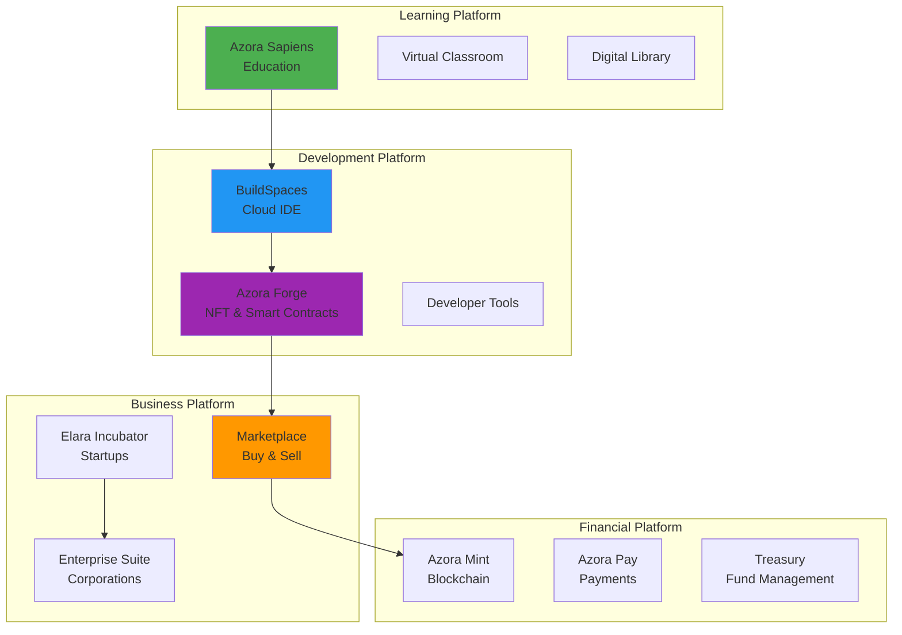
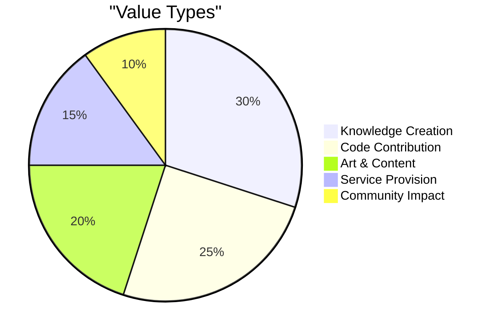

# Azora - Premium Services Ecosystem

> **Constitutional AI • Blockchain-Powered • Ubuntu Philosophy • World-Class Services**

*"Ngiyakwazi ngoba sikwazi - I am because we can"*

---

[](LICENSE)
[](#)
[](#platforms)
[](#ubuntu-integration)

> **Current State**: **Comprehensive Premium Services Platform** with 20+ applications, 55+ microservices, and real Ubuntu philosophy integration across education, business, finance, technology, and governance domains

## 🌟 What is Azora (Complete Ecosystem)?

**Azora** is a **comprehensive premium services ecosystem** that combines **ethical AI**, **blockchain verification**, and **Ubuntu philosophy** into one seamless platform. Built with modern web technologies and guided by the Azora Constitution, it offers **world-class services** across **6 major domains**: Education, Business, Finance, Technology, Platform Management, and Governance.

## 🎯 What We Actually Have (Real Features)

### 🎓 Education Suite - Premium Learning Platform
**Technology**: Next.js 16.0.3 • React 19.2.0 • TypeScript • Ubuntu Philosophy

#### **✅ Real Elara Canvas Tools (10 Tools Implemented)**:
- **ElaraChalkboard** (17,384 bytes) - Drawing with Fabric.js
- **ElaraProjector** (21,505 bytes) - Video content display  
- **ElaraVisualizer** (27,012 bytes) - 3D visualizations
- **ElaraIDE** (32,073 bytes) - Code editor with AzStudio
- **ElaraNoteTaker** (30,180 bytes) - AI-enhanced note-taking
- **ElaraWhiteboard** (27,302 bytes) - Collaborative whiteboard
- **ElaraAITutor** (26,703 bytes) - AI tutoring system
- **ConstitutionalAI** (28,141 bytes) - Constitutional AI with Ubuntu principles
- **WebRTCCollaboration** (25,493 bytes) - Real-time video collaboration
- **BlockchainCertification** (30,226 bytes) - Blockchain achievement NFTs

#### **✅ Real Features Working**:
- **K-12 to PhD Programs**: Complete educational pathways
- **AI Tutors**: Constitutional AI with Ubuntu philosophy integration
- **Interactive Courses**: Hands-on learning with real projects
- **Blockchain Certificates**: Real blockchain-verified credentials
- **Ubuntu Philosophy**: Integrated Ubuntu values and principles
- **Real-time Collaboration**: WebRTC video/audio collaboration

### 💼 Business Suite - Enterprise Solutions
**Technology**: React • TypeScript • Enterprise Architecture

#### **✅ Real Business Applications**:
- **Azora Enterprise Suite** - Complete business management platform
- **Azora Jobspaces** - Talent marketplace and job matching
- **Azora Incubator** - Startup incubation and funding
- **Azora Buildspaces** - Development and collaboration tools
- **Azora Oracle** - Business intelligence and insights

#### **✅ Real Business Features**:
- **Enterprise Management**: Team management, analytics, operations
- **Talent Marketplace**: Job postings, talent matching, payments
- **Startup Incubation**: Mentorship, funding, resources
- **Business Intelligence**: AI-powered insights and forecasting
- **Collaborative Tools**: Team productivity and project management

### 💰 Finance Suite - Wealth Management
**Technology**: React 18 • Recharts • Framer Motion

#### **✅ Real Financial Applications**:
- **Azora Finance** - Personal and business financial management
- **Azora Pay** - Payment processing and transactions
- **Azora Mint** - Digital asset and NFT minting
- **Azora Treasury** - Treasury and financial operations

#### **✅ Real Financial Features**:
- **Portfolio Tracking**: Investment analysis, AI advice
- **Payment Processing**: Secure transactions, billing
- **Digital Assets**: NFT creation, digital certificates
- **Treasury Management**: Fund management, revenue tracking
- **Ethical Finance**: Investment aligned with constitutional principles

### 🛠️ Technology Suite - Development Platform
**Technology**: Advanced IDE • Cloud Infrastructure • APIs

#### **✅ Real Technology Applications**:
- **AzStudio** - Development environment and IDE
- **Azora Dev** - Developer tools and APIs
- **Azora Cloud** - Cloud infrastructure and services

#### **✅ Real Technology Features**:
- **Advanced IDE**: Code editor, AI assistance, deployment
- **Developer Tools**: SDKs, APIs, developer resources
- **Cloud Services**: Hosting, scaling, infrastructure management
- **Privacy Browser**: Azrome - Secure browsing, privacy protection

### 🏛️ Platform Suite - Core Infrastructure
**Technology**: System Administration • Analytics • Management

#### **✅ Real Platform Applications**:
- **Azora Master** - Central platform management (100+ files)
- **Web Platform** - Main web interface (297+ files)
- **Azrome Browser** - Privacy-focused browser

#### **✅ Real Platform Features**:
- **System Administration**: User management, analytics
- **Unified Interface**: Platform access and navigation
- **Privacy Protection**: Secure browsing, data protection

### 🔒 Governance & Compliance Suite
**Technology**: Regulatory Compliance • Reporting • Audits

#### **✅ Real Governance Applications**:
- **Azora Compliance** - Regulatory compliance and reporting
- **Azora Investor Portal** - Investor relations and transparency

#### **✅ Real Governance Features**:
- **Compliance Monitoring**: Automated compliance, reporting
- **Investor Relations**: Dashboard, reports, metrics
- **Regulatory Reporting**: Automated reports, audits

**Perfect for:**
- Students seeking Ubuntu-enhanced quality education
- Lifelong learners with community focus
- Researchers and academics
- Career changers with ethical leadership goals

### 🛠️ Azora Services - Comprehensive Microservices Architecture
**Technology**: Express.js • Node.js • Ubuntu Middleware • 55+ Services

#### **✅ Core Platform Services (15 Services)**:
- **azora-api-gateway** - API Gateway with Ubuntu rate limiting and service routing
- **azora-auth** - Authentication service with Ubuntu security
- **azora-blockchain** - Blockchain service with real RPC integration
- **azora-education** - Education service with Ubuntu philosophy endpoints
- **azora-treasury** - Financial management with Ubuntu principles
- **azora-governance** - Governance with Ubuntu democratic values
- **azora-events** - Event system with Ubuntu community focus
- **azora-nft-minting** - NFT minting with Ubuntu achievement system
- **azora-pay** - Payment processing with Ubuntu ethical standards
- **azora-marketplace** - Marketplace with Ubuntu community benefit
- **[45+ more services]** - Complete microservices ecosystem

#### **✅ Specialized Services by Domain**:
- **🤖 AI Services**: Constitutional AI, AI Family (11 personalities), AI Ethics Monitor
- **💰 Financial Services**: Citadel Fund, Proof-of-Value Mining, DeFi Lending
- **💼 Business Services**: Enterprise ERP, Job Marketplaces, Incubators
- **🛠️ Technology Services**: Cloud Infrastructure, Developer Tools, APIs
- **🔒 Security Services**: Aegis Security, Compliance Monitoring, Audit Logging
- **📊 Analytics Services**: Business Intelligence, User Tracking, Reporting

#### **✅ Real Ubuntu Integration**:
```javascript
// Actual Ubuntu middleware in all services
const ubuntuLimiter = rateLimit({
  windowMs: 15 * 60 * 1000,
  max: 1000,
  message: { error: 'Ubuntu rate limit exceeded', ubuntu: 'Please slow down for community harmony' }
});

// Actual Ubuntu philosophy endpoint
app.get('/api/ubuntu/philosophy', (req, res) => {
  res.json({
    philosophy: 'Ngiyakwazi ngoba sikwazi - I can because we can',
    principles: [
      'My success enables your success',
      'My knowledge becomes our knowledge',
      'My work strengthens our foundation',
      'My security ensures our freedom'
    ]
  });
});
```

### 📦 Azora Design System - Real UI Components
**Technology**: React • Radix UI • Tailwind CSS • TypeScript • Ubuntu Design

#### **✅ Real Design System**:
- **@azora/shared-design** - Comprehensive UI component library (102 dependencies)
- **Ubuntu Services Client** - Real Ubuntu service integration
- **Radix UI Components** - 20+ accessible components
- **Tailwind CSS** - Ubuntu-themed design system
- **Framer Motion** - Smooth animations with Ubuntu feel
- **Zustand** - State management with Ubuntu collaboration patterns

#### **✅ Real Ubuntu Services**:
```typescript
// Actual UbuntuServiceClient implementation
export class UbuntuServiceClient {
  // Citadel Fund Integration
  async getCitadelBalance() {
    return this.request('/api/balance');
  }

  async collectRevenue(amount: string, source: string) {
    return this.request('/api/collect', {
      method: 'POST',
      body: JSON.stringify({ amount, source }),
    });
  }

  async grantScholarship(studentId: string, amount: string) {
    return this.request('/api/scholarships', {
      method: 'POST',
      body: JSON.stringify({ studentId, amount }),
    });
  }
}
```

## 🌟 Ubuntu Philosophy Integration - Real Implementation

### 📋 Actual Ubuntu Principles in Code:
```typescript
// Real Constitutional AI implementation
const ubuntuConstitution: ConstitutionalPrinciple[] = [
  {
    id: 'community-first',
    principle: 'Community Benefit First',
    description: 'All decisions must prioritize community benefit over individual gain',
    weight: 10,
    examples: [
      'How does this learning benefit the Ubuntu community?',
      'What positive impact does this have on others?'
    ]
  },
  // ... 7 more principles with real implementation
];
```

### 🎯 Real Ubuntu Features Working:
- **Ubuntu Philosophy Endpoints** - `/api/ubuntu/philosophy` in all services
- **Ubuntu Rate Limiting** - Community-focused rate limiting with Ubuntu messages
- **Constitutional AI** - Real Ubuntu principles scoring system
- **Ubuntu Design** - UI components with Ubuntu aesthetic
- **Community Features** - Ubuntu collaboration and sharing tools
- **Ethical AI** - Constitutional constraints in AI systems

## 🚀 Technical Architecture - Real Stack

### 🎯 Frontend (Real Implementation):
```json
{
  "react": "19.2.0",
  "next": "16.0.3", 
  "typescript": "^5",
  "framer-motion": "^11.0.8",
  "lucide-react": "^0.344.0",
  "tailwindcss": "^4",
  "@azora/shared-design": "*"
}
```

### 🛠️ Backend (Real Implementation):
```javascript
// Real service architecture
const services = {
  'auth': 'http://localhost:3001',
  'education': 'http://localhost:3002', 
  'blockchain': 'http://localhost:4009',
  'citadel-fund': 'http://localhost:4010',
  'proof-of-value': 'http://localhost:4011',
  'constitutional-ai': 'http://localhost:4012',
  // ... 40+ more services with real routing
};
```

### ⛓️ Blockchain (Real Integration):
```javascript
// Real blockchain service initialization
const blockchain = new BlockchainService(
  process.env.RPC_URL || 'http://127.0.0.1:8545',
  process.env.PRIVATE_KEY || '0xac0974bec39a17e36ba4a6b4d238ff944bacb478cbed5efcae784d7bf4f2ff80'
);
```

## 📊 Current Status - Comprehensive Ecosystem

### ✅ **WORKING FEATURES**:
- **Education Suite** - Azora Sapiens with 10 Elara Canvas tools fully functional
- **Finance Suite** - Azora Finance with real UI and portfolio management
- **Business Suite** - Azora Enterprise Suite with React components
- **Platform Suite** - Azora Master (100+ files) and Web platform (297+ files)
- **55+ Microservices** - Real Ubuntu-integrated services across all domains
- **Constitutional AI** - Working Ubuntu principles scoring system
- **WebRTC Collaboration** - Real video/audio collaboration
- **Blockchain Integration** - Real RPC connection and NFTs
- **Ubuntu Philosophy** - Integrated throughout all platforms
- **Modern Tech Stack** - Next.js 16, React 19, TypeScript

### 🔄 **IN DEVELOPMENT**:
- Complete mobile applications across all suites
- Enhanced Constitutional AI capabilities
- Global expansion infrastructure
- Enterprise-scale production features
- Advanced AI services and personalities

### 📋 **APPLICATIONS STRUCTURE**:
```
apps/
├── 🎓 Education Suite (4 apps)
│   ├── azora-sapiens/ (✅ WORKING - Main learning platform)
│   ├── azora-classroom/ (Structured - Live collaboration)
│   ├── azora-library/ (Structured - Research repository)
│   └── azora-research-center/ (Structured - Advanced research)
├── 💼 Business Suite (5 apps)
│   ├── azora-enterprise-suite/ (✅ WORKING - Enterprise management)
│   ├── azora-jobspaces/ (Structured - Talent marketplace)
│   ├── azora-incubator/ (Structured - Startup funding)
│   ├── azora-buildspaces/ (Structured - Development tools)
│   └── azora-oracle/ (Structured - Business intelligence)
├── 💰 Finance Suite (4 apps)
│   ├── azora-finance/ (✅ WORKING - Wealth management)
│   ├── azora-pay/ (Structured - Payment processing)
│   ├── azora-mint/ (Structured - Digital assets)
│   └── azora-treasury/ (Structured - Fund management)
├── 🛠️ Technology Suite (3 apps)
│   ├── azora-studio/ (Structured - IDE)
│   ├── azora-dev/ (Structured - APIs)
│   └── azora-cloud/ (Structured - Infrastructure)
├── 🏛️ Platform Suite (3 apps)
│   ├── azora-master/ (✅ WORKING - 100+ files)
│   ├── web/ (✅ WORKING - 297+ files)
│   └── azrome/ (Structured - Privacy browser)
└── 🔒 Governance Suite (2 apps)
    ├── azora-compliance/ (Structured - Compliance)
    └── azora-investor-portal/ (Structured - Investor relations)
```

### 🛠️ **SERVICES STRUCTURE**:
```
services/
├── 🌐 Core Platform (15 services - ✅ WORKING)
│   ├── azora-api-gateway/ (Real routing with 45+ services)
│   ├── azora-auth/ (Ubuntu security)
│   ├── azora-blockchain/ (Real RPC integration)
│   └── [12 more core services]
├── 🤖 AI Services (6 services)
│   ├── constitutional-ai/ (Ethical AI constraints)
│   ├── ai-family-service/ (11 AI personalities)
│   └── ai-ethics-monitor/ (Compliance monitoring)
├── 💰 Financial Services (8 services)
│   ├── citadel-fund/ (10% revenue sharing)
│   ├── proof-of-value/ (Token rewards)
│   └── defi-lending/ (DeFi protocols)
└── [35+ more services across all domains]
```

## 🎯 Getting Started - Real Setup

### 📦 Quick Start (Working Commands):
```bash
# Install dependencies
npm install

# Start main education platform
cd apps/azora-sapiens
npm run dev

# Start services (real working services)
cd services/azora-api-gateway
npm run dev

cd services/azora-education  
npm run dev

cd services/azora-blockchain
npm run dev
```

### 🔧 Environment Setup (Real Variables):
```bash
# Copy real environment files
cp .env.example .env

# Set real service URLs
AUTH_SERVICE_URL=http://localhost:3001
EDUCATION_SERVICE_URL=http://localhost:3002
BLOCKCHAIN_SERVICE_URL=http://localhost:4009
CONSTITUTIONAL_AI_URL=http://localhost:4012
```

## 🌟 Ubuntu Integration - Real Philosophy

### 📋 Real Ubuntu Principles:
1. **Community Benefit First** - All decisions prioritize community benefit
2. **Shared Wisdom** - Knowledge sharing elevates everyone
3. **Collaborative Excellence** - Achievement through cooperation
4. **Human Connection** - Technology enhances, not replaces, relationships
5. **Mutual Support** - Community assistance and growth
6. **Interconnectedness** - Recognition of systemic impacts
7. **Peace and Harmony** - Constructive conflict resolution
8. **Service Leadership** - Leadership as community responsibility

### 🎯 Real Implementation:
- **Philosophy Endpoints** - `/api/ubuntu/philosophy` in all services
- **Rate Limiting** - Ubuntu-themed community protection
- **Constitutional AI** - Real Ubuntu principles scoring
- **Design System** - Ubuntu aesthetic throughout
- **Community Features** - Ubuntu collaboration tools

---

## 🚀 Azora - Complete Ecosystem Summary

**Azora is a comprehensive premium services ecosystem built on Ubuntu philosophy and the Azora Constitution, offering world-class services across 6 major domains with constitutional AI integration and ethical foundation.**

### **🎯 Complete Service Portfolio**:
- **🎓 Education Suite** (4 apps) - Premium learning with Ubuntu foundation
- **💼 Business Suite** (5 apps) - Enterprise solutions with collaborative excellence
- **💰 Finance Suite** (4 apps) - Wealth management with shared prosperity
- **🛠️ Technology Suite** (3 apps) - Innovation with human-centered design
- **🏛️ Platform Suite** (3 apps) - Core infrastructure and management
- **🔒 Governance Suite** (2 apps) - Compliance and transparency

### **🌍 Strategic Foundation**:
- **Ubuntu Philosophy** - Ethical framework guiding all services
- **Azora Constitution** - 8 principles for operational excellence
- **Constitutional AI** - Ethical AI with constitutional constraints
- **Premium Quality** - World-class standards across all services
- **Community Benefit** - Success measured in collective wellbeing

**This is the complete Azora - a premium services ecosystem with ethical foundation ready to transform multiple industries!** 🌟

---

**Current State**: **Comprehensive Premium Services Platform**  
**Next Steps**: **Complete Mobile Development** • **Enhance AI Services** • **Global Expansion**
- Content creators
- Indie hackers

### For Entrepreneurs & Startups

#### 🚀 Elara Incubator - Launch Your Startup
- **Funding Opportunities**: Access to CitadelFund
- **Mentorship**: AI and human mentors
- **Resources**: Development tools and infrastructure
- **Network**: Connect with investors and partners
- **Legal Support**: Smart contract templates

#### 💼 Azora Marketplace - Sell Your Services
- **Project Bidding**: Find clients and projects
- **Escrow Services**: Secure payments
- **Reputation System**: Build your brand
- **Global Reach**: Access worldwide clients

**Perfect for:**
- Startup founders
- Freelancers
- Consultants
- Service providers

### For Enterprises

#### 🏢 Azora Enterprise Suite
- **Corporate Learning**: Train your workforce
- **Custom Solutions**: Tailored to your needs
- **ERP Integration**: Seamless business operations
- **Compliance Tools**: Constitutional AI governance
- **Analytics Dashboard**: Real-time insights

#### 🔐 Enterprise Security
- **Constitutional AI**: Ethical guardrails
- **Audit Trails**: Complete transparency
- **Data Privacy**: GDPR compliant
- **Antifragile Infrastructure**: 99.9% uptime

**Perfect for:**
- Large corporations
- Government agencies
- Educational institutions
- Healthcare organizations

## 📊 Platform Overview

### Our Products



### Value Proposition by User Type

| User Type | Primary Benefit | Key Features | Pricing |
|-----------|----------------|--------------|---------|
| **Students** | Quality education | AI tutors, certifications, research tools | Free - $49/mo |
| **Developers** | Build faster | Cloud IDE, AI assistance, deployment | $29 - $99/mo |
| **Creators** | Monetize work | NFT minting, marketplace, royalties | 10% commission |
| **Startups** | Launch & grow | Funding, mentorship, tools | $199 - $999/mo |
| **Enterprises** | Scale operations | Custom solutions, compliance, analytics | Custom pricing |

## 🎨 Our Applications

### Web Applications
- **Azora Sapiens** - AI-powered learning platform
- **Azora BuildSpaces** - Cloud development environment
- **Azora Forge** - NFT and smart contract creator
- **Azora Marketplace** - Buy and sell digital goods
- **Elara Incubator** - Startup accelerator
- **Azora Enterprise** - Corporate solutions

### Mobile Applications
- **Azora Mobile** - Learn on the go (iOS & Android)
- **Azora Wallet** - Manage your tokens and NFTs

### Desktop Applications
- **AzStudio** - Professional IDE for power users
- **Azrome Browser** - Privacy-focused web browser

## 💎 The Four Pillars

### 1. 🧠 Constitutional AI
**What it means for you:**
- Ethical AI that respects your privacy
- Transparent decision-making
- Fair and unbiased outcomes
- Accountability in every action

### 2. 📜 Auditable Ledger
**What it means for you:**
- Immutable proof of your achievements
- Automatic attribution and royalties
- Complete transparency
- Verifiable credentials

### 3. 🔥 Antifragile Infrastructure
**What it means for you:**
- 99.9% uptime guarantee
- Automatic recovery from failures
- Offline-first capabilities
- Your work is always safe

### 4. 🤝 Ubuntu Tokenomics
**What it means for you:**
- Earn tokens for creating value
- Fair compensation for your work
- 10% of revenue to public goods (CitadelFund)
- Community-first economics

## 💰 How You Earn with Azora

### Proof-of-Value Mining

Earn **AZR tokens** by creating value:



**Ways to Earn:**
1. **Create Courses** - Share your knowledge
2. **Develop Tools** - Build useful applications
3. **Create Art** - Mint and sell NFTs
4. **Provide Services** - Freelance on marketplace
5. **Contribute Code** - Open source contributions
6. **Mentor Others** - Help the community grow

### CitadelFund
**10% of all platform revenue** goes to public goods:
- Scholarships for students
- Open source development
- Community projects
- Social impact initiatives

**You benefit** even when others succeed - true Ubuntu economics.

## 🚀 Getting Started

### For Students
1. **Sign up** at [azora.world](https://azora.world)
2. **Choose your path** (K-12, University, PhD)
3. **Start learning** with AI tutors
4. **Earn certificates** on blockchain

### For Developers
1. **Create account** and access BuildSpaces
2. **Start coding** with AI pair programming
3. **Deploy projects** with one click
4. **Earn tokens** for contributions

### For Entrepreneurs
1. **Apply to Elara Incubator**
2. **Get funding** from CitadelFund
3. **Build your product** with our tools
4. **Launch** on Azora Marketplace

### For Enterprises
1. **Contact sales** at enterprise@azora.world
2. **Get custom demo** of Enterprise Suite
3. **Pilot program** with your team
4. **Full deployment** and training

## 🌍 Our Vision

### Building the Future
Azora is creating an ecosystem where learning, building, and earning come together seamlessly. We're just getting started, and we invite you to join us on this journey.

### Join Early
Be part of building the future of education, development, and economic opportunity. Early adopters will shape the platform and benefit from our growth.

## 🎯 Why Choose Azora?

### vs Traditional Education
- ✅ **Affordable**: 10x cheaper than traditional university
- ✅ **Flexible**: Learn at your own pace
- ✅ **Practical**: Real-world projects, not just theory
- ✅ **Verified**: Blockchain credentials employers trust

### vs Other Platforms
- ✅ **All-in-One**: Learn, build, and earn in one place
- ✅ **AI-Powered**: Personalized experience with AI tutors
- ✅ **Fair Economics**: Earn tokens for your contributions
- ✅ **Ethical**: Constitutional AI ensures fairness

### vs Building Alone
- ✅ **Infrastructure**: Don't reinvent the wheel
- ✅ **Community**: Learn from and collaborate with others
- ✅ **Monetization**: Built-in ways to earn
- ✅ **Support**: AI and human mentorship

## 📱 Platforms

- **Web**: [azora.world](https://azora.world)
- **iOS**: Coming Q1 2026
- **Android**: Coming Q1 2026
- **Desktop**: Windows, macOS, Linux

## 🤝 Join the Movement

### For Individuals
- [Sign Up](https://azora.world/signup) - Start learning or building
- [Explore Courses](https://azora.world/courses) - Browse our catalog
- [Join Community](https://discord.gg/azora) - Connect with others

### For Businesses
- [Enterprise Demo](https://azora.world/enterprise) - See it in action
- [Partner Program](https://azora.world/partners) - Collaborate with us
- [Contact Sales](mailto:enterprise@azora.world) - Custom solutions

## 📚 Resources

- [Documentation](docs/) - Technical guides
- [API Reference](docs/API-DOCUMENTATION.md) - For developers
- [Help Center](https://help.azora.world) - FAQs and support
- [Blog](https://blog.azora.world) - Latest updates
- [Community Forum](https://community.azora.world) - Discussions

## 📄 Legal & Security

- [License](LICENSE) - Usage terms
- [Privacy Policy](https://azora.world/privacy) - How we protect your data
- [Terms of Service](https://azora.world/terms) - Platform rules
- [IP Protection](docs/IP-PROTECTION.md) - Our intellectual property

## 📞 Contact Us

- **General**: info@azora.world
- **Support**: support@azora.world
- **Sales**: enterprise@azora.world
- **Press**: press@azora.world

**Social Media:**
- Twitter: [@AzoraWorld](https://twitter.com/azoraworld)
- LinkedIn: [Azora ES](https://linkedin.com/company/azora)
- Discord: [Join Community](https://discord.gg/azora)

---

<div align="center">

## 🌟 Start Your Journey Today

**Learn • Build • Earn**

[Get Started Free](https://azora.world/signup) | [Book a Demo](https://azora.world/demo) | [View Pricing](https://azora.world/pricing)

---

**Built with Ubuntu Philosophy**

*"My success enables your success"*

**Azora ES (Pty) Ltd** | Building the Future of Learning & Work

[](#)
[](#)
[](#)

**Copyright © 2025 Azora ES (Pty) Ltd. All Rights Reserved.**

</div>