# 🛡️ Azora OS Security Guide

**Constitutional AI Operating System - Ubuntu Security Framework**

*"My security ensures our freedom" - Ubuntu Security Philosophy*

---

## 🌍 Ubuntu Security Philosophy

### Core Security Principles
Azora OS security embodies Ubuntu philosophy where individual protection strengthens collective freedom:

```mermaid
graph TB
    subgraph "🛡️ Ubuntu Security Model"
        A[Individual Security<br/>👤 Personal protection] --> D[Collective Security<br/>🤝 Community safety]
        B[Shared Defense<br/>🔄 Mutual protection] --> D
        C[Constitutional Governance<br/>📜 Ethical oversight] --> D
        
        D --> E[Emergent Resilience<br/>🌟 System-wide immunity]
        D --> F[Scalable Trust<br/>📈 Growing confidence]
        D --> G[Global Freedom<br/>🌍 Universal sovereignty]
    end
```



### Security Layers
- **🔐 Identity Security**: Individual authentication protecting collective access
- **🛡️ Data Protection**: Personal privacy enabling community trust
- **🌐 Network Security**: Infrastructure protection serving all users
- **📜 Constitutional Compliance**: AI ethics ensuring responsible governance
- **🔄 Incident Response**: Collective healing from security events

---

## 🔐 Authentication & Authorization

### Multi-Factor Authentication (MFA)


### Ubuntu Authentication Flow
```typescript
interface UbuntuAuthenticationService {
  // Individual authentication
  authenticateUser(credentials: UserCredentials): Promise<AuthResult>;
  
  // Collective security validation
  validateCommunityTrust(user: User): Promise<TrustScore>;
  
  // Constitutional compliance check
  validateConstitutionalCompliance(action: AuthAction): Promise<boolean>;
}

class AuthService implements UbuntuAuthenticationService {
  async authenticateUser(credentials: UserCredentials): Promise<AuthResult> {
    // 1. Validate individual credentials
    const user = await this.validateCredentials(credentials);
    
    // 2. Check MFA if enabled
    if (user.mfaEnabled) {
      await this.validateMFA(credentials.mfaToken);
    }
    
    // 3. Assess community trust score
    const trustScore = await this.validateCommunityTrust(user);
    
    // 4. Constitutional AI compliance check
    const isCompliant = await this.validateConstitutionalCompliance({
      user,
      action: 'login',
      context: credentials.context
    });
    
    if (!isCompliant) {
      throw new ConstitutionalViolationError('Login violates AI ethics');
    }
    
    // 5. Generate Ubuntu-enhanced tokens
    return this.generateUbuntuTokens(user, trustScore);
  }
}
```

### Role-Based Access Control (RBAC)
```yaml
# Ubuntu RBAC Configuration
ubuntu_roles:
  student:
    permissions:
      - education:read
      - education:enroll
      - wallet:read
      - marketplace:browse
    ubuntu_multiplier: 1.0
    
  educator:
    permissions:
      - education:read
      - education:write
      - education:manage_students
      - analytics:read
    ubuntu_multiplier: 1.2
    
  enterprise:
    permissions:
      - analytics:read
      - users:manage
      - billing:read
      - marketplace:post_jobs
    ubuntu_multiplier: 1.5
    
  ubuntu_guardian:
    permissions:
      - constitutional:monitor
      - security:audit
      - governance:participate
      - system:admin
    ubuntu_multiplier: 2.0
```

---

## 🔒 Data Protection

### Encryption Standards

```mermaid
graph TB
    subgraph "🔐 Ubuntu Encryption Layers"
        A[Data at Rest<br/>AES-256-GCM] --> D[Ubuntu Data Vault<br/>🏦 Secure Storage]
        B[Data in Transit<br/>TLS 1.3] --> D
        C[Data in Use<br/>Homomorphic Encryption] --> D
        
        D --> E[Individual Privacy<br/>👤 Personal protection]
        D --> F[Collective Security<br/>🤝 Community trust]
        D --> G[Constitutional Compliance<br/>📜 Ethical data handling]
    end
```


### Ubuntu Data Classification
```typescript
enum UbuntuDataClassification {
  PUBLIC = 'public',           // Community-shareable data
  PERSONAL = 'personal',       // Individual private data
  COLLECTIVE = 'collective',   // Community aggregated data
  CONSTITUTIONAL = 'constitutional', // AI governance data
  SOVEREIGN = 'sovereign'      // Highest protection level
}

interface UbuntuDataProtection {
  classification: UbuntuDataClassification;
  encryptionLevel: EncryptionLevel;
  accessControls: AccessControl[];
  auditRequirements: AuditLevel;
  retentionPolicy: RetentionPolicy;
  ubuntuSharing: SharingPolicy;
}

class DataProtectionService {
  async protectData(data: any, classification: UbuntuDataClassification): Promise<ProtectedData> {
    const protection = this.getProtectionPolicy(classification);
    
    // Apply Ubuntu-appropriate encryption
    const encrypted = await this.encrypt(data, protection.encryptionLevel);
    
    // Set Ubuntu access controls
    const accessControlled = await this.applyAccessControls(encrypted, protection.accessControls);
    
    // Enable constitutional compliance monitoring
    await this.enableConstitutionalMonitoring(accessControlled, protection.auditRequirements);
    
    return accessControlled;
  }
}
```

### Personal Data Protection (GDPR/CCPA Compliance)
```typescript
interface UbuntuPrivacyRights {
  // Individual rights
  rightToAccess: boolean;
  rightToRectification: boolean;
  rightToErasure: boolean;
  rightToPortability: boolean;
  
  // Ubuntu collective considerations
  communityImpactAssessment: boolean;
  collectiveConsentRequired: boolean;
  ubuntuBenefitPreservation: boolean;
}

class PrivacyService {
  async handleDataSubjectRequest(request: PrivacyRequest): Promise<PrivacyResponse> {
    // 1. Validate individual rights
    const rights = await this.validatePrivacyRights(request.userId);
    
    // 2. Assess Ubuntu community impact
    const communityImpact = await this.assessCommunityImpact(request);
    
    // 3. Constitutional AI review
    const constitutionalReview = await this.constitutionalAI.reviewPrivacyRequest(request);
    
    // 4. Balance individual rights with collective benefit
    return this.balanceRightsAndCommunity(request, rights, communityImpact, constitutionalReview);
  }
}
```

---

## 🌐 Network Security

### Ubuntu Network Architecture

```mermaid
graph TB
    subgraph "🌐 Ubuntu Network Defense"
        subgraph "🔥 Perimeter Defense"
            WAF[Web Application Firewall<br/>🛡️ Attack Prevention]
            DDoS[DDoS Protection<br/>⚡ Traffic Filtering]
            CDN[Global CDN<br/>🌍 Distributed Defense]
        end
        
        subgraph "🔍 Traffic Analysis"
            IDS[Intrusion Detection<br/>👁️ Threat Monitoring]
            IPS[Intrusion Prevention<br/>🛑 Attack Blocking]
            AI_SEC[AI Security Analysis<br/>🤖 Behavioral Detection]
        end
        
        subgraph "🔐 Access Control"
            VPN[Ubuntu VPN<br/>🔒 Secure Access]
            ZERO[Zero Trust Network<br/>🎯 Verify Everything]
            MICRO[Microsegmentation<br/>🧩 Isolated Services]
        end
        
        subgraph "📊 Monitoring"
            SIEM[Security Information & Event Management<br/>📈 Centralized Monitoring]
            SOC[Security Operations Center<br/>👥 24/7 Response]
            THREAT[Threat Intelligence<br/>🧠 Predictive Security]
        end
    end
    
    WAF --> IDS
    DDoS --> IPS
    CDN --> AI_SEC
    
    IDS --> VPN
    IPS --> ZERO
    AI_SEC --> MICRO
    
    VPN --> SIEM
    ZERO --> SOC
    MICRO --> THREAT
```


### API Security
```typescript
interface UbuntuAPISecurityMiddleware {
  // Rate limiting with Ubuntu fairness
  rateLimiting: UbuntuRateLimiter;
  
  // Authentication with community trust
  authentication: UbuntuAuthenticator;
  
  // Input validation with constitutional compliance
  inputValidation: ConstitutionalValidator;
  
  // Output sanitization with privacy protection
  outputSanitization: PrivacySanitizer;
}

class APISecurityService {
  async secureAPIEndpoint(request: APIRequest): Promise<SecureAPIResponse> {
    // 1. Ubuntu rate limiting (fair usage)
    await this.ubuntuRateLimiter.checkLimit(request);
    
    // 2. Constitutional authentication
    const user = await this.constitutionalAuth.authenticate(request);
    
    // 3. Input validation with AI ethics
    await this.constitutionalValidator.validate(request.body);
    
    // 4. Process with Ubuntu principles
    const response = await this.processWithUbuntu(request, user);
    
    // 5. Sanitize output for privacy
    return this.privacySanitizer.sanitize(response, user.privacyLevel);
  }
}
```

---

## 📜 Constitutional AI Security

### AI Ethics Enforcement

```mermaid
graph TB
    subgraph "🤖 Constitutional AI Security"
        A[AI Decision Request<br/>🎯 System Action] --> B[Constitutional Review<br/>📜 Ethics Check]
        B --> C{Compliant?}
        C -->|Yes| D[Execute with Monitoring<br/>✅ Approved Action]
        C -->|No| E[Block & Log<br/>🚫 Ethical Violation]
        
        D --> F[Audit Trail<br/>📋 Decision Logging]
        E --> F
        
        F --> G[Community Transparency<br/>🌍 Public Accountability]
        F --> H[Continuous Learning<br/>🧠 AI Improvement]
    end
```


### Constitutional Compliance Framework
```typescript
interface ConstitutionalAIFramework {
  // Core constitutional principles
  principles: ConstitutionalPrinciple[];
  
  // Decision validation engine
  validator: ConstitutionalValidator;
  
  // Audit and transparency system
  auditor: ConstitutionalAuditor;
  
  // Community oversight mechanism
  oversight: CommunityOversight;
}

class ConstitutionalAI {
  async validateDecision(decision: AIDecision): Promise<ConstitutionalValidation> {
    // 1. Check against constitutional principles
    const principleCheck = await this.validatePrinciples(decision);
    
    // 2. Assess Ubuntu community impact
    const communityImpact = await this.assessUbuntuImpact(decision);
    
    // 3. Verify individual rights protection
    const rightsProtection = await this.validateRightsProtection(decision);
    
    // 4. Constitutional AI consensus
    const aiConsensus = await this.getAIConsensus(decision);
    
    return {
      isConstitutional: principleCheck.valid && communityImpact.positive && rightsProtection.adequate,
      reasoning: this.generateReasoning(principleCheck, communityImpact, rightsProtection),
      auditTrail: this.createAuditTrail(decision, aiConsensus),
      communityNotification: communityImpact.requiresNotification
    };
  }
}
```

---

## 🚨 Incident Response

### Ubuntu Incident Response Process

```mermaid
graph TB
    subgraph "🚨 Ubuntu Incident Response"
        A[Security Event<br/>⚠️ Threat Detected] --> B[Ubuntu Triage<br/>🔍 Community Assessment]
        B --> C[Impact Analysis<br/>📊 Individual + Collective]
        C --> D[Response Coordination<br/>🤝 Community Mobilization]
        D --> E[Mitigation Actions<br/>🛠️ Collective Defense]
        E --> F[Recovery Process<br/>🌱 Ubuntu Healing]
        F --> G[Lessons Learned<br/>📚 Community Wisdom]
        G --> H[Prevention Enhancement<br/>🛡️ Stronger Together]
    end
```


### Incident Classification
```typescript
enum UbuntuIncidentSeverity {
  INFO = 'info',           // Informational, no Ubuntu impact
  LOW = 'low',             // Minor individual impact
  MEDIUM = 'medium',       // Moderate community impact
  HIGH = 'high',           // Significant Ubuntu disruption
  CRITICAL = 'critical',   // Constitutional AI compromise
  CATASTROPHIC = 'catastrophic' // Ubuntu community threat
}

interface UbuntuIncident {
  id: string;
  severity: UbuntuIncidentSeverity;
  individualImpact: ImpactAssessment;
  communityImpact: CommunityImpactAssessment;
  constitutionalImplications: ConstitutionalImplications;
  ubuntuResponseRequired: boolean;
  communityNotificationNeeded: boolean;
}

class IncidentResponseService {
  async handleIncident(incident: SecurityIncident): Promise<IncidentResponse> {
    // 1. Ubuntu triage assessment
    const ubuntuIncident = await this.triageWithUbuntu(incident);
    
    // 2. Community impact analysis
    const communityImpact = await this.assessCommunityImpact(ubuntuIncident);
    
    // 3. Constitutional AI consultation
    const constitutionalGuidance = await this.getConstitutionalGuidance(ubuntuIncident);
    
    // 4. Coordinate Ubuntu response
    const response = await this.coordinateUbuntuResponse(
      ubuntuIncident, 
      communityImpact, 
      constitutionalGuidance
    );
    
    // 5. Community healing and learning
    await this.facilitateCommunityHealing(response);
    
    return response;
  }
}
```

---

## 🔍 Security Monitoring

### Ubuntu Security Metrics


### Continuous Security Monitoring
```typescript
interface UbuntuSecurityMonitoring {
  // Individual security metrics
  userSecurityScore: SecurityScore;
  
  // Community security health
  communityTrustLevel: TrustLevel;
  
  // Constitutional compliance status
  constitutionalCompliance: ComplianceStatus;
  
  // Ubuntu-specific threat intelligence
  ubuntuThreatLandscape: ThreatIntelligence;
}

class SecurityMonitoringService {
  async monitorUbuntuSecurity(): Promise<SecurityStatus> {
    // 1. Individual security assessment
    const individualSecurity = await this.assessIndividualSecurity();
    
    // 2. Community security health check
    const communitySecurity = await this.assessCommunitySecurity();
    
    // 3. Constitutional AI compliance monitoring
    const constitutionalCompliance = await this.monitorConstitutionalCompliance();
    
    // 4. Ubuntu threat landscape analysis
    const threatAnalysis = await this.analyzeUbuntuThreats();
    
    // 5. Generate Ubuntu security insights
    return this.generateUbuntuSecurityInsights({
      individual: individualSecurity,
      community: communitySecurity,
      constitutional: constitutionalCompliance,
      threats: threatAnalysis
    });
  }
}
```

---

## 🛡️ Security Best Practices

### Ubuntu Security Guidelines

#### For Developers
```typescript
// Ubuntu Secure Coding Practices
class UbuntuSecureCoding {
  // 1. Input validation with constitutional compliance
  async validateInput(input: any): Promise<ValidatedInput> {
    // Validate technical correctness
    const technicalValidation = await this.validateTechnical(input);
    
    // Check constitutional compliance
    const constitutionalValidation = await this.validateConstitutional(input);
    
    // Assess Ubuntu community impact
    const communityValidation = await this.validateCommunityImpact(input);
    
    if (!technicalValidation.valid || !constitutionalValidation.compliant || !communityValidation.beneficial) {
      throw new UbuntuValidationError('Input fails Ubuntu security standards');
    }
    
    return input;
  }
  
  // 2. Output sanitization with privacy protection
  async sanitizeOutput(output: any, user: User): Promise<SanitizedOutput> {
    // Remove sensitive individual data
    const personalDataRemoved = await this.removeSensitiveData(output, user.privacyLevel);
    
    // Protect community information
    const communityProtected = await this.protectCommunityData(personalDataRemoved);
    
    // Apply constitutional constraints
    const constitutionallyCompliant = await this.applyConstitutionalConstraints(communityProtected);
    
    return constitutionallyCompliant;
  }
}
```

#### For System Administrators
```bash
# Ubuntu Security Hardening Checklist

# 1. System Updates (Ubuntu Community Benefit)
sudo apt update && sudo apt upgrade -y
sudo apt autoremove -y

# 2. Firewall Configuration (Collective Protection)
sudo ufw enable
sudo ufw default deny incoming
sudo ufw default allow outgoing
sudo ufw allow 22/tcp    # SSH (secure access)
sudo ufw allow 80/tcp    # HTTP (community access)
sudo ufw allow 443/tcp   # HTTPS (secure community access)

# 3. SSH Hardening (Individual + Community Security)
sudo sed -i 's/#PasswordAuthentication yes/PasswordAuthentication no/' /etc/ssh/sshd_config
sudo sed -i 's/#PermitRootLogin yes/PermitRootLogin no/' /etc/ssh/sshd_config
sudo systemctl restart ssh

# 4. Ubuntu Security Monitoring
sudo apt install fail2ban -y
sudo systemctl enable fail2ban
sudo systemctl start fail2ban

# 5. Constitutional AI Compliance Monitoring
sudo systemctl enable azora-constitutional-monitor
sudo systemctl start azora-constitutional-monitor
```

---

## 📋 Security Compliance

### Regulatory Compliance Matrix
| Regulation | Ubuntu Compliance | Implementation Status |
|------------|-------------------|----------------------|
| **GDPR** | ✅ Individual privacy + Community benefit | Production Ready |
| **CCPA** | ✅ Consumer rights + Ubuntu transparency | Production Ready |
| **SOX** | ✅ Financial controls + AI governance | Production Ready |
| **HIPAA** | ✅ Health data protection + Community health | In Development |
| **PCI DSS** | ✅ Payment security + Ubuntu economics | Production Ready |
| **ISO 27001** | ✅ Information security + Community trust | Certified |

### Constitutional AI Compliance
```typescript
interface ConstitutionalCompliance {
  // AI Ethics Requirements
  aiEthicsCompliance: {
    transparentDecisionMaking: boolean;
    humanOversightMaintained: boolean;
    biasPreventionActive: boolean;
    privacyByDesign: boolean;
  };
  
  // Ubuntu Community Requirements
  ubuntuCompliance: {
    collectiveBenefitEnsured: boolean;
    individualRightsProtected: boolean;
    communityConsentObtained: boolean;
    culturalSensitivityMaintained: boolean;
  };
  
  // Governance Requirements
  governanceCompliance: {
    democraticOversight: boolean;
    transparentProcesses: boolean;
    accountabilityMechanisms: boolean;
    continuousImprovement: boolean;
  };
}
```

---

## 🔐 Security Resources

### Security Documentation
- **[🛡️ Security Architecture](./security/architecture.md)** - Detailed security design
- **[🔐 Authentication Guide](./security/authentication.md)** - Identity management
- **[📜 Constitutional AI Security](./security/constitutional-ai.md)** - AI ethics enforcement
- **[🚨 Incident Response](./security/incident-response.md)** - Emergency procedures
- **[📋 Compliance Guide](./security/compliance.md)** - Regulatory requirements

### Security Tools
```bash
# Ubuntu Security Toolkit
npm run security:scan          # Vulnerability scanning
npm run security:audit         # Dependency audit
npm run security:test          # Security testing
npm run security:monitor       # Real-time monitoring
npm run security:constitutional # AI ethics validation
```

### Security Training
- **Ubuntu Security Fundamentals** - Basic security principles
- **Constitutional AI Security** - AI ethics and governance
- **Incident Response Training** - Emergency procedures
- **Secure Coding Practices** - Development security
- **Community Security Leadership** - Ubuntu security advocacy

---

## 🚨 Reporting Security Issues

### Ubuntu Security Disclosure
We follow responsible disclosure principles aligned with Ubuntu philosophy:

#### 🔒 **Private Disclosure** (Preferred)
```
Email: security@azora.com
PGP Key: [Ubuntu Security Team Public Key]
Subject: [UBUNTU-SEC] Brief description of issue

Include:
- Detailed vulnerability description
- Steps to reproduce
- Potential Ubuntu community impact
- Suggested mitigation approaches
- Your contact information for coordination
```

#### 🌍 **Community Disclosure Process**
1. **Private Report** → Security team assessment (24-48 hours)
2. **Ubuntu Impact Analysis** → Community impact evaluation (2-5 days)
3. **Constitutional Review** → AI ethics implications (1-3 days)
4. **Coordinated Fix** → Development and testing (varies)
5. **Community Notification** → Transparent disclosure (after fix)
6. **Ubuntu Learning** → Community education and prevention

#### 🏆 **Security Researcher Recognition**
- **Ubuntu Security Badge** - Recognition in community
- **AZR Bounty Rewards** - Financial compensation based on impact
- **Hall of Fame** - Annual recognition for outstanding contributions
- **Conference Speaking** - Opportunities to share Ubuntu security insights

---

**"My security ensures our freedom" - Ubuntu Security Commitment**

*Together, we build security that protects individual privacy while enabling collective prosperity and constitutional AI governance.*