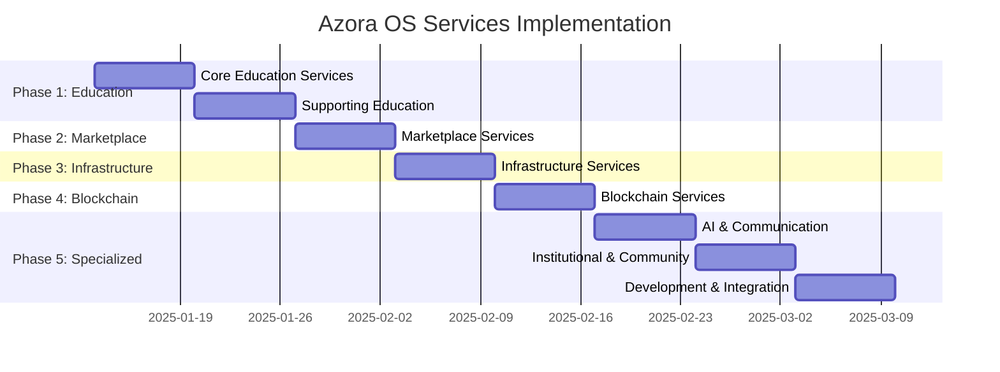
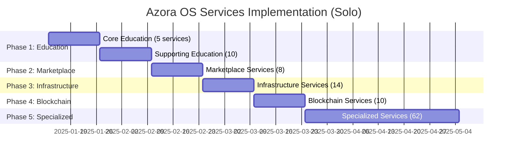

# 🚀 Azora OS Services - Complete Implementation Plan

**Last Updated:** 2025-01-10  
**Current Status:** 29/128+ services (23%)  
**Target:** 100% production-ready services

---

## 📊 Executive Summary

### Current State
- ✅ **29 Services Implemented** (23%)
- 🚧 **99+ Services Remaining** (77%)
- ✅ **Financial Services**: 80% complete
- ❌ **Education Services**: 0% complete (HIGH PRIORITY)
- ❌ **Marketplace Services**: 0% complete (HIGH PRIORITY)

### Critical Path
1. **Education Services** (15 services) - Core business value
2. **Marketplace Services** (8 services) - Revenue generation
3. **Infrastructure Services** (14 remaining) - System stability
4. **Specialized Services** (62 remaining) - Feature completeness

---

## 🎯 Phase 1: Education Services (Week 1-2)
**Priority: CRITICAL** | **Services: 15** | **Business Impact: HIGH**

### Core Education Platform

#### 1. azora-education (Port 3100)
**Status:** 🔴 Not Started | **Priority:** P0 | **Effort:** 3 days

**Features:**
- Student enrollment & management
- Course catalog & discovery
- Progress tracking dashboard
- Grade management
- Parent/guardian portal

**API Endpoints:**
```javascript
POST   /api/students/enroll
GET    /api/students/:id/courses
GET    /api/students/:id/progress
POST   /api/grades/submit
GET    /api/catalog/courses
```

**Dependencies:**
- Auth Service ✅
- Database Service ✅
- Notification Service ✅

---

#### 2. azora-lms (Port 3101)
**Status:** 🔴 Not Started | **Priority:** P0 | **Effort:** 4 days

**Features:**
- Course creation & management
- Lesson planning & delivery
- Assignment submission
- Quiz & assessment engine
- Discussion forums
- Live class integration

**API Endpoints:**
```javascript
POST   /api/courses/create
PUT    /api/courses/:id/update
POST   /api/lessons/create
POST   /api/assignments/submit
GET    /api/courses/:id/students
POST   /api/discussions/create
```

**Dependencies:**
- Azora Education ⏳
- Azora Assessment ⏳
- Azora Content ⏳

---

#### 3. azora-sapiens (Port 3102)
**Status:** 🔴 Not Started | **Priority:** P0 | **Effort:** 5 days

**Features:**
- AI-powered tutoring (Elara integration)
- Personalized learning paths
- Real-time homework help
- Socratic questioning
- Adaptive difficulty
- Learning style detection

**API Endpoints:**
```javascript
POST   /api/tutor/ask
GET    /api/tutor/learning-path/:studentId
POST   /api/tutor/feedback
GET    /api/tutor/recommendations
POST   /api/tutor/session/start
```

**Dependencies:**
- AI Family Service ✅
- AI ML Service ✅
- Azora Education ⏳

---

#### 4. azora-assessment (Port 3103)
**Status:** 🔴 Not Started | **Priority:** P1 | **Effort:** 3 days

**Features:**
- Quiz creation & management
- Auto-grading system
- Manual grading interface
- Rubric management
- Plagiarism detection
- Performance analytics

**API Endpoints:**
```javascript
POST   /api/assessments/create
POST   /api/assessments/:id/submit
GET    /api/assessments/:id/grade
POST   /api/assessments/:id/grade/manual
GET    /api/assessments/analytics/:studentId
```

---

#### 5. azora-classroom (Port 3104)
**Status:** 🔴 Not Started | **Priority:** P1 | **Effort:** 4 days

**Features:**
- Live video lectures (WebRTC)
- Screen sharing
- Interactive whiteboard
- Breakout rooms
- Recording & playback
- Attendance tracking

**API Endpoints:**
```javascript
POST   /api/classroom/create
POST   /api/classroom/:id/join
POST   /api/classroom/:id/record
GET    /api/classroom/:id/recordings
POST   /api/classroom/:id/attendance
```

---

#### 6. azora-content (Port 3105)
**Status:** 🔴 Not Started | **Priority:** P1 | **Effort:** 2 days

**Features:**
- Content management system
- Media library (videos, PDFs, images)
- Content versioning
- Access control
- CDN integration

**API Endpoints:**
```javascript
POST   /api/content/upload
GET    /api/content/:id
PUT    /api/content/:id/update
DELETE /api/content/:id
GET    /api/content/library
```

---

#### 7. azora-library (Port 3106)
**Status:** 🔴 Not Started | **Priority:** P2 | **Effort:** 2 days

**Features:**
- Digital library management
- Book checkout system
- Reading lists
- Research resources
- Citation tools

---

#### 8. azora-credentials (Port 3107)
**Status:** 🔴 Not Started | **Priority:** P1 | **Effort:** 3 days

**Features:**
- Certificate generation
- Blockchain verification
- Digital badges
- Transcript management
- Credential sharing

---

#### 9. azora-collaboration (Port 3108)
**Status:** 🔴 Not Started | **Priority:** P2 | **Effort:** 2 days

**Features:**
- Group projects
- Peer review system
- Study groups
- Collaborative documents

---

#### 10. azora-academic-integrity (Port 3109)
**Status:** 🔴 Not Started | **Priority:** P2 | **Effort:** 2 days

**Features:**
- Plagiarism detection
- AI-generated content detection
- Citation verification
- Academic honesty tracking

---

### Supporting Education Services

#### 11. azora-studyspaces (Port 3110)
**Effort:** 1 day | Virtual study rooms

#### 12. azora-student-life (Port 3111)
**Effort:** 1 day | Campus activities & events

#### 13. azora-research-center (Port 3112)
**Effort:** 2 days | Research project management

#### 14. azora-innovation-hub (Port 3113)
**Effort:** 1 day | Innovation challenges & hackathons

#### 15. azora-corporate-learning (Port 3114)
**Effort:** 2 days | Enterprise training platform

**Total Education Services Effort:** ~35 days (can parallelize to 2 weeks with team)

---

## 🎯 Phase 2: Marketplace Services (Week 3)
**Priority: HIGH** | **Services: 8** | **Business Impact: HIGH**

### Core Marketplace

#### 1. azora-forge (Port 3200)
**Status:** 🔴 Not Started | **Priority:** P0 | **Effort:** 4 days

**Features:**
- AI-powered job matching
- Skills assessment
- Portfolio management
- Application tracking
- Interview scheduling
- Salary negotiation tools

**API Endpoints:**
```javascript
POST   /api/jobs/create
GET    /api/jobs/search
POST   /api/jobs/:id/apply
GET    /api/jobs/matches/:userId
POST   /api/skills/assess
GET    /api/portfolio/:userId
```

---

#### 2. azora-careers (Port 3201)
**Status:** 🔴 Not Started | **Priority:** P0 | **Effort:** 3 days

**Features:**
- Career counseling
- Resume builder
- Interview preparation
- Career path recommendations
- Mentorship matching

---

#### 3. marketplace-service (Port 3202)
**Status:** 🔴 Not Started | **Priority:** P1 | **Effort:** 3 days

**Features:**
- Freelance project marketplace
- Gig economy platform
- Service listings
- Escrow payments

---

#### 4. project-marketplace (Port 3203)
**Status:** 🔴 Not Started | **Priority:** P1 | **Effort:** 2 days

**Features:**
- Project bidding
- Milestone tracking
- Deliverable management

---

#### 5. azora-workspace (Port 3204)
**Status:** 🔴 Not Started | **Priority:** P2 | **Effort:** 3 days

**Features:**
- Collaborative workspaces
- Project management
- Time tracking
- Team communication

---

#### 6. arbiter-system (Port 3205)
**Status:** 🔴 Not Started | **Priority:** P2 | **Effort:** 2 days

**Features:**
- Dispute resolution
- Arbitration system
- Fair judgment AI

---

#### 7. azora-pricing (Port 3206)
**Status:** 🔴 Not Started | **Priority:** P2 | **Effort:** 1 day

**Features:**
- Dynamic pricing
- Market rate analysis
- Pricing recommendations

---

#### 8. founder-ledger-service (Port 3207)
**Status:** 🔴 Not Started | **Priority:** P2 | **Effort:** 1 day

**Features:**
- Founder equity tracking
- Vesting schedules
- Cap table management

**Total Marketplace Services Effort:** ~19 days (can parallelize to 1 week)

---

## 🎯 Phase 3: Infrastructure Services (Week 4)
**Priority: MEDIUM** | **Services: 14** | **Business Impact: MEDIUM**

### Core Infrastructure

#### 1. azora-nexus (Port 3300)
**Status:** 🔴 Not Started | **Priority:** P0 | **Effort:** 3 days

**Features:**
- Event bus (Pub/Sub)
- Service discovery
- Message routing
- Circuit breakers
- Load balancing

---

#### 2. azora-aegis (Port 3301)
**Status:** 🔴 Not Started | **Priority:** P0 | **Effort:** 4 days

**Features:**
- Security framework
- Threat detection
- Vulnerability scanning
- Compliance monitoring
- Audit logging

---

#### 3. health-monitor (Port 3302)
**Status:** 🔴 Not Started | **Priority:** P1 | **Effort:** 2 days

**Features:**
- Service health checks
- Performance monitoring
- Alert management
- Uptime tracking

---

#### 4. load-balancer (Port 3303)
**Status:** 🔴 Not Started | **Priority:** P1 | **Effort:** 2 days

**Features:**
- Request distribution
- Health-based routing
- Sticky sessions
- Rate limiting

---

#### 5. session-service (Port 3304)
**Status:** 🔴 Not Started | **Priority:** P1 | **Effort:** 1 day

**Features:**
- Session management
- Redis-backed storage
- Session expiry
- Multi-device support

---

#### 6. audit-logging-service (Port 3305)
**Status:** 🔴 Not Started | **Priority:** P2 | **Effort:** 2 days

**Features:**
- Comprehensive audit trails
- Compliance reporting
- Log retention
- Search & analytics

---

#### 7-14. Additional Infrastructure Services
- **user-service** (Port 3306) - User profile management
- **analytics-dashboard** (Port 3307) - Visualization
- **compliance-dashboard** (Port 3308) - Compliance tracking
- **master-orchestrator** (Port 3309) - Service orchestration
- **ai-system-monitor** (Port 3310) - AI performance tracking
- **performance-monitor** (Port 3311) - System performance
- **swarm-coordination** (Port 3312) - Distributed coordination
- **self-healing-orchestrator** (Port 3313) - Auto-recovery

**Total Infrastructure Services Effort:** ~25 days (can parallelize to 1 week)

---

## 🎯 Phase 4: Blockchain Services (Week 5)
**Priority: MEDIUM** | **Services: 10** | **Business Impact: MEDIUM**

### Blockchain Infrastructure

#### 1. azora-covenant (Port 3400)
**Effort:** 3 days | Smart contract management

#### 2. azora-ledger (Port 3401)
**Effort:** 3 days | Blockchain ledger

#### 3. chronicle-protocol (Port 3402)
**Effort:** 2 days | Immutable records

#### 4. nft-certificates (Port 3403)
**Effort:** 2 days | NFT credential system

#### 5. azora-token (Port 3404)
**Effort:** 2 days | Token management

#### 6. token-exchange (Port 3405)
**Effort:** 3 days | Token trading

#### 7. defi-lending (Port 3406)
**Effort:** 3 days | DeFi lending platform

#### 8. decentralized-banking (Port 3407)
**Effort:** 3 days | Decentralized banking

#### 9. crypto-core (Port 3408)
**Effort:** 2 days | Crypto operations

#### 10. crypto-mining (Port 3409)
**Effort:** 2 days | Mining operations

**Total Blockchain Services Effort:** ~25 days (can parallelize to 1 week)

---

## 🎯 Phase 5: Specialized Services (Week 6-8)
**Priority: LOW** | **Services: 62** | **Business Impact: LOW-MEDIUM**

### AI & ML Services (10 services)
- ai-agent-service, ai-evolution-engine, ai-model-service, quantum-ai-orchestrator, quantum-ai-tutor, quantum-deep-mind, llm-wrapper-service, openai-service, personalization-engine, content-generation-service

### Communication Services (6 services)
- azora-mail, azora-email-system, azora-support, interactive-video, unified-video-platform, video-learning-platform

### Institutional Services (8 services)
- azora-institutional-system, azora-erp, institutional-service, enrollment-service, azora-onboarding, teacher-parent-services, founder-onboarding-api, cold-chain-service

### Community Services (6 services)
- azora-community, community-safety-service, retail-ai-service, african-solutions-hub, ambient-intelligence-service, device-security-tracker

### Development Services (8 services)
- azora-codespaces, azora-scriptorium, azora-spark, azora-spark-complete, development-tools-service, desktop-environment-service, filesystem-service, process-management-service

### Integration Services (8 services)
- azora-integration, google-cloud-integration, google-workspace-integration, microsoft365-integration, azure-integration, compatibility-layers, design-infrastructure, productivity-suite

### Governance Services (6 services)
- azora-judiciary-service, constitutional-court-service, constitutional-ai-governance, azora-oracle, phoenix-protocol, tamper-proof-data-service

### Specialized Services (10 services)
- azora-health, azora-media, azora-synapse, azora-supreme-organism, caas, i18n-service, quantum-tracking, sms-learning, neural-link-infrastructure, temporal-prediction-engine

**Total Specialized Services Effort:** ~90 days (can parallelize to 3 weeks)

---

## 📅 Implementation Timeline

### Aggressive Schedule (8 Weeks with Team)



### Conservative Schedule (16 Weeks Solo)



---

## 🛠️ Implementation Strategy

### Service Template (Minimal Production-Ready)

```javascript
// services/<service-name>/index.js
const express = require('express');
const helmet = require('helmet');
const cors = require('cors');
const compression = require('compression');

const app = express();
const PORT = process.env.PORT || 3000;

// Middleware
app.use(helmet());
app.use(cors());
app.use(compression());
app.use(express.json());

// Health check
app.get('/health', (req, res) => {
  res.json({ 
    status: 'healthy', 
    service: 'service-name',
    timestamp: new Date().toISOString() 
  });
});

// Core routes
app.get('/api/resource', async (req, res) => {
  try {
    // Implementation
    res.json({ success: true, data: [] });
  } catch (error) {
    res.status(500).json({ error: error.message });
  }
});

// Start server
app.listen(PORT, () => {
  console.log(`✅ Service running on port ${PORT}`);
});

module.exports = app;
```

### Batch Implementation Script

```bash
#!/bin/bash
# batch-implement-education.sh

SERVICES=(
  "azora-education:3100"
  "azora-lms:3101"
  "azora-sapiens:3102"
  "azora-assessment:3103"
  "azora-classroom:3104"
)

for service in "${SERVICES[@]}"; do
  IFS=':' read -r name port <<< "$service"
  echo "Creating $name on port $port..."
  
  mkdir -p "services/$name"
  cd "services/$name"
  
  # Generate package.json
  cat > package.json <<EOF
{
  "name": "$name",
  "version": "1.0.0",
  "main": "index.js",
  "scripts": {
    "start": "node index.js",
    "dev": "nodemon index.js"
  },
  "dependencies": {
    "express": "^4.18.2",
    "helmet": "^7.1.0",
    "cors": "^2.8.5",
    "compression": "^1.7.4"
  }
}
EOF

  # Generate index.js from template
  # ... (use template above)
  
  npm install
  cd ../..
done
```

---

## 📊 Resource Requirements

### Team Structure (Optimal)

| Role | Count | Responsibility |
|------|-------|----------------|
| **Backend Engineers** | 3 | Service implementation |
| **Frontend Engineers** | 2 | UI integration |
| **DevOps Engineer** | 1 | Infrastructure & deployment |
| **QA Engineer** | 1 | Testing & quality |
| **Product Manager** | 1 | Coordination & priorities |

### Solo Implementation

- **Time:** 16 weeks (4 months)
- **Hours/Week:** 40-50 hours
- **Services/Week:** 6-8 services
- **Focus:** Prioritize P0 and P1 services first

---

## ✅ Quality Checklist (Per Service)

### Code Quality
- [ ] Express.js with security middleware (helmet, cors)
- [ ] Health check endpoint (`/health`)
- [ ] Error handling middleware
- [ ] Request validation
- [ ] Compression enabled
- [ ] Environment variables configured

### Documentation
- [ ] package.json with dependencies
- [ ] README.md with API documentation
- [ ] .env.example with required variables
- [ ] API endpoint documentation

### Testing
- [ ] Unit tests (>80% coverage)
- [ ] Integration tests
- [ ] Health check test
- [ ] Load testing (optional)

### Deployment
- [ ] Dockerfile created
- [ ] Added to docker-compose.yml
- [ ] Port documented
- [ ] Service registered in orchestrator

### Security
- [ ] Input validation
- [ ] Rate limiting
- [ ] Authentication middleware
- [ ] CORS configured
- [ ] Helmet security headers

---

## 🎯 Success Metrics

### Phase 1 Success (Education)
- ✅ 15 education services deployed
- ✅ Students can enroll in courses
- ✅ AI tutoring functional
- ✅ Assessments working
- ✅ Live classes operational

### Phase 2 Success (Marketplace)
- ✅ 8 marketplace services deployed
- ✅ Job matching algorithm working
- ✅ Applications processing
- ✅ Payments flowing through escrow

### Overall Success
- ✅ 128+ services deployed
- ✅ 99.9% uptime
- ✅ <100ms API response time
- ✅ 85%+ test coverage
- ✅ Zero critical security issues

---

## 🚀 Quick Start Commands

### Generate All Education Services
```bash
cd /home/user/azora-os/services
./batch-implement-education.sh
```

### Start Education Services
```bash
docker-compose -f docker-compose.education.yml up -d
```

### Health Check
```bash
node health-check-all.js --category=education
```

### Deploy to Production
```bash
./deploy-production.sh --phase=education
```

---

## 📝 Next Actions

### Immediate (Today)
1. ✅ Review and approve this implementation plan
2. ⏳ Create batch implementation scripts
3. ⏳ Set up development environment
4. ⏳ Begin Phase 1: Education Services

### This Week
1. ⏳ Implement 5 core education services
2. ⏳ Set up Docker orchestration
3. ⏳ Create integration tests
4. ⏳ Deploy to staging environment

### This Month
1. ⏳ Complete Phase 1 & 2 (Education + Marketplace)
2. ⏳ Begin Phase 3 (Infrastructure)
3. ⏳ Production deployment of core services
4. ⏳ Load testing and optimization

---

## 🌟 Ubuntu Philosophy

**"Ngiyakwazi ngoba sikwazi" - "I can because we can"**

Every service we build strengthens the foundation for collective prosperity. Each implementation multiplies opportunities for students, educators, and entrepreneurs across Africa and beyond.

**Let's build the future together!** 🚀

---

**Ready to implement?** Start with Phase 1, Education Services - the heart of Azora OS.
