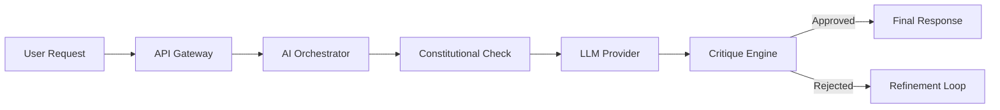

# 🧠 AI Orchestrator Service

> **Constitutional AI Core • Ethics Engine • Model Coordination**

[](../../docs/launch-dashboard.html)
[](../../LICENSE)
[](https://www.typescriptlang.org/)

## 🌟 Overview

The **AI Orchestrator** is the "Superego" of the Azora ecosystem. It serves as the central nervous system for all AI interactions, ensuring every decision, generation, and action adheres to the **Azora Constitution**.

### Key Capabilities
- **Constitutional Guardrails**: Enforces 20+ ethical rules on all AI outputs.
- **Critique Engine**: Implements a "Critique-Refine" loop before any action is finalized.
- **Model Routing**: Intelligently routes requests to the most appropriate model (GPT-4, Claude, Llama, etc.).
- **Fairness Scoring**: Automatically scores outputs for bias, transparency, and privacy.

## 🏗️ Architecture

This service sits between the user-facing applications and the raw LLMs.



## 🔌 API Endpoints

### Core
- `POST /api/generate` - Generate content with constitutional checks
- `POST /api/chat` - Chat interface with memory and ethics
- `GET /health` - Service health status

### Constitutional
- `POST /api/critique` - Run standalone critique on text
- `GET /api/rules` - List active constitutional rules

## 🔧 Configuration

| Variable | Description | Default |
|----------|-------------|---------|
| `PORT` | Service port | `3014` |
| `OPENAI_API_KEY` | Key for OpenAI models | - |
| `ANTHROPIC_API_KEY` | Key for Claude models | - |
| `CONSTITUTION_MODE` | Strictness level | `STRICT` |

## 🚀 Getting Started

### Prerequisites
- Node.js v18+
- Docker (optional)

### Installation

```bash
# Install dependencies
npm install

# Start development server
npm run dev

# Run tests
npm test
```

## 🧪 Testing

We use Jest for unit and integration testing.

```bash
# Run all tests
npm test

# Run specific test file
npm test -- src/critique/engine.test.ts
```

## 🤝 Contributing

Please read [CONTRIBUTING.md](../../CONTRIBUTING.md) for details on our code of conduct and the process for submitting pull requests.

---

**Built with Ubuntu Philosophy: "I am because we are."**