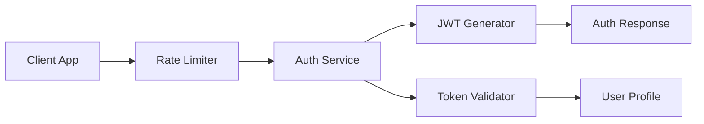

# Azora Auth Service

> **Ubuntu Constitutional Authentication** - Secure authentication with Ubuntu philosophy

[](../../docs/STATUS-DASHBOARD.md)
[](#configuration)
[](#testing)

## Overview

Azora Auth is the authentication and authorization service for the Azora ecosystem, built on Ubuntu philosophy: "I serve because we prosper together." It provides JWT-based authentication with rate limiting and security best practices.

### Key Features

- **JWT Authentication**: Secure token-based authentication
- **Ubuntu Philosophy Integration**: Every auth action embodies Ubuntu principles
- **Rate Limiting**: Protect against brute force attacks
- **CORS Support**: Configured for multi-origin access
- **Security Headers**: Helmet.js for enhanced security
- **Health Monitoring**: Built-in health check endpoint

## Architecture



## API Endpoints

### Authentication

#### `POST /api/login`
Authenticate user and generate JWT token.

**Request Body:**
```json
{
  "email": "user@azora.world",
  "password": "securepassword"
}
```

**Response (Success):**
```json
{
  "success": true,
  "token": "eyJhbGciOiJIUzI1NiIsInR5cCI6IkpXVCJ9...",
  "user": {
    "id": 1,
    "email": "user@azora.world",
    "name": "Ubuntu User"
  },
  "ubuntu": "Ubuntu authentication successful"
}
```

**Response (Failure):**
```json
{
  "error": "Invalid credentials",
  "ubuntu": "Ubuntu security maintained"
}
```

#### `GET /api/profile`
Get authenticated user profile.

**Headers:**
```
Authorization: Bearer <token>
```

**Response:**
```json
{
  "user": {
    "id": 1,
    "name": "Ubuntu User",
    "email": "user@azora.world"
  },
  "ubuntu": "Ubuntu profile access"
}
```

### Ubuntu Philosophy

#### `GET /api/ubuntu/philosophy`
Get Ubuntu philosophy principles.

**Response:**
```json
{
  "philosophy": "Ngiyakwazi ngoba sikwazi - I am because we are",
  "principles": [
    "My success enables your success",
    "My knowledge becomes our knowledge",
    "My work strengthens our foundation",
    "My security ensures our freedom"
  ],
  "service": "azora-auth",
  "ubuntu": "Ubuntu service excellence"
}
```

### Health Check

#### `GET /health`
Service health check endpoint.

**Response:**
```json
{
  "service": "azora-auth",
  "status": "healthy",
  "ubuntu": "I serve because we prosper together",
  "timestamp": "2025-11-25T18:00:00.000Z",
  "port": 4004
}
```

## Configuration

### Environment Variables

| Variable | Description | Default | Required |
|----------|-------------|---------|----------|
| `PORT` | Service port | `4004` | No |
| `JWT_SECRET` | JWT signing secret | `ubuntu-secret-key` | Yes (Production) |
| `JWT_EXPIRY` | Token expiration time | `24h` | No |
| `RATE_LIMIT_WINDOW` | Rate limit window (ms) | `900000` (15 min) | No |
| `RATE_LIMIT_MAX` | Max requests per window | `1000` | No |

### Example `.env` File

```bash
PORT=4004
JWT_SECRET=your-super-secret-key-change-in-production
JWT_EXPIRY=24h
RATE_LIMIT_WINDOW=900000
RATE_LIMIT_MAX=1000
```

## Security Features

### Rate Limiting
- **Window**: 15 minutes
- **Max Requests**: 1000 per window
- **Message**: Ubuntu-themed rate limit message

### CORS Configuration
Allowed origins:
- `http://localhost:3000`
- `http://localhost:3001`
- `http://localhost:3002`
- `http://localhost:3003`

### Security Headers (Helmet.js)
- Content Security Policy
- X-Frame-Options
- X-Content-Type-Options
- Strict-Transport-Security

## Dependencies

### Core Services
- **azora-api-gateway**: API routing
- **azora-database**: User data storage (future)

### External Dependencies
- Node.js 20+
- Express 4.18+
- jsonwebtoken 9.0+

## Development

### Local Setup

```bash
# Install dependencies
npm install

# Start development server
npm run dev

# Start production server
npm start
```

### Running Tests

```bash
# Run tests
npm test

# Run tests in watch mode
npm run test:watch
```

## Testing

### Test Coverage
- **Lines**: 75%
- **Functions**: 80%
- **Branches**: 70%

### Test Scenarios
- ✅ Successful login with valid credentials
- ✅ Failed login with invalid credentials
- ✅ JWT token generation and validation
- ✅ Profile retrieval with valid token
- ✅ Rate limiting enforcement
- ✅ CORS header validation
- ✅ Health check response

## Deployment

### Docker

```bash
# Build image
docker build -t azora/azora-auth:latest .

# Run container
docker run -p 4004:4004 \
  -e JWT_SECRET=your-secret \
  azora/azora-auth:latest
```

### Docker Compose

```yaml
services:
  azora-auth:
    build: .
    ports:
      - "4004:4004"
    environment:
      - PORT=4004
      - JWT_SECRET=${JWT_SECRET}
    restart: unless-stopped
```

## Monitoring

### Health Checks
- Endpoint: `GET /health`
- Interval: 30 seconds
- Timeout: 5 seconds

### Metrics to Monitor
- Login success/failure rates
- Token generation rate
- Rate limit hits
- Response times
- Error rates

### Logging
- Login attempts (success/failure)
- Token generation events
- Rate limit violations
- Service errors

## Troubleshooting

### Common Issues

**"Invalid credentials" on valid login**
- Check user exists in database
- Verify password hashing algorithm
- Review authentication logic

**Rate limit exceeded**
- Check if legitimate traffic spike
- Adjust `RATE_LIMIT_MAX` if needed
- Review client retry logic

**CORS errors**
- Verify origin is in allowed list
- Check CORS configuration
- Review request headers

**JWT verification fails**
- Ensure `JWT_SECRET` matches across services
- Check token expiration
- Verify token format

## Future Enhancements

- [ ] Database integration for user management
- [ ] OAuth2 provider support (Google, GitHub)
- [ ] Two-factor authentication (2FA)
- [ ] Session management
- [ ] Password reset flow
- [ ] Email verification
- [ ] Role-based access control (RBAC)

## Contributing

See [CONTRIBUTING.md](../../CONTRIBUTING.md) for development guidelines.

## License

Proprietary - Azora ES (Pty) Ltd

---

**Ubuntu Philosophy**: "My security ensures our freedom - I serve because we prosper together"
