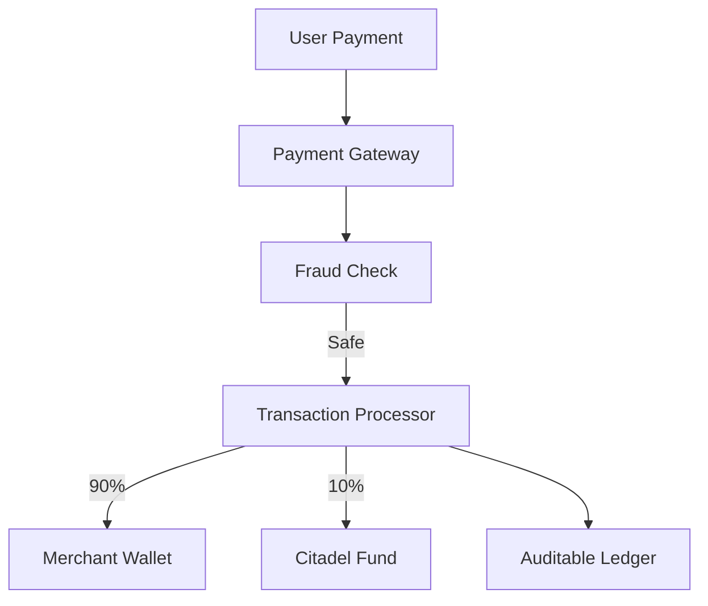

# 💳 Azora Pay (Financial Service)

> **Ubuntu Tokenomics • Universal Payments • Citadel Fund Integration**

[](../../docs/launch-dashboard.html)
[](../../LICENSE)
[](https://www.typescriptlang.org/)

## 🌟 Overview

**Azora Pay** is the financial heart of the ecosystem. It handles all fiat and crypto transactions, ensuring seamless value transfer while enforcing the **Ubuntu Philosophy**.

### Key Capabilities
- **Universal Payment Gateway**: Accepts Credit Cards, Crypto (ETH, SOL, AZR), and Mobile Money.
- **CitadelFund Auto-Split**: Automatically routes 10% of every transaction to the community treasury.
- **Revenue Splitting**: Instantly splits revenue between platform, creators, and affiliates.
- **Fraud Detection**: AI-powered fraud prevention.

## 🏗️ Architecture



## 🔌 API Endpoints

### Transactions
- `POST /api/pay` - Process a payment
- `POST /api/refund` - Issue a refund
- `GET /api/history` - Transaction history

### Wallet
- `POST /api/wallet/topup` - Add funds
- `POST /api/wallet/withdraw` - Withdraw funds

## 🔧 Configuration

| Variable | Description | Default |
|----------|-------------|---------|
| `PORT` | Service port | `3010` |
| `STRIPE_KEY` | Stripe Secret Key | - |
| `CITADEL_PERCENT` | Community tax | `10` |

## 🚀 Getting Started

### Installation

```bash
# Install dependencies
npm install

# Start service
npm start
```

## 🧪 Testing

```bash
# Run payment simulation tests
npm test
```

---

**"Prosperity is shared, or it is nothing."**
