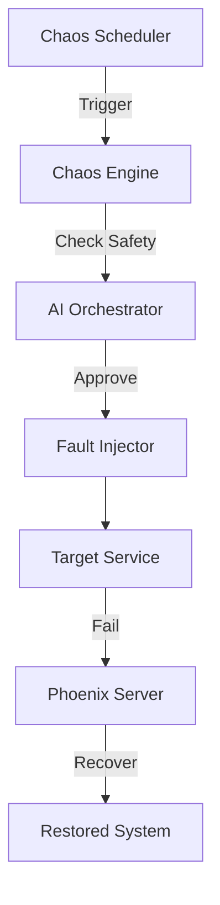

# 🐵 Chaos Monkey Service

> **Antifragile Infrastructure • Resilience Testing • System Hardening**

[](../../docs/launch-dashboard.html)
[](../../LICENSE)
[](https://www.typescriptlang.org/)

## 🌟 Overview

The **Chaos Monkey** is the "Immune System" challenger. It proactively injects controlled failures into the Azora ecosystem to ensure the system is **Antifragile**—getting stronger with every stressor.

### Key Capabilities
- **Failure Injection**: Simulates 7 types of failures (Service Crash, Latency, Packet Loss, CPU Spike, Memory Leak, Disk Fill, Time Drift).
- **Random Scheduling**: Executes chaos experiments at random intervals (configurable).
- **Constitutional Safety**: Checks with AI Orchestrator before running high-risk experiments.
- **Recovery Validation**: Verifies that PhoenixServer successfully recovers the system.

## 🏗️ Architecture



## 🔌 API Endpoints

### Chaos Control
- `POST /api/chaos/inject` - Manually trigger a specific failure
- `POST /api/chaos/schedule` - Update chaos schedule
- `GET /api/chaos/history` - View past experiments

## 🔧 Configuration

| Variable | Description | Default |
|----------|-------------|---------|
| `PORT` | Service port | `3050` |
| `CHAOS_ENABLED` | Master switch | `true` |
| `INTENSITY_LEVEL` | 1-10 scale | `5` |

## 🚀 Getting Started

### Installation

```bash
# Install dependencies
npm install

# Start the monkey
npm start
```

### Safety Warning ⚠️
**DO NOT RUN IN PRODUCTION WITHOUT APPROVAL.**
This service is designed to break things. Ensure `PhoenixServer` is running before enabling.

---

**"What doesn't kill the system makes it stronger."**
