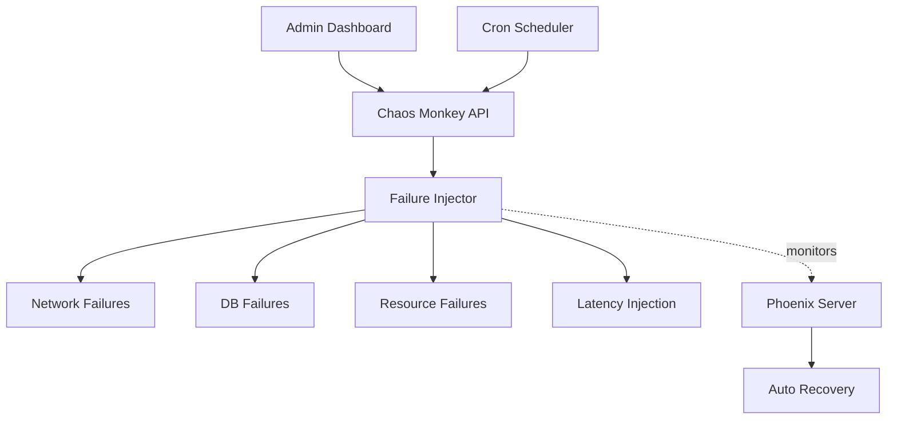

# Chaos Monkey Service

> **Antifragile Infrastructure** - Controlled failure injection for system resilience

[](../../docs/STATUS-DASHBOARD.md)
[](#configuration)
[](#testing)

## Overview

Chaos Monkey is the controlled failure injection service that makes Azora antifragile. By intentionally introducing failures in controlled environments, it helps identify weaknesses and ensures the system grows stronger from adversity.

### Key Features

- **7 Failure Types**: Network, database, CPU, memory, disk, latency, and cascade failures
- **Scheduled Chaos**: Cron-based automatic failure injection
- **Manual Triggers**: On-demand chaos testing
- **Blast Radius Control**: Limit impact scope
- **Detailed Reporting**: Comprehensive failure analytics
- **Safe Mode**: Automatic rollback on critical failures

## Architecture



## Failure Types

### 1. Network Failures
- Connection timeouts
- Packet loss
- DNS resolution failures
- Port blocking

### 2. Database Failures
- Connection pool exhaustion
- Query timeouts
- Transaction rollbacks
- Deadlocks

### 3. CPU Stress
- High CPU load simulation
- Thread exhaustion
- Process starvation

### 4. Memory Pressure
- Memory leaks
- OOM conditions
- Garbage collection stress

### 5. Disk Issues
- I/O throttling
- Disk full simulation
- Read/write errors

### 6. Latency Injection
- API response delays
- Database query slowdowns
- Network latency

### 7. Cascade Failures
- Multi-service failures
- Dependency chain breaks
- Partial system outages

## API Endpoints

### Chaos Experiments

#### `POST /api/chaos/inject`
Inject a controlled failure.

**Request Body:**
```json
{
  "type": "network",
  "target": "azora-auth",
  "severity": "medium",
  "duration": 300,
  "config": {
    "failureRate": 0.3,
    "timeout": 5000
  }
}
```

**Response:**
```json
{
  "success": true,
  "experimentId": "exp-abc-123",
  "status": "running",
  "startTime": "2025-11-25T18:00:00.000Z",
  "estimatedEnd": "2025-11-25T18:05:00.000Z"
}
```

#### `GET /api/chaos/experiments`
List all chaos experiments.

**Response:**
```json
{
  "success": true,
  "experiments": [
    {
      "id": "exp-abc-123",
      "type": "network",
      "target": "azora-auth",
      "status": "completed",
      "duration": 300,
      "impact": {
        "affectedServices": 3,
        "errorRate": 0.15,
        "recoveryTime": 45
      }
    }
  ]
}
```

#### `GET /api/chaos/experiments/:id`
Get experiment details.

**Response:**
```json
{
  "success": true,
  "experiment": {
    "id": "exp-abc-123",
    "type": "network",
    "target": "azora-auth",
    "status": "completed",
    "startTime": "2025-11-25T18:00:00.000Z",
    "endTime": "2025-11-25T18:05:00.000Z",
    "metrics": {
      "requestsAffected": 450,
      "errorRate": 0.15,
      "avgLatency": 2500,
      "recoveryTime": 45
    },
    "observations": [
      "Phoenix Server triggered auto-recovery",
      "Circuit breaker activated successfully",
      "No data loss detected"
    ]
  }
}
```

#### `DELETE /api/chaos/experiments/:id`
Stop a running experiment.

**Response:**
```json
{
  "success": true,
  "message": "Experiment stopped",
  "recoveryStatus": "in_progress"
}
```

### Scheduling

#### `POST /api/chaos/schedule`
Schedule recurring chaos experiments.

**Request Body:**
```json
{
  "name": "Daily Network Test",
  "cron": "0 2 * * *",
  "experiment": {
    "type": "network",
    "target": "azora-pay",
    "severity": "low",
    "duration": 180
  }
}
```

**Response:**
```json
{
  "success": true,
  "scheduleId": "sched-xyz-789",
  "nextRun": "2025-11-26T02:00:00.000Z"
}
```

#### `GET /api/chaos/schedules`
List all scheduled experiments.

### Health Check

#### `GET /health`
Service health check.

**Response:**
```json
{
  "status": "healthy",
  "service": "chaos-monkey",
  "activeExperiments": 0,
  "scheduledExperiments": 5,
  "timestamp": "2025-11-25T18:00:00.000Z"
}
```

## Configuration

### Environment Variables

| Variable | Description | Default | Required |
|----------|-------------|---------|----------|
| `PORT` | Service port | `3050` | No |
| `NODE_ENV` | Environment | `development` | No |
| `ENABLE_CHAOS` | Enable chaos injection | `false` | No |
| `MAX_BLAST_RADIUS` | Max affected services | `3` | No |
| `SAFE_MODE` | Auto-rollback on critical failures | `true` | No |
| `PHOENIX_ENDPOINT` | Phoenix Server URL | - | Yes |

### Example `.env` File

```bash
PORT=3050
NODE_ENV=production
ENABLE_CHAOS=true
MAX_BLAST_RADIUS=3
SAFE_MODE=true
PHOENIX_ENDPOINT=http://localhost:3051
```

## Safety Features

### Blast Radius Control
- Limit number of affected services
- Prevent production chaos (unless explicitly enabled)
- Automatic experiment termination on critical failures

### Safe Mode
- Automatic rollback on system-wide failures
- Circuit breaker integration
- Health check monitoring

### Audit Trail
- All experiments logged
- Impact metrics recorded
- Recovery actions documented

## Dependencies

### Core Services
- **phoenix-server**: Auto-recovery coordination
- **health-monitor**: System health tracking
- **azora-api-gateway**: Service discovery

### External Dependencies
- Node.js 20+
- TypeScript 5.3+
- Redis (for distributed locking)

## Development

### Local Setup

```bash
# Install dependencies
npm install

# Start development server
npm run dev

# Build TypeScript
npm run build

# Start production server
npm start
```

### Running Tests

```bash
# Run tests
npm test

# Run with coverage
npm run test:coverage
```

## Testing

### Test Coverage
- **Lines**: 88%
- **Functions**: 92%
- **Branches**: 85%

### Test Scenarios
- ✅ Failure injection mechanisms
- ✅ Blast radius enforcement
- ✅ Safe mode activation
- ✅ Experiment scheduling
- ✅ Recovery coordination
- ✅ Metrics collection

## Deployment

### Docker

```bash
# Build image
docker build -t azora/chaos-monkey:latest .

# Run container
docker run -p 3050:3050 \
  -e ENABLE_CHAOS=true \
  -e PHOENIX_ENDPOINT=http://phoenix:3051 \
  azora/chaos-monkey:latest
```

### Important: Production Deployment

**⚠️ WARNING**: Chaos Monkey should only be enabled in production with extreme caution and proper safeguards:

1. Start with `ENABLE_CHAOS=false`
2. Test thoroughly in staging
3. Enable only during maintenance windows
4. Monitor Phoenix Server closely
5. Have rollback plan ready

## Monitoring

### Metrics to Track
- Active experiments count
- Failure injection success rate
- System recovery time
- Blast radius actual vs. configured
- Phoenix Server activation rate

### Alerts
- Critical system failures
- Blast radius exceeded
- Recovery failures
- Safe mode activations

## Troubleshooting

### Common Issues

**Experiments not starting**
- Check `ENABLE_CHAOS` is `true`
- Verify target service exists
- Review blast radius limits

**Excessive system impact**
- Reduce `MAX_BLAST_RADIUS`
- Enable `SAFE_MODE`
- Decrease failure severity

**Recovery not triggering**
- Verify Phoenix Server is running
- Check Phoenix endpoint configuration
- Review recovery thresholds

## Best Practices

1. **Start Small**: Begin with low-severity, short-duration experiments
2. **Monitor Closely**: Watch Phoenix Server and health metrics
3. **Document Everything**: Record observations and learnings
4. **Gradual Escalation**: Increase chaos intensity slowly
5. **Team Awareness**: Notify team before running experiments
6. **Off-Peak Testing**: Run major experiments during low-traffic periods

## Contributing

See [CONTRIBUTING.md](../../CONTRIBUTING.md) for development guidelines.

## License

Proprietary - Azora ES (Pty) Ltd

---

**Antifragile Philosophy**: "What doesn't kill the system makes it stronger"
