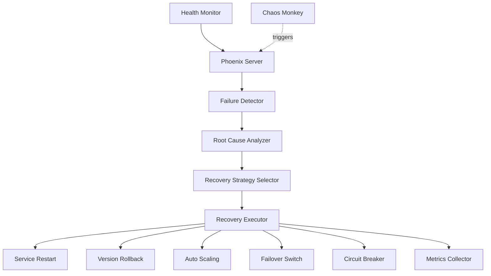
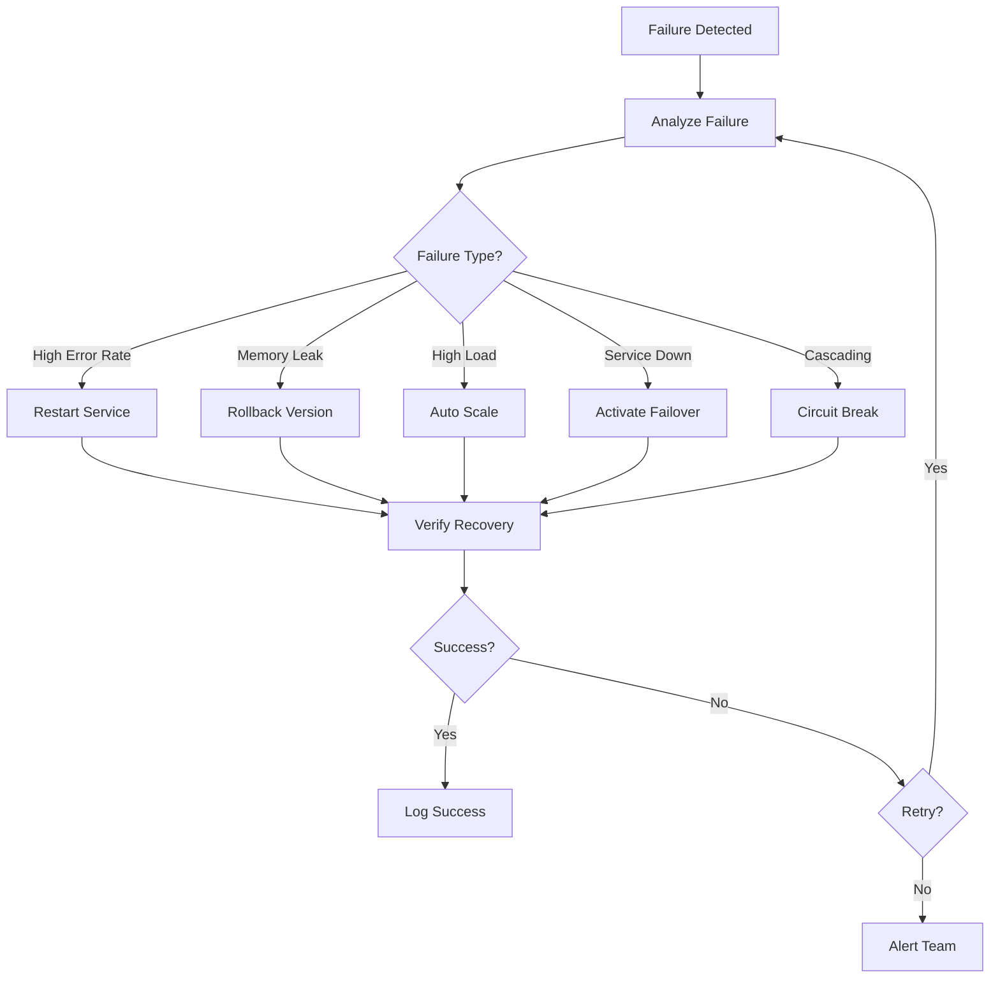

# Phoenix Server

> **Antifragile Infrastructure** - Intelligent auto-recovery and system resilience

[](../../docs/STATUS-DASHBOARD.md)
[](#configuration)
[](#testing)

## Overview

Phoenix Server is the auto-recovery service that ensures Azora rises from failures stronger than before. It monitors system health, detects failures, and executes intelligent recovery strategies to maintain service availability.

### Key Features

- **5 Recovery Strategies**: Restart, rollback, scale, failover, and circuit breaking
- **Intelligent Detection**: ML-based anomaly detection
- **Automated Recovery**: Zero-touch failure resolution
- **Learning System**: Improves recovery strategies over time
- **Graceful Degradation**: Maintains partial functionality during failures
- **Recovery Playbooks**: Predefined recovery procedures

## Architecture



## Recovery Strategies

### 1. Service Restart
- Graceful shutdown
- Clean state initialization
- Health check verification
- Traffic restoration

### 2. Version Rollback
- Identify last known good version
- Automated rollback deployment
- Data migration if needed
- Validation checks

### 3. Auto Scaling
- Horizontal pod scaling
- Resource allocation adjustment
- Load balancer reconfiguration
- Capacity verification

### 4. Failover
- Primary to backup switch
- Data synchronization
- DNS/routing updates
- Consistency checks

### 5. Circuit Breaking
- Temporary service isolation
- Request queue management
- Gradual traffic restoration
- Health-based reopening

## API Endpoints

### Recovery Management

#### `POST /api/recovery/trigger`
Manually trigger recovery for a service.

**Request Body:**
```json
{
  "service": "azora-auth",
  "strategy": "restart",
  "reason": "High error rate detected",
  "force": false
}
```

**Response:**
```json
{
  "success": true,
  "recoveryId": "rec-abc-123",
  "status": "in_progress",
  "strategy": "restart",
  "estimatedDuration": 60,
  "startTime": "2025-11-25T18:00:00.000Z"
}
```

#### `GET /api/recovery/status/:id`
Get recovery operation status.

**Response:**
```json
{
  "success": true,
  "recovery": {
    "id": "rec-abc-123",
    "service": "azora-auth",
    "strategy": "restart",
    "status": "completed",
    "startTime": "2025-11-25T18:00:00.000Z",
    "endTime": "2025-11-25T18:01:15.000Z",
    "duration": 75,
    "steps": [
      {
        "name": "Graceful shutdown",
        "status": "completed",
        "duration": 10
      },
      {
        "name": "Service restart",
        "status": "completed",
        "duration": 45
      },
      {
        "name": "Health verification",
        "status": "completed",
        "duration": 20
      }
    ],
    "outcome": "success",
    "metrics": {
      "downtime": 15,
      "requestsLost": 23,
      "dataIntegrity": "verified"
    }
  }
}
```

#### `GET /api/recovery/history`
Get recovery history.

**Query Parameters:**
- `service` (optional): Filter by service
- `limit` (optional): Number of results (default: 50)
- `status` (optional): Filter by status

**Response:**
```json
{
  "success": true,
  "recoveries": [
    {
      "id": "rec-abc-123",
      "service": "azora-auth",
      "strategy": "restart",
      "status": "completed",
      "duration": 75,
      "outcome": "success",
      "timestamp": "2025-11-25T18:00:00.000Z"
    }
  ],
  "total": 150
}
```

### Playbook Management

#### `POST /api/playbooks`
Create a recovery playbook.

**Request Body:**
```json
{
  "name": "Database Connection Recovery",
  "service": "azora-education",
  "triggers": [
    {
      "type": "error_rate",
      "threshold": 0.1,
      "duration": 60
    }
  ],
  "steps": [
    {
      "action": "restart_connection_pool",
      "timeout": 30
    },
    {
      "action": "restart_service",
      "timeout": 60,
      "condition": "if_previous_failed"
    }
  ]
}
```

**Response:**
```json
{
  "success": true,
  "playbookId": "pb-xyz-789",
  "status": "active"
}
```

#### `GET /api/playbooks`
List all recovery playbooks.

#### `PUT /api/playbooks/:id`
Update a playbook.

#### `DELETE /api/playbooks/:id`
Delete a playbook.

### Health Monitoring

#### `GET /api/health/services`
Get health status of all monitored services.

**Response:**
```json
{
  "success": true,
  "services": [
    {
      "name": "azora-auth",
      "status": "healthy",
      "uptime": 99.98,
      "lastCheck": "2025-11-25T18:00:00.000Z",
      "metrics": {
        "errorRate": 0.001,
        "latency": 45,
        "throughput": 1500
      }
    }
  ]
}
```

#### `GET /health`
Phoenix Server health check.

**Response:**
```json
{
  "status": "healthy",
  "service": "phoenix-server",
  "activeRecoveries": 0,
  "monitoredServices": 58,
  "playbooksActive": 12,
  "timestamp": "2025-11-25T18:00:00.000Z"
}
```

## Configuration

### Environment Variables

| Variable | Description | Default | Required |
|----------|-------------|---------|----------|
| `PORT` | Service port | `3051` | No |
| `NODE_ENV` | Environment | `development` | No |
| `AUTO_RECOVERY` | Enable automatic recovery | `true` | No |
| `MAX_RECOVERY_ATTEMPTS` | Max retry attempts | `3` | No |
| `RECOVERY_TIMEOUT` | Recovery timeout (seconds) | `300` | No |
| `HEALTH_CHECK_INTERVAL` | Health check interval (seconds) | `30` | No |
| `ALERT_WEBHOOK` | Webhook for recovery alerts | - | No |

### Example `.env` File

```bash
PORT=3051
NODE_ENV=production
AUTO_RECOVERY=true
MAX_RECOVERY_ATTEMPTS=3
RECOVERY_TIMEOUT=300
HEALTH_CHECK_INTERVAL=30
ALERT_WEBHOOK=https://alerts.azora.world/webhook
```

## Recovery Decision Logic



## Dependencies

### Core Services
- **health-monitor**: Service health data
- **chaos-monkey**: Failure notifications
- **azora-api-gateway**: Service registry

### External Dependencies
- Node.js 20+
- TypeScript 5.3+
- Kubernetes API (for scaling/failover)
- Docker API (for restarts)

## Development

### Local Setup

```bash
# Install dependencies
npm install

# Start development server
npm run dev

# Build TypeScript
npm run build

# Start production server
npm start
```

### Running Tests

```bash
# Run tests
npm test

# Run with coverage
npm run test:coverage
```

## Testing

### Test Coverage
- **Lines**: 90%
- **Functions**: 93%
- **Branches**: 87%

### Test Scenarios
- ✅ Failure detection accuracy
- ✅ Recovery strategy selection
- ✅ Graceful degradation
- ✅ Playbook execution
- ✅ Retry logic
- ✅ Alert triggering

## Deployment

### Docker

```bash
# Build image
docker build -t azora/phoenix-server:latest .

# Run container
docker run -p 3051:3051 \
  -e AUTO_RECOVERY=true \
  -v /var/run/docker.sock:/var/run/docker.sock \
  azora/phoenix-server:latest
```

### Kubernetes

```yaml
apiVersion: apps/v1
kind: Deployment
metadata:
  name: phoenix-server
spec:
  replicas: 2
  template:
    spec:
      containers:
      - name: phoenix-server
        image: azora/phoenix-server:latest
        ports:
        - containerPort: 3051
        env:
        - name: AUTO_RECOVERY
          value: "true"
```

## Monitoring

### Metrics to Track
- Recovery success rate
- Mean time to recovery (MTTR)
- False positive rate
- Service uptime improvements
- Recovery strategy effectiveness

### Alerts
- Recovery failures
- Max retry attempts reached
- Cascading failures detected
- Playbook execution errors

## Troubleshooting

### Common Issues

**Recovery not triggering**
- Check `AUTO_RECOVERY` is enabled
- Verify health monitor is running
- Review failure detection thresholds

**Recovery fails repeatedly**
- Check max retry attempts
- Review recovery strategy selection
- Verify service dependencies

**False positive recoveries**
- Adjust health check thresholds
- Review anomaly detection sensitivity
- Update playbook triggers

## Best Practices

1. **Test Playbooks**: Validate recovery playbooks in staging
2. **Monitor Metrics**: Track MTTR and success rates
3. **Gradual Rollout**: Test new strategies on non-critical services first
4. **Alert Integration**: Connect to incident management system
5. **Regular Reviews**: Analyze recovery patterns monthly
6. **Documentation**: Document custom playbooks thoroughly

## Contributing

See [CONTRIBUTING.md](../../CONTRIBUTING.md) for development guidelines.

## License

Proprietary - Azora ES (Pty) Ltd

---

**Phoenix Philosophy**: "From every failure, we rise stronger and wiser"
