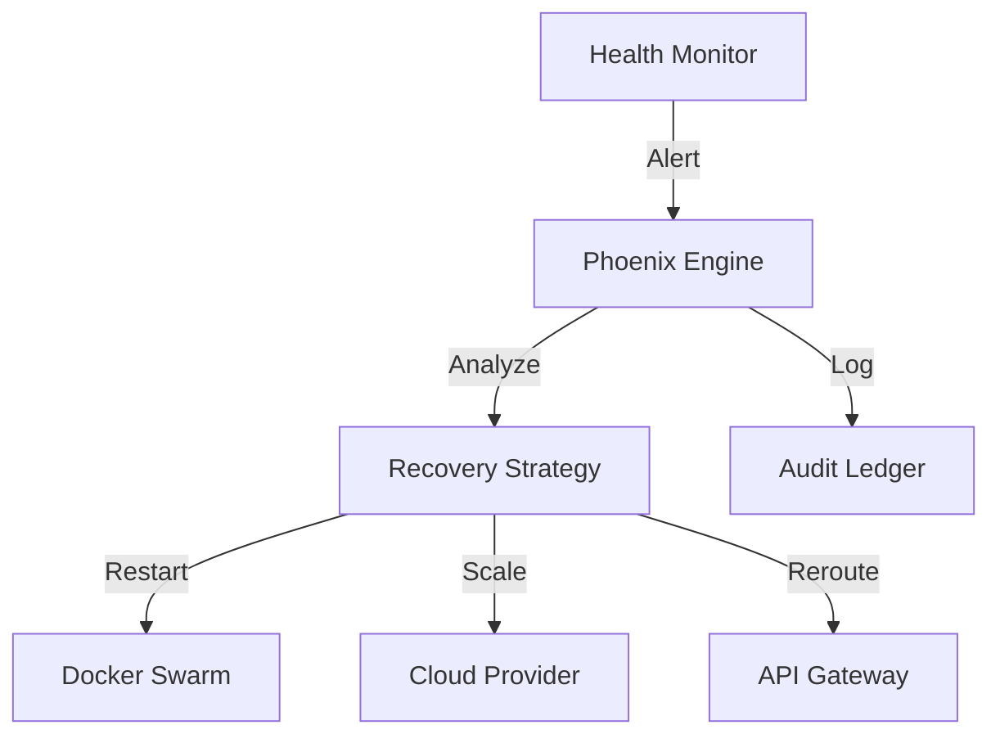

# 🔥 Phoenix Server (Auto-Recovery)

> **Antifragile Infrastructure • Self-Healing • Resurrection Engine**

[](../../docs/launch-dashboard.html)
[](../../LICENSE)
[](https://www.typescriptlang.org/)

## 🌟 Overview

**Phoenix Server** is the "Regenerative Force" of Azora. When `ChaosMonkey` breaks things (or when real failures happen), Phoenix rises to fix them. It monitors system health and automatically executes recovery protocols.

### Key Capabilities
- **Auto-Resurrection**: Detects crashed services and restarts them instantly.
- **Traffic Rerouting**: Detects high latency and reroutes traffic to healthy nodes.
- **Circuit Breaking**: Isolates failing components to prevent cascading failure.
- **Scale-Out**: Automatically spins up new replicas during load spikes.

## 🏗️ Architecture



## 🔌 API Endpoints

### Recovery
- `POST /api/recover/:serviceId` - Manually trigger recovery
- `GET /api/health/status` - System-wide health report

## 🔧 Configuration

| Variable | Description | Default |
|----------|-------------|---------|
| `PORT` | Service port | `3051` |
| `RECOVERY_MODE` | Strategy | `AUTO` |
| `MAX_RETRIES` | Restart attempts | `3` |

## 🚀 Getting Started

### Installation

```bash
# Install dependencies
npm install

# Start the phoenix
npm start
```

---

**"From the ashes, we rise stronger."**
