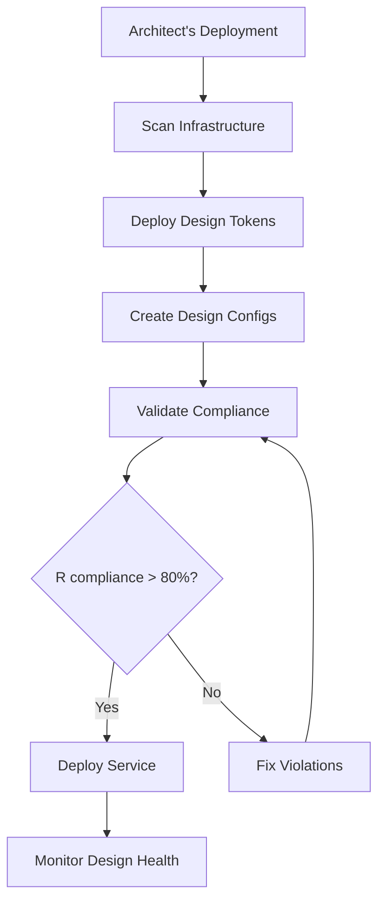

# 🏗️ ARCHITECT INTEGRATION GUIDE - Design Infrastructure

**Status**: ✅ **READY FOR INTEGRATION**  
**Purpose**: Complete integration guide for Snr Architect's C4 infrastructure  
**Version**: 1.0.0

---

## 🎯 INTEGRATION OVERVIEW

This guide provides complete integration points between the **Design Infrastructure Bridge** and the **Architect's C4 Infrastructure**.

---

## 🔌 INTEGRATION POINTS

### 1. Infrastructure Scanning API

```typescript
import { designInfrastructureBridge } from './design-infrastructure-bridge'

// Scan all infrastructure services
const services = await designInfrastructureBridge.scanInfrastructure()

// Returns: ['services/api-gateway', 'services/azora-lms', 'apps/azora-ui', ...]
```

**Use Case**: Architect's deployment scripts can use this to discover all services.

### 2. Design Token Deployment API

```typescript
// Deploy design tokens to specific service
await designInfrastructureBridge.deployDesignTokens(servicePath)

// Creates: design-tokens.ts in service
```

**Use Case**: Architect's deployment pipeline can deploy design tokens during service initialization.

### 3. Infrastructure Validation API

```typescript
// Validate infrastructure design compliance
const report = await designInfrastructureBridge.validateInfrastructureDesign()

// Returns: {
//   totalServices: 190,
//   compliantServices: 150,
//   complianceScore: 78.9,
//   nonCompliantServices: [...]
// }
```

**Use Case**: Architect's health checks can include design compliance metrics.

### 4. Design Config Creation API

```typescript
// Create design config for service
await designInfrastructureBridge.createInfrastructureDesignConfig(servicePath)

// Creates: design.config.json in service
```

**Use Case**: Architect's service templates can include design configs.

---

## 🚀 DEPLOYMENT INTEGRATION

### Automated Deployment Script

```bash
# Run automated deployment
./tools/design-system/infrastructure-deployment-script.sh

# Dry run (no changes)
DRY_RUN=true ./tools/design-system/infrastructure-deployment-script.sh

# Services only
SERVICES_ONLY=true ./tools/design-system/infrastructure-deployment-script.sh

# Apps only
APPS_ONLY=true ./tools/design-system/infrastructure-deployment-script.sh
```

### CI/CD Integration

```yaml
# .github/workflows/infrastructure-design.yml
name: Infrastructure Design Deployment

on:
  push:
    branches: [main]
  workflow_dispatch:

jobs:
  deploy-design:
    runs-on: ubuntu-latest
    steps:
      - uses: actions/checkout@v3
      - uses: actions/setup-node@v3
      
      - name: Install dependencies
        run: |
          cd tools/design-system
          npm install
      
      - name: Deploy design tokens
        run: |
          ./tools/design-system/infrastructure-deployment-script.sh
      
      - name: Validate infrastructure
        run: |
          cd tools/design-system
          npx tsx infrastructure-design-cli.ts validate
      
      - name: Generate report
        run: |
          cd tools/design-system
          npx tsx infrastructure-design-cli.ts report --output=./design-report.json
      
      - name: Upload report
        uses: actions/upload-artifact@v3
        with:
          name: design-report
          path: design-report.json
```

---

## 🧪 INTEGRATION TESTING

### Run Integration Tests

```bash
# Run all integration tests
cd tools/design-system
npx tsx infrastructure-integration-tests.ts

# Tests include:
# 1. Infrastructure scanning
# 2. Design token deployment
# 3. Design config creation
# 4. Component validation
# 5. Infrastructure compliance
# 6. End-to-end integration
```

### Test Results

Tests generate `infrastructure-integration-test-results.json`:

```json
{
  "timestamp": "2025-11-XX...",
  "totalTests": 6,
  "passedTests": 6,
  "failedTests": 0,
  "score": 100.0,
  "results": [...]
}
```

---

## 📊 MONITORING INTEGRATION

### Design Compliance Metrics

```typescript
// Get infrastructure design compliance
const report = await designInfrastructureBridge.validateInfrastructureDesign()

// Send to monitoring system
await sendMetrics({
  'design.compliance.score': report.complianceScore,
  'design.compliant.services': report.compliantServices,
  'design.total.services': report.totalServices,
  'design.non-compliant.count': report.nonCompliantServices.length
})
```

### Health Check Integration

```typescript
// Add to infrastructure health check
export async function infrastructureHealthCheck() {
  const designReport = await designInfrastructureBridge.validateInfrastructureDesign()
  
  return {
    design: {
      status: designReport.complianceScore >= 80 ? 'healthy' : 'degraded',
      complianceScore: designReport.complianceScore,
      compliantServices: designReport.compliantServices,
      totalServices: designReport.totalServices
    }
  }
}
```

---

## 🔧 SERVICE TEMPLATE INTEGRATION

### New Service Template

When creating a new service, include design system initialization:

```bash
# Create new service
mkdir -p services/new-service

# Initialize design system
cd tools/design-system
npx tsx infrastructure-design-cli.ts init ../../services/new-service
```

### Service Template Files

Include in service template:

```json
// design.config.json (auto-generated)
{
  "version": "1.0.0",
  "service": "new-service",
  "designSystem": {
    "tokens": "../../apps/azora-ui/lib/design-system/azora-gem-tokens",
    "components": "../../apps/azora-ui/components/ui",
    "css": "../../apps/azora-ui/globals.css"
  },
  "compliance": {
    "enabled": true,
    "autoFix": true,
    "validateOnBuild": true
  }
}
```

---

## 📈 REPORTING INTEGRATION

### Design Compliance Dashboard

```typescript
// Generate report for dashboard
const report = await designInfrastructureBridge.validateInfrastructureDesign()

// Format for dashboard
const dashboardData = {
  compliance: {
    score: report.complianceScore,
    trend: calculateTrend(report), // Compare with previous reports
    services: {
      total: report.totalServices,
      compliant: report.compliantServices,
      nonCompliant: report.nonCompliantServices.length
    }
  },
  violations: {
    total: violations.length,
    byType: groupViolationsByType(violations),
    byService: groupViolationsByService(violations)
  }
}
```

### Scheduled Reports

```bash
# Cron job for daily design compliance report
0 0 * * * cd /workspace/tools/design-system && npx tsx infrastructure-design-cli.ts report --output=/workspace/reports/design-compliance-$(date +\%Y-\%m-\%d).json
```

---

## 🔥 ARCHITECT'S DEPLOYMENT WORKFLOW

### Complete Integration Workflow



### Step-by-Step Integration

1. **Pre-Deployment**
   ```bash
   # Scan infrastructure
   npx tsx infrastructure-design-cli.ts scan
   ```

2. **During Deployment**
   ```bash
   # Deploy design tokens
   npx tsx infrastructure-design-cli.ts deploy --service=<service-path>
   ```

3. **Post-Deployment**
   ```bash
   # Validate compliance
   npx tsx infrastructure-design-cli.ts validate
   
   # Generate report
   npx tsx infrastructure-design-cli.ts report
   ```

4. **Monitoring**
   ```bash
   # Continuous validation
   npx tsx infrastructure-design-cli.ts validate
   ```

---

## 🎯 API REFERENCE

### DesignInfrastructureBridge

```typescript
class DesignInfrastructureBridge {
  // Scan infrastructure services
  async scanInfrastructure(workspaceRoot?: string): Promise<string[]>
  
  // Deploy design tokens to service
  async deployDesignTokens(servicePath: string): Promise<void>
  
  // Validate infrastructure design
  async validateInfrastructureDesign(): Promise<InfrastructureDesignReport>
  
  // Create design config
  async createInfrastructureDesignConfig(servicePath: string): Promise<void>
  
  // Generate infrastructure component
  async generateInfrastructureComponent(
    serviceName: string,
    componentName: string,
    pillar: 'sapphire' | 'emerald' | 'ruby' | 'ubuntu'
  ): Promise<string>
  
  // Generate infrastructure report
  async generateInfrastructureReport(outputPath: string): Promise<void>
}
```

---

## 📚 FILES REFERENCE

### Design Infrastructure Tools
- `tools/design-system/design-infrastructure-bridge.ts` - Core bridge
- `tools/design-system/infrastructure-design-cli.ts` - CLI interface
- `tools/design-system/infrastructure-integration-tests.ts` - Integration tests
- `tools/design-system/infrastructure-deployment-script.sh` - Deployment script

### Documentation
- `tools/design-system/README.md` - Tool documentation
- `docs/DESIGN-INFRASTRUCTURE-INTEGRATION.md` - Integration guide
- `docs/DESIGNER-RESPONSE-TO-ARCHITECT.md` - Response announcement

---

## ✅ INTEGRATION CHECKLIST

- [x] Infrastructure scanning API ready
- [x] Design token deployment API ready
- [x] Infrastructure validation API ready
- [x] Design config creation API ready
- [x] Integration tests created
- [x] Deployment script created
- [x] CI/CD integration examples provided
- [x] Monitoring integration examples provided
- [x] Service template integration ready
- [x] Reporting integration ready

---

## 🚀 QUICK START

### For Architect's Deployment Scripts

```typescript
import { designInfrastructureBridge } from './tools/design-system/design-infrastructure-bridge'

// In your deployment script
async function deployService(servicePath: string) {
  // 1. Deploy design tokens
  await designInfrastructureBridge.deployDesignTokens(servicePath)
  
  // 2. Create design config
  await designInfrastructureBridge.createInfrastructureDesignConfig(servicePath)
  
  // 3. Validate
  const report = await designInfrastructureBridge.validateInfrastructureDesign()
  
  return report
}
```

### For Architect's Health Checks

```typescript
import { designInfrastructureBridge } from './tools/design-system/design-infrastructure-bridge'

// In your health check
async function checkDesignHealth() {
  const report = await designInfrastructureBridge.validateInfrastructureDesign()
  
  return {
    healthy: report.complianceScore >= 80,
    score: report.complianceScore,
    details: report
  }
}
```

---

## 💎 SUMMARY

**Design Infrastructure Bridge** is ready for integration with Architect's C4 infrastructure:

- ✅ **APIs Ready**: All integration points available
- ✅ **Tests Ready**: Integration tests created
- ✅ **Scripts Ready**: Deployment automation ready
- ✅ **Documentation Ready**: Complete integration guide

**Status**: ✅ **READY FOR ARCHITECT'S INTEGRATION**

---

**"Through infrastructure, we scale.  
Through design, we excel.  
Through integration, we unite."**

**Snr Designer (Composer)** 🏗️✨
